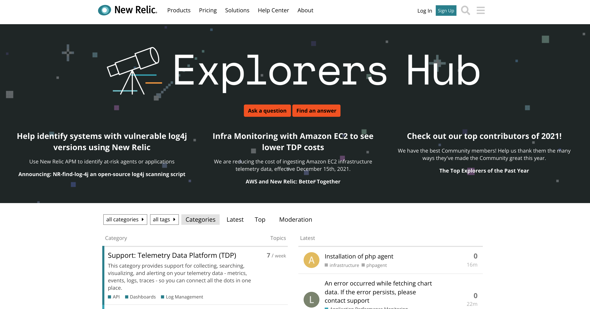
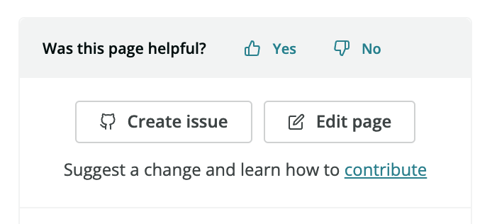

New Relic offers a variety of support options, including online help, a troubleshooting tool, open source documentation with detailed procedures and troubleshooting tips, and support assistance in (and out) of the Platform.

* [Access support resources in the New Relic One Platform](#nr-support)
* [Ask in New Relic's Explorers Hub.](#nr-forum)
* [Run the New Relic Diagnostics tool.](#diagnostics)
* [Find answers in New Relic Docs and New Relic University.](#find-answers)
* [Contribute to our documentation.](#docs-contribution)
* [Don't find what you need? File a documentation issue.](#file-doc-issue)
* [File a case in the platform or support portal.](#file-ticket)
* [Check the status of our systems.](#check-status)
* [Read about our licenses, data security, and compliance information.](#licenses-policies)

## Access Support resources in the New Relic One platform [#nr-support]

All [in-product support](https://one.newrelic.com/redirect/support) resources are accessible while navigating the New Relic One platform: Just select the small **?** icon from the top right navigation menu.

The in-product Support view provides visibility into what's new with New Relic, our documentation, and our Explorers Hub. The support sidebar provides rapid access to all our support tools.

## Ask in New Relic's Explorers Hub, our free forum [#nr-forum]

[New Relic's Explorer Hub](https://discuss.newrelic.com/) is our forum that's free for all users. New Relic users and employees engage every day in conversations to troubleshoot and solve issues, find workarounds, and discuss new features.

<figcaption>
  [**discuss.newrelic.com**](https://discuss.newrelic.com/): The Explorer Hub is our public forum. Use it to ask questions and find answers. Join our community of users to learn more about New Relic and get some inspiration.
</figcaption>

## Run the New Relic Diagnostics tool [#diagnostics]

[New Relic Diagnostics](/docs/using-new-relic/cross-product-functions/troubleshooting/new-relic-diagnostics) is our automated diagnostic tool for Linux, Windows, and Mac. If it detects a problem with any of our agents, it suggests solutions and saves troubleshooting logs that you can attach to tickets.

## Find answers in New Relic Docs and New Relic University [#find-answers]

New Relic's [docs site](https://docs.newrelic.com/) contains helpful installation, configuration, and troubleshooting tips. From the [main page](http://docs.newrelic.com), select from frequently-used categories and topics, like [release notes](/docs/release-notes). Or, [search from any page](http://docs.newrelic.com/search).

For a library of additional videos, webinars, and other information about using New Relic features, visit [New Relic University](https://learn.newrelic.com/) and [newrelic.com/resources](https://newrelic.com/resources/videos).

## Contribute to our documentation [#docs-contribution]

Our documentation is open source and available in [GitHub](https://github.com/newrelic/docs-website), and we encourage you to contribute! We really care about ensuring our docs are helpful, complete, and accurate. To edit a page, click the **Edit page** button in any document to create a pull request with the edit you think is needed. We don't want you to worry about style. When you edit a file, tech writers on our team review it for style, grammar, and formatting.

<figcaption>
  [docs.newrelic.com](https://docs.newrelic.com): At the right-hand side of each page you'll find a feedback widget. Use it to tell us whether a page is helpful, create an issue, or edit the page.
</figcaption>

## Don't find what you need? File a documentation issue [#file-doc-issue]

If you can't find an answer in the documentation, you can file an issue to ask us for help. When you find places the docs could be better, let us know too! To do it, click the **Create issue** button in any document and we'll look into your problem to find a solution.

<figcaption>
  [docs.newrelic.com](https://docs.newrelic.com): At the right-hand side of each page you'll find a feedback widget. Use it to tell us whether a page is helpful, create an issue, or edit the page.
</figcaption>

## File a case in the platform or support portal [#file-ticket]

If none of the above methods worked, click the **?** icon on the top right menu, or go to [support.newrelic.com](https://support.newrelic.com/home). The support portal gives you access to unified search across all of New Relic's help resources. If you can't find what you're looking for, and your subscription level includes technical support, [file a support ticket](https://support.newrelic.com/tickets).

<Callout variant="important">
  Support for beta or limited release features may not be available.
</Callout>

To file a new case from the platform:

1. Go to the **[I need more help](https://one.newrelic.com/redirect/support)** button under **Looking for more help?** on the right panel.

2. Select your account.
3. Choose "Create a Support case".
4. Provide as many details as possible. Include the URL, if applicable, or select **Attach file** to include a log file, a New Relic diagnostics file, screenshots, or any other useful attachments.
5. Click **Submit**.

To file a new case from the support portal:

1. Go to **[support.newrelic.com](https://support.newrelic.com) > Login**.
2. From the support portal, select the area of New Relic you need help with.
3. Select your account.
4. Provide as many details as possible. Include the URL, if applicable, or select **Attach file** to include a log file, a New Relic diagnostics file, screenshots, or any other useful attachments.
5. Click **Submit**.

## Check the status of our systems [#check-status]

It's always a good idea to visit [status.newrelic.com](https://status.newrelic.com/) to check the status of our systems. If there are open incidents, you'll be able to find more information.

## Licenses and security information [#licenses-policies]

* Review New Relic's [licenses, attributions, and other notices](/docs/licenses).
* Read about our [data security, privacy, and compliance policies](/docs/security).

