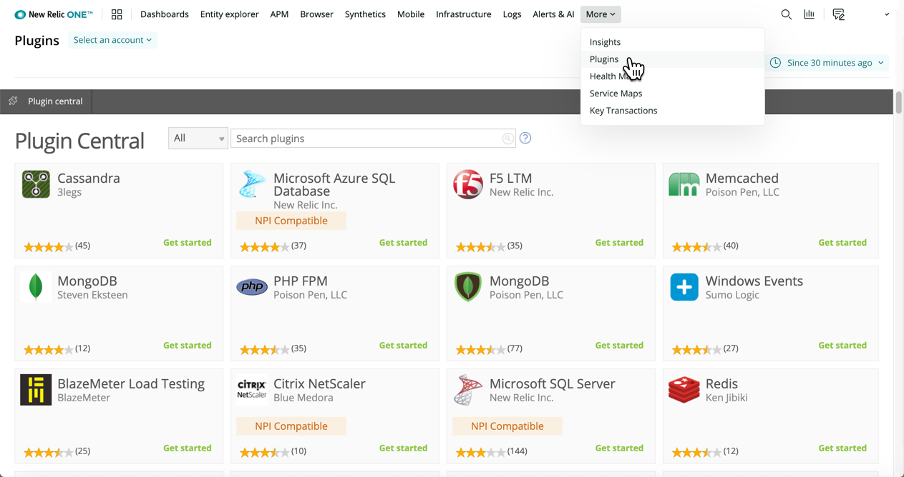

import { Link } from 'gatsby'

As of December 2, 2020, plugin access is limited to accounts that have accessed a plugin in the past 30 days. We will provide access to add plugins on a per-account basis. If you’d like to continue to use plugins for your accounts, please contact your New Relic account team, and we will work with you on a per-account situation.

The plugin experience will reach end of life (EoL) in June 2021. For more information, see our [Explorers Hub post](https://discuss.newrelic.com/t/first-notice-limiting-access-to-new-relic-plugins/121832).

<Callout variant="important">
  For an even better experience than plugins, go to:

  * **[newrelic.com/integrations](https://newrelic.com/integrations):** Integrate the on-host and cloud systems you already use with New Relic, so you can filter and analyze data, create dashboards, and set alerts within a single platform.
  * **[developer.newrelic.com](https://developer.newrelic.com/):** Use developer tools to collect data from any source, automate workflows, build apps, and use our APIs.
</Callout>

Plugins in Plugin Central are not supported with accounts that host data in the [EU region data center](/docs/using-new-relic/welcome-new-relic/getting-started/introduction-eu-region-data-center).

To view plugins in Plugin Central, go to **one.newrelic.com > More > Plugins**.

<LandingPageTileGrid>
  <LandingPageTile title="Get started.">
    <i
      aria-hidden="true"
      className="fa fa-plug fa-3x"
    >
      \[plug icon]
    </i>

    * [Learn about plugins](/docs/plugins/plugins-new-relic/getting-started/introduction-new-relic-plugins) in Plugin Central.
    * [Install](/docs/plugins/plugins-new-relic/installing-plugins/install-plugin-central) available plugins.
  </LandingPageTile>

  <LandingPageTile title="Work with your data.">
    <i
      aria-hidden="true"
      className="fa fa-area-chart fa-3x"
    >
      \[chart icon]
    </i>

    * Explore your [plugin's dashboard](/docs/plugins/plugins-new-relic/installing-plugins/use-plugin-central-plugin).
    * View [alert details](/docs/plugins/plugins-new-relic/installing-plugins/use-plugin-central-plugin#alert_details).
  </LandingPageTile>

  <LandingPageTile title="Build your own plugins.">
    <i
      aria-hidden="true"
      className="fa fa-file-code-o fa-3x"
    >
      \[code file icon]
    </i>

    * [Plan, code, and share](/docs/plugins/developing-plugins/structuring-your-plugin/checklist-developing-plugins) your plugins.
    * Use our [plugin developer resources](/docs/plugins/plugin-developer-resources).
  </LandingPageTile>
</LandingPageTileGrid>

<Button
  role="button"
  as={Link}
  to="/docs/plugins/table-of-contents"
  variant="normal"
>
  View all Plugins docs
</Button>
