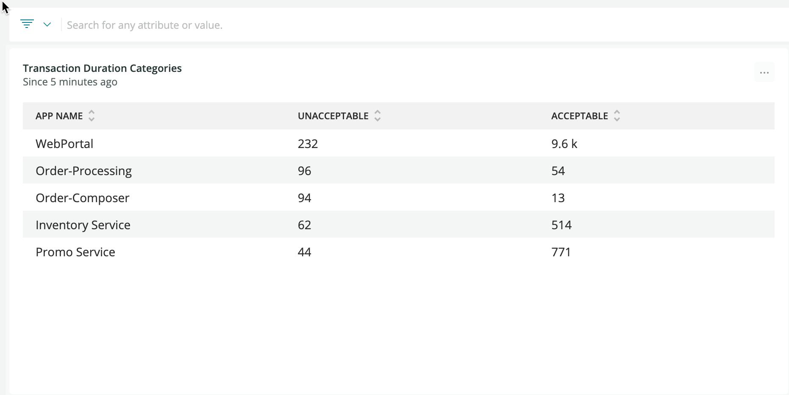

You can filter your [New Relic One dashboards](/docs/dashboards/new-relic-one-dashboards/get-started/introduction-new-relic-one-dashboards) by faceted attributes, making your dashboards more interactive and easy to use.

## Why use facet filtering? [#feature]

In [New Relic One dashboards](/docs/dashboards/new-relic-one-dashboards/get-started/introduction-new-relic-one-dashboards), for NRQL queries containing a [`FACET` clause](/docs/query-data/nrql-new-relic-query-language/getting-started/nrql-syntax-components-functions#sel-facet) and meeting other [chart-type requirements](#requirements), you can set up the faceted attributes to filter the current dashboard or a related, linked dashboard. By letting you quickly filter your dashboards, and link to pre-filtered dashboards, your dashboards are more interactive and easy to use.

This feature is available when adding a new chart to a dashboard or when editing a chart on an existing dashboard.

To see this feature in action, see the [example use case](#example-use).

## Requirements

Requirements to use this feature:

* Must be in [New Relic One dashboards](/docs/dashboards/new-relic-one-dashboards/get-started/introduction-new-relic-one-dashboards). Will not work on a standalone chart in the [query builder](/docs/chart-builder/use-chart-builder/get-started/introduction-chart-builder).
* NRQL query must contain a [`FACET` clause](/docs/query-data/nrql-new-relic-query-language/getting-started/nrql-syntax-components-functions#sel-facet).
* Available only for [bar charts](/docs/insights/use-insights-ui/manage-dashboards/chart-types#widget-barchart), [heat maps](/docs/insights/use-insights-ui/manage-dashboards/chart-types#widget-heatmap), [pie charts](/docs/insights/use-insights-ui/manage-dashboards/chart-types#widget-piechart), and [tables](/docs/insights/use-insights-ui/manage-dashboards/chart-types#widget-table).

## Example use of facet filtering [#example-use]

Let's say you create the following facet-containing NRQL query for an existing dashboard in New Relic One:


<figcaption>
  **[one.newrelic.com](https://one.newrelic.com) > Dashboards**: For queries containing a `FACET` clause and meeting [chart-type requirements](#requirements), you can set those attributes to be used as an easy dashboard filter. You can set the attribute to filter the current dashboard you're on, or filter a related dashboard that you select.
</figcaption>

If you select **Filter the current dashboard**, that chart will be used to filter the current dashboard by the available `userAgentName` attributes. Here's a view of selecting one of those attributes to filter that dashboard. Notice that the chosen attribute appears as a filter in the search bar at the top.


<figcaption>
  **[one.newrelic.com](https://one.newrelic.com) > Dashboards**: When you select an attribute you've set up for facet filtering, it filters the current dashboard.
</figcaption>

For more about this feature, see the [Explorers Hub post on facet filtering](https://discuss.newrelic.com/t/facet-linking-in-new-relic-one-now-you-can-use-facets-to-filter-your-new-relic-one-dashboards/82289).

## Facet linking with the FACET CASES clause [#facet-linking-cases]

[`FACET CASES`](/docs/query-your-data/nrql-new-relic-query-language/get-started/nrql-syntax-clauses-functions#sel-facet-cases) is a NRQL function that allows to group facets based on conditions. We support multiple cases in the same facet.

Let's say you want to query some data and put the responses into mnemonic categories for a dashboard or report.  This syntax will allow you to query based on transaction duration and put the results into two categories: ACCEPTABlE and UNACCEPTABLE.  This can be really useful for making dashboards more human readable and actionable.

```
SELECT filter(count(*), WHERE duration > 1) as 'UNACCEPTABLE', filter(count(*), 
WHERE duration <=1) as 'ACCEPTABLE' 
FROM Transaction  FACET appName LIMIT 5 since 5 minutes ago
```



By using FACET CASES, we can more efficiently use multiple complex conditions to generate a set of custom facets.  Building on the previous example, let's say we want to include a compound condition which excludes errors from our duration data and adds them into a third category:

```
SELECT count(*)
FROM Transaction FACET CASES (where duration > 1 and error is NULL as 'UNACCEPTABLE', where duration <= 1 and error is NULL as 'ACCEPTABLE', where error is not NULL as 'ERROR') since 5 minutes ago
```


Then, using facet linking, you can filter your dashboards by those facets.
