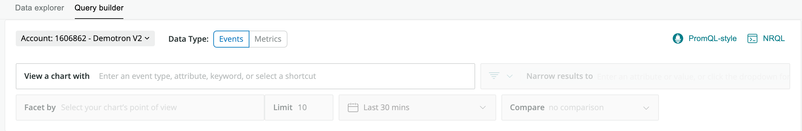

Use the [New Relic One query builder](/docs/chart-builder/use-chart-builder/get-started/introduction-chart-builder) in **basic mode** to create a chart without having to use NRQL, our querying language. The basic mode helps guides you through a query-creation process. You can choose the source of the raw data, apply filters, and use other techniques to narrow the scope of the data in the chart.

<Callout variant="important">
  As of September 1, 2021, we are discontinuing support of the query builder's basic mode. Instead, you can use our data explorer's user-friendly and intuitive functionality in New Relic One. For more details, including how you can easily prepare for this transition, see our [Explorers Hub post](https://discuss.newrelic.com/t/important-upcoming-changes-to-support-and-capabilities-across-browser-node-js-agent-query-builder-net-agent-apm-errors-distributed-tracing/153373).
</Callout>

## Data type

The query builder basic mode has a **Data type** selector with two options:

* **Events:** In this context, this refers to all our non-[`Metric-`type](/docs/using-new-relic/data/understand-data/new-relic-data-types#dimensional-metrics) data, including [events](/docs/using-new-relic/data/understand-data/new-relic-data-types#event-data), [logs](/docs/using-new-relic/data/understand-data/new-relic-data-types#log-data), and [trace data](/docs/using-new-relic/data/understand-data/new-relic-data-types#trace-data).
* **Metrics:** This refers to our dimensional [`Metric` data type](/docs/using-new-relic/data/understand-data/new-relic-data-types#dimensional-metrics). You can also use this to [query some types of metric timeslice data](/docs/query-data/nrql-new-relic-query-language/nrql-query-tutorials/query-metric-timeslice-data-nrql). For more on other types of metrics, see [Data types](/docs/using-new-relic/data/understand-data/new-relic-data-types#metrics-new-relic).

## Example of using basic mode [#example]

This example shows how to create a chart in basic mode.

<CollapserGroup id="basic-mode-tutorial">
  <Collapser
    id="step-1"
    title={<strong>Step 1: Select the source of the data for a chart</strong>}
  >
    Begin by specifying what data you want to view in your chart. Click in the **View a chart with** box to select the event type, an attribute, and a function to perform on the attribute.

    You can use the [event data dictionary](/attribute-dictionary) to view information about an event type and its attributes on a single page. To see a tooltip with information about an event or attribute, hover over any term that has a dotted line underneath it.

    Here are the results of using the event data dictionary to specify the data:

    * **Event type**. The [`Transaction`](/attribute-dictionary/?event=Transaction) event type measures a variety of data that describes what happens while a user is on a website, such as that user clicking on a button on a page.
    * **Attribute**. The `name` attribute stores information on all transactions.
    * **Function**. Select the `unique_count` function to get a count of all the transactions that occurred during the time frame.

    Basic mode now shows the selection:

    

    <figcaption>
      **[one.newrelic.com](https://one.newrelic.com) > Query builder > Basic >** (event and attribute specified)
    </figcaption>

    As you specify data, the chart updates to show you the results from the data you specified.

    Based on the information specified so far, you can see a chart that shows the total number of transactions during the default time frame of 30 minutes. This total includes all transactions, whether the transaction was completed successfully or had errors.

    

    <figcaption>
      **[one.newrelic.com](https://one.newrelic.com) > Query builder > Basic >** (event and attribute specified)
    </figcaption>
  </Collapser>

  <Collapser
    id="step-2"
    title={<strong>Step 2: Filter the data</strong>}
  >
    Your next step is to determine which of those transactions got a **404 page not found** error. If you look in the [data dictionary for the `Transaction` event](/attribute-dictionary/?event=Transaction), you'll find this event also includes an attribute called `httpResponseCode`.

    * Narrow the results to show only those transactions where a **page not found** error occurred. Use the **Narrow results to** box to create this filter: `httpResponseCode = 404` .
    * Because you want to be able to see the names of the apps that are resulting in the 404 errors, you use the **Facet by** box to see the results by `appName` (which is also an attribute for the `Transaction` event type). Faceting by `appName` updates the chart to break down the total number of 404 errors by the application names. This lets you know which apps are experiencing 404 errors.

    Your chart now shows the [line chart](/docs/insights/use-insights-ui/manage-dashboards/chart-types#widget-linechart) with a line for each app, each with its own color.

    

    <figcaption>
      **[one.newrelic.com](https://one.newrelic.com) > Query builder > Basic >** (event and attribute specified) **>** (filters and facets applied)
    </figcaption>
  </Collapser>

  <Collapser
    id="step-3"
    title={<strong>Step 3: Adjust time range and limits</strong>}
  >
    You decide to focus on the five apps with the most **page not found** errors. The default value for the **Limit** field is 10, meaning that your chart will show the ten most relevant returns. You change that value to 5.

    Customer support told you that they had been getting calls about these errors for a little over two hours. You decide to change the **time range** from the last 30 minutes to the last three hours so that you can view the errors during the time when the customers were calling support.

    Now that you have the data set so that you are seeing exactly what you need, you can turn your attention to the appearance of the chart.
  </Collapser>

  <Collapser
    id="step-4"
    title={<strong>Step 4: Customize the chart</strong>}
  >
    Because you are more interested in the total number of errors than a timeline view, you change the [chart type](/docs/insights/use-insights-ui/manage-dashboards/insights-chart-types) to a [bar chart](/docs/insights/use-insights-ui/manage-dashboards/chart-types#widget-barchart).

    

    <figcaption>
      **one.newrelic.com > Query builder > Basic >** (event and attribute specified) **>** (filters and facets applied) **>** (time range and limit customized) **>** (chart type customized)
    </figcaption>
  </Collapser>
</CollapserGroup>

When you're finished with your chart, you can [add it to a dashboard](/docs/chart-builder/use-chart-builder/use-charts/use-your-charts#add-to-dashboard) or [share it.](/docs/chart-builder/use-chart-builder/use-charts/use-your-charts#share-charts)

This table contains notes about using basic mode.

<table>
  <thead>
    <tr>
      <th width="25%">
        **Item**
      </th>

      <th>
        **Description**
      </th>
    </tr>
  </thead>

  <tbody>
    <tr>
      <td>
        Prompts
      </td>

      <td>
        You can start typing directly in an empty box; a list of items that match the information you type will display.  
        You can also click on an empty box to view a list of all of the items that are appropriate for the field, based on your earlier choices.
      </td>
    </tr>

    <tr>
      <td>
        Saving a basic mode data specification
      </td>

      <td>
        Every time you run a query, that query is saved in the **My recent queries** dropdown in [**advanced (NRQL) mode**](/docs/query-your-data/explore-query-data/query-builder/use-advanced-nrql-mode-query-data).
      </td>
    </tr>

    <tr>
      <td>
        Events
      </td>

      <td>
        Basic mode only supports data for one event and attribute.

        If you want to use more than one event and/or attribute, use the [`SELECT`](/docs/insights/nrql-new-relic-query-language/nrql-reference/nrql-syntax-components-functions#state-select) statement in **advanced (NRQL) mode**.
      </td>
    </tr>

    <tr>
      <td>
        Shortcuts
      </td>

      <td>
        Basic mode contains shortcuts that can display more complex events and attributes that aren't generally supported, as in this example (which shows the tooltip for the shortcut).

        

        <figcaption>
          Example of the Response time histogram shortcut, showing a tooltip.
        </figcaption>
      </td>
    </tr>

    <tr>
      <td>
        Tooltips
      </td>

      <td>
        Any time you see a dotted line under a term, you can hover over that term to see a tooltip with an explanation of the term.
      </td>
    </tr>

    <tr>
      <td>
        Narrow by
      </td>

      <td>
        You can use more than one Narrow by definition in basic mode filter; the conditions will be joined by `AND`.

        The [`WHERE`](/docs/insights/nrql-new-relic-query-language/nrql-reference/nrql-syntax-components-functions#sel-where) clause in **advanced (NRQL)** allows `OR` in addition to `AND`.
      </td>
    </tr>
  </tbody>
</table>

<Callout variant="important">
  If your query was started using basic mode **and** if you make changes to that query using advanced (NRQL) mode, you **cannot** return to basic mode to edit that query.

  Any additional changes may only be made in advanced (NRQL) mode.
</Callout>
