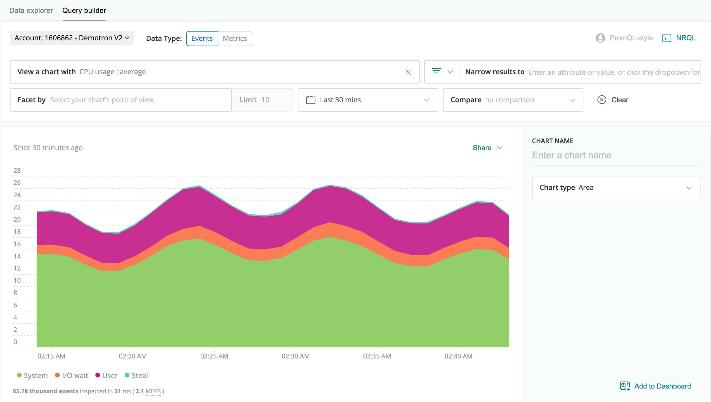
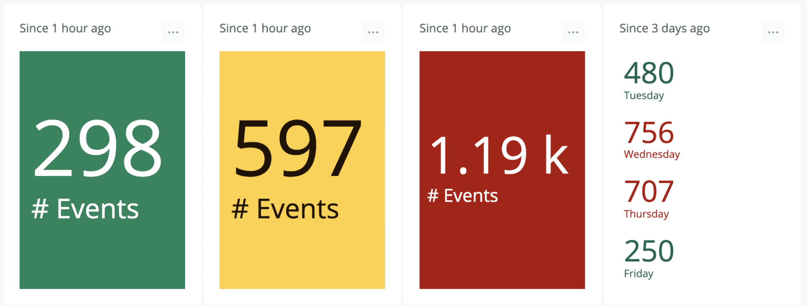
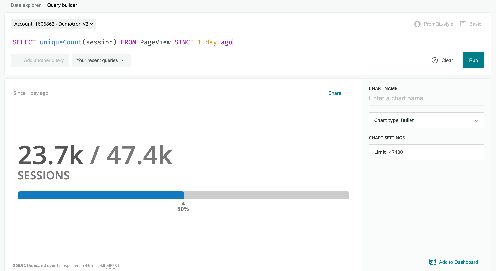
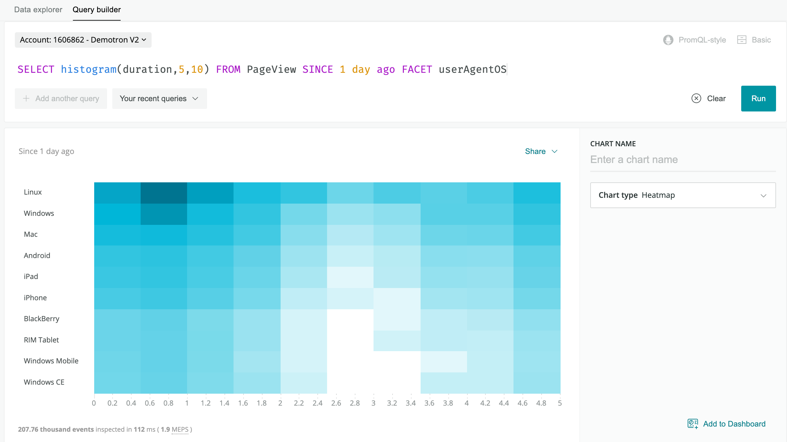
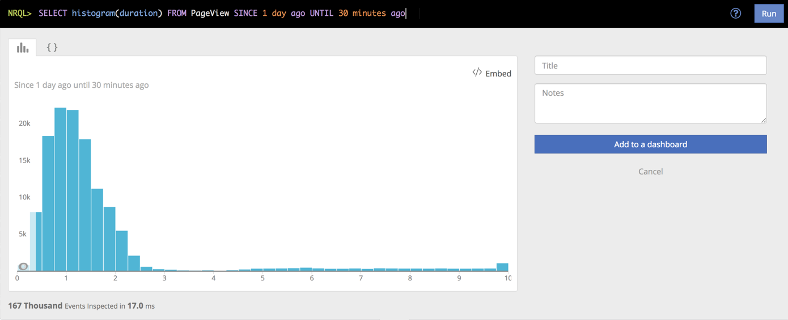
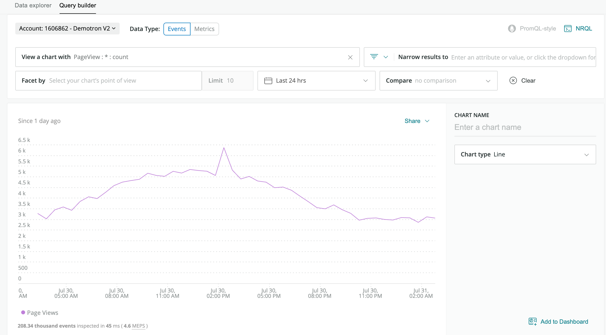
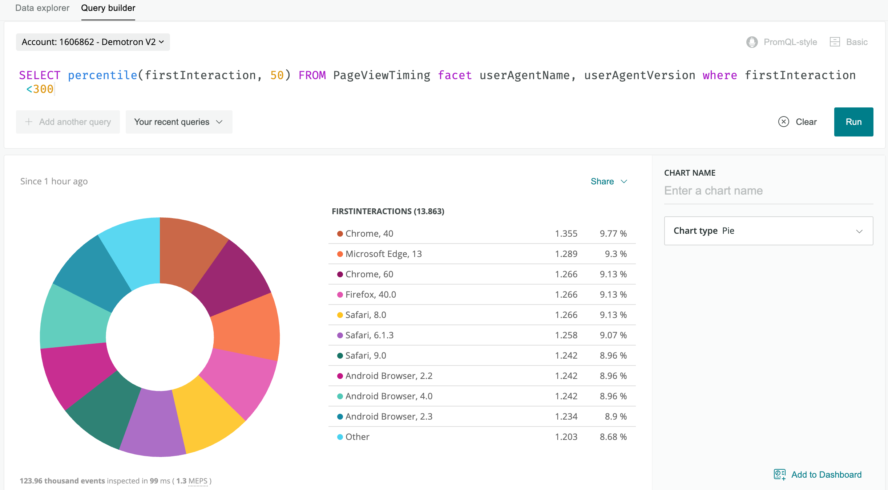
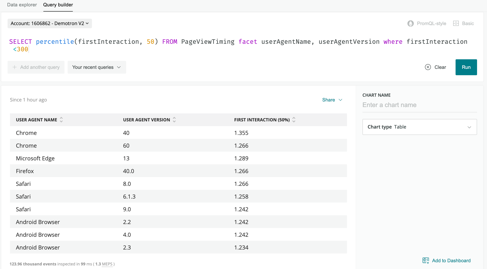

When building a query using the [query builder](/docs/query-your-data/explore-query-data/query-builder/introduction-query-builder/), there are a variety of types of visualizations for presenting your data in the optimal format.

This table contains all chart types. Whether a chart type is available for your query will be dependent on: 

* The type of query (some query results do not match some chart types)
* The query mode (basic or advanced)

<CollapserGroup>
  <Collapser
    className="freq-link"
    id="widget-areachart"
    title="Area chart"
  >
  
    An area chart shows a time series for a single attribute.

    

    <figcaption>
      The area chart type shows a time series for a single attribute.
    </figcaption>

    To enable an area chart, add a [`FACET`](/docs/insights/nrql-new-relic-query-language/nrql-reference/nrql-syntax-components-functions#sel-facet) to your query.

    You can use facet to add up to five attributes, separated by commas. Use the [`TIMESERIES`](/docs/insights/nrql-new-relic-query-language/nrql-reference/nrql-syntax-components-functions#sel-timeseries) function when you use a `FACET` in an NRQL query.

    <table>
      <tbody>
        <tr>
          <td>
            Use an area chart when you want to
          </td>

          <td>
            View the measurement of a single attribute over a period of time that you specify.
          </td>
        </tr>

        <tr>
          <td>
            Avoid an area chart when you want to
          </td>

          <td>
            View a chart that contains more than a single attribute. The [line chart type](#widget-linechart) is a good option; you can view multiple attributes over a time range that you specify. The [bar chart type](#widget-barchart) gives you a comparison view between the attributes; it uses a total of each attribute for the time range you choose.
          </td>
        </tr>
      </tbody>
    </table>
  </Collapser>


  <Collapser
    className="freq-link"
    id="widget-barchart"
    title="Bar chart"
  >

    The bar chart shows comparisons among the categories returned in the query results.

    

    <figcaption>
      The bar chart compares a related set of values.
    </figcaption>

    To enable a bar chart, add a [`FACET`](/docs/insights/nrql-new-relic-query-language/nrql-reference/nrql-syntax-components-functions#sel-facet) clause to the query.

    You can use `FACET` with up to 5 different attributes, separated by commas.

    <table>
      <tbody>
        <tr>
          <td>
            Use a bar chart when you want to
          </td>

          <td>
            Create a chart that reports the total count of the data for a category over the specified time range. With the bar chart format, you can easily see the differences between each category.
          </td>
        </tr>

        <tr>
          <td>
            Avoid a bar chart when you want to
          </td>

          <td>
            Include measurements over a period of time. This chart type is not available when using a [TIMESERIES](/docs/query-data/nrql-new-relic-query-language/getting-started/nrql-syntax-clauses-functions#sel-timeseries) clause. The [line chart type](#widget-linechart) is a good option for this visualization.
          </td>
        </tr>
      </tbody>
    </table>
  </Collapser>

  <Collapser
    className="freq-link"
    id="widget-billboard"
    title="Billboard"
  >
   
    The billboard chart type presents results as a single, highly-visible value. It's an option when your query returns a single number, such as from this query:

```
SELECT uniqueCount(session) FROM PageView since 1 day ago
```

    A billboard chart is useful for single-stat queries like the [Apdex](/docs/apm/new-relic-apm/apdex/apdex-measure-user-satisfaction) function. Use billboards to monitor values at a glance.

    Billboards can also be used to compare a single value across states. For instance, use the [`COMPARE WITH`](/docs/insights/nrql-new-relic-query-language/nrql-reference/nrql-syntax-components-functions#sel-compare) clause to compare the same attribute across two different time frames.

    To enable the data for a billboard chart, search for a single value. You can view multiple values by adding a facet from the dropdown.

    **Thresholds**
    
    Optionally, you can set **Warning** and/or **Critical** thresholds on billboards. Once set, if your service is working correctly, the chart's full box is green. When a threshold is crossed, the chart turns yellow (warning) or red (critical). Access the threshold fields on the right side of the chart edit pane in the query builder. 

    

    <figcaption>
      The billboard chart displays a single value in a large, easy to read font. The background color changes based on your thresholds.
    </figcaption>

    If you want to highlight a chart when a value falls below a given value rather than above it, set the **Warning** threshold higher than the **Critical** threshold.

    <Callout variant="tip">
      Threshold fields will only be available for dashboards that present a single value. For instance, the use of a `COMPARE WITH` clause will disable the threshold settings in the edit pane.
    </Callout>

    **Uses**

    <table>
      <tbody>
        <tr>
          <td>
            Use a billboard chart when you want to
          </td>

          <td>
            Monitor values, including thresholds for **Critical** and **Warning** states, in a large, easy-to-read font.
          </td>
        </tr>

        <tr>
          <td>
            Avoid a billboard chart type when
          </td>

          <td>
            You want to view data over a period of time. The [line chart type](#widget-linechart) is a better option for viewing data by time.
          </td>
        </tr>
      </tbody>
    </table>
  </Collapser>

  <Collapser
    className="freq-link"
    id="bullet-chart"
    title="Bullet chart"
  >
  
    Use the bullet chart type to represent progress to a target or goal, called the limit. To use this chart type, run a query that returns a single number, such as:

```
SELECT uniqueCount(session) FROM PageView SINCE 1 day ago
```

    

    <figcaption>
      The bullet chart displays a value compared against a limit.
    </figcaption>

    Bullet defaults to a limit that is twice the resulting query value. To adjust the limit, use the **Limit** field to enter another number. The bullet will adjust accordingly.

    <Callout variant="tip">
      The bullet chart type can only be used for charts that present a single value. For example, a query using [`COMPARE WITH`](/docs/insights/nrql-new-relic-query-language/nrql-reference/nrql-syntax-components-functions#sel-compare) will not list bullet as an option.
    </Callout>

    <table>
      <tbody>
        <tr>
          <td>
            Use a bullet chart when you want to
          </td>

          <td>
            View a chart uses a large, easy-to-read font that helps you view the value quickly.
          </td>
        </tr>

        <tr>
          <td>
            Avoid a bullet chart when you want to
          </td>

          <td>
            View data that has more than a single value. Bar and line chart types may be better choices in this instance.  
          </td>
        </tr>
      </tbody>
    </table>
  </Collapser>


  <Collapser
    className="freq-link"
    id="funnel"
    title="Funnel"
  >
  
    Use [funnels](/docs/insights/nrql-new-relic-query-language/nrql-query-examples/funnels-evaluate-data-series-events) to evaluate a series of related data types that make up the steps toward a specified goal. A funnel allows you to ask, “Of the people that did (A), how many also did (B), and of the people that did (A) and (B), how many also completed (C)?”

    

    <figcaption>
      Sample funnel chart for a shopping site.
    </figcaption>

    In this example, you want to determine that of all the visitors that viewed the landing page, how many of them:

    * Browsed the products.
    * Then added one or more products to a shopping cart.
    * And finally, purchased the item(s) in the shopping cart.

    Unlike other queries, you must use a [`SELECT`](/docs/insights/nrql-new-relic-query-language/nrql-reference/nrql-syntax-components-functions#state-select) [`funnel()`](/docs/insights/nrql-new-relic-query-language/nrql-reference/nrql-syntax-components-functions#func-funnel) statement in your query; the funnel chart type is not selectable from any other type of query.

    Additionally, the funnel chart type is only available for queries with eight steps or fewer. A funnel query that includes more than eight steps will only return the results as JSON.

    ```
    SELECT funnel(session,
        WHERE pageUrl like '%/index.html' AS 'Landing',
        WHERE pageUrl LIKE '%/browse/phones' AS 'Browse ',
        WHERE pageUrl LIKE '%/shoppingcart' AS 'Cart',
        WHERE pageUrl LIKE '%/checkout' AS 'Purchased')
        FROM PageView where appName = 'WebPortal' AND duration < 1
        SINCE 1 week ago
    ```

    <table>
      <tbody>
        <tr>
          <td>
            Use a funnel when you want to
          </td>

          <td>
            You want to visually evaluate the paths that visitors take after they hit a page that you designate as a landing page.
          </td>
        </tr>

        <tr>
          <td>
            Avoid a funnel when you want to
          </td>

          <td>
            You only want counts for the attributes in the [`WHERE`](/docs/insights/nrql-new-relic-query-language/nrql-reference/nrql-syntax-components-functions#where-operator) clause. You will not be able to choose funnel unless you use `SELECT funnel` in your query.
          </td>
        </tr>
      </tbody>
    </table>
  </Collapser>

  
  <Collapser
    className="freq-link"
    id="widget-heatmap"
    title="Heat map"
  >

    The heat map displays data in a tabular format using color gradations to show frequency in specific time buckets.

    

    <figcaption>
      The heat map is a faceted distribution of values where color density represents the values displayed.
    </figcaption>

    To enable a heat map, use the [`Histogram()`](/docs/insights/nrql-new-relic-query-language/nrql-reference/nrql-syntax-components-functions#func-histogram) function with a numeric attribute and use [`FACET`](/docs/insights/nrql-new-relic-query-language/nrql-reference/nrql-syntax-components-functions#sel-facet) to add up to five attributes, separated by commas.

    See [Histograms: View data distribution](/docs/using-new-relic/user-interface-functions/view-your-data/histograms-view-data-distribution) for more detailed information about histogram-based charts.

    <table style={{ fontSize: "12pt" }}>
      <tbody>
        <tr>
          <td>
            Use a heat map when you want to
          </td>

          <td>
            View tabular data for multiple attributes over a period of time, with gradated colors instead of numerals.
          </td>
        </tr>

        <tr>
          <td>
            Avoid a heat map when you want to
          </td>

          <td>
            View the exact data for multiple attributes over a period of time. A line or bar chart may be an option.
          </td>
        </tr>
      </tbody>
    </table>
  </Collapser>

  <Collapser
    className="freq-link"
    id="widget-histogram"
    title="Histogram"
  >

    

    <figcaption>
      A histogram charts frequency across a series of value ranges.
    </figcaption>

    Use histograms to show the distribution of data across time buckets. See [Histograms: View data distribution](/docs/using-new-relic/user-interface-functions/view-your-data/histograms-view-data-distribution) for more detailed information about histogram-based charts.

    <table>
      <tbody>
        <tr>
          <td>
            Use a histogram when you want to
          </td>

          <td>
            Chart frequency of data over a series of values.
          </td>
        </tr>

        <tr>
          <td>
            Avoid a histogram when you want to
          </td>

          <td>
            View the same data as [heat](#widget-heatmap) [map](#widget-heatmap) or to view the data without the time buckets.
          </td>
        </tr>
      </tbody>
    </table>
  </Collapser>

  <Collapser
    className="freq-link"
    id="widget-json"
    title="JSON"
  >

    Use the returned JSON to review the raw data returned and to help develop integrations with New Relic. To implement integrations, use [remote queries](/docs/insights/new-relic-insights/adding-querying-data/querying-your-data-remotely) to return raw JSON as a service.

    To use this, select the **Share** menu and click **Copy JSON**.

    Example NRQL query:

    ```
SELECT uniqueCount(name) FROM Transaction
  WHERE httpResponseCode = '200'
  TIMESERIES
  FACET appName
  LIMIT 10
  SINCE 24 hours ago
    ```

    Example JSON response:

    ```
    {
      "metadata": {
        "contents": {
          "messages": [],
          "timeSeries": {
            "messages": [],
            "contents": [
              {
                "function": "uniquecount",
                "attribute": "name",
                "simple": true
              }
            ]
          },
          "bucketSizeMillis": 1800000
        },
        "eventTypes": [
          "Transaction"
        ],
        "eventType": "Transaction",
        "openEnded": true,
        "messages": [],
        "beginTimeMillis": 1556226069396,
        "endTimeMillis": 1556312469396,
        "beginTime": "2019-04-25T21:01:09Z",
        "endTime": "2019-04-26T21:01:09Z",
        "guid": "5238a2c6-328d-a5ff-9185-7f3f04c42d1e",
        "routerGuid": "1aea2ec5-0be8-3a60-7554-851e1b016eb0",
        "rawSince": "24 HOURS AGO",
        "rawUntil": "NOW",
        "rawCompareWith": "",
        "facet": "appName",
        "offset": 0,
        "limit": 10
      },
      "facets": [
        {
          "name": "RPM Combined Production",
          "beginTimeSeconds": 0,
          "endTimeSeconds": 0,
          "timeSeries": [
            {
              "results": [
                {
                  "uniqueCount": 415
                }
              ],
              "beginTimeSeconds": 1556226069,
              "endTimeSeconds": 1556227869,
              "inspectedCount": 4589471
            },
            [
              {
                "uniqueCount": 1714
              }
            ],
            "beginTimeSeconds": 1556310669,
            "endTimeSeconds": 1556312469,
            "inspectedCount": 53341469
          }
        ],
        "total": {
          "results": [
            {
              "uniqueCount": 2651
            }
          ],
          "beginTimeSeconds": 0,
          "endTimeSeconds": 0,
          "inspectedCount": 5053841114
        }
      },
      "performanceStats": {
        "inspectedCount": 6088068932,
        "responseTime": 8077
      }
    }

...
    ```
  </Collapser>

  <Collapser
    className="freq-link"
    id="widget-linechart"
    title="Line"
  >

    A line chart is useful for spotting trends over time.

    

    <figcaption>
      The line chart plots a timeseries for an attribute.
    </figcaption>

    When working in basic query mode, select a single attribute you can plot over time.

    When using NRQL, [`SELECT`](/docs/query-your-data/nrql-new-relic-query-language/get-started/nrql-syntax-clauses-functions/#state-select) one or more attributes you can plot over time and then use the [`TIMESERIES`](/docs/insights/nrql-new-relic-query-language/nrql-reference/nrql-syntax-components-functions#sel-timeseries) function.

    <table>
      <tbody>
        <tr>
          <td>
            Use a line chart when you want to
          </td>

          <td>
            Create a chart that lets you easily view trends over a specified time frame.
          </td>
        </tr>

        <tr>
          <td>
            Avoid a line chart when you want to
          </td>

          <td>
            View your data using one or more attributes and see the values associated with each attribute. A bar or table chart is an option.
          </td>
        </tr>
      </tbody>
    </table>
  </Collapser>

 
  <Collapser
    className="freq-link"
    id="widget-piechart"
    title="Pie chart"
  >

    A pie chart is the graphic representation of the table. It appears as an option for some functions when the [`FACET`](/docs/insights/nrql-new-relic-query-language/nrql-reference/nrql-syntax-components-functions#sel-facets) clause is used. To use this chart type, run a query that returns one value for each of a set of attributes.

    

    <figcaption>
      The pie chart maps a set of values as a portion of a whole.
    </figcaption>

    To enable pie chart, add a [`FACET`](/docs/insights/nrql-new-relic-query-language/nrql-reference/nrql-syntax-components-functions#sel-facet) from the dropdown.

    You can add only one `FACET` in basic query mode. If you're using NRQL, you can use `FACET` to add up to 5 attributes, separated by commas, and also include the [`TIMESERIES`](/docs/insights/nrql-new-relic-query-language/nrql-reference/nrql-syntax-components-functions#sel-timeseries) function.

    Pie charts are unavailable for the following [aggregator functions](/docs/insights/new-relic-insights/using-new-relic-query-language/nrql-reference#functions): `average`, `apdex`, `min`, `max`, `percentage`, and `percentile`. For `uniqueCount`, percentages [may add up to more than 100%](#pie-percentage-problem).

    <table>
      <tbody>
        <tr>
          <td>
            Use a pie chart when you want to
          </td>

          <td>
            Create a chart that that graphically presents a set of values as they relate to a whole. A pie chart is effective for displaying values for a time period, for example.
          </td>
        </tr>

        <tr>
          <td>
            Avoid a pie chart when you want to
          </td>

          <td>
            Present data that does not use values as they related to a whole, such as with line charts.
          </td>
        </tr>
        
      </tbody>
    </table>

### Pie chart percentage problem [#pie-percentage-problem]

When using a pie chart with the [`uniqueCount`](/docs/insights/nrql-new-relic-query-language/nrql-resources/nrql-syntax-components-functions#func-uniqueCount) aggregator function, the percentages can add up to more than 100%. This is because the attributes being uniquely counted may be present in multiple facets. For example, in the query `SELECT uniqueCount(user) FROM PageView FACET appName`, a single unique user may use multiple apps. Each of these users are included in the unique value for each of the appropriate facets (apps), but the total number of unique users won't change.

To solve this, use a [bar chart](#widget-barchart) or [table](#widget-table) to provide a more accurate visualization of `uniqueCount` data.

  </Collapser>

  <Collapser
    className="freq-link"
    id="widget-table"
    title="Table"
  >
    A table is the standard view for a set of values related to a specific attribute (for example, the count of all page views by user agent name). By default, all tables are sortable by any one column.

    If you are using the [`FACET`](/docs/insights/nrql-new-relic-query-language/nrql-reference/nrql-syntax-components-functions#sel-facet) clause, the results will normally be returned as a table.
    
    Other features of tables: 
    * You can use a table as a shortcut to other dashboards. If a table is faceted by attribute, selecting an entry takes you to an existing dashboard [filtered by that attribute](/docs/query-your-data/explore-query-data/dashboards/filter-new-relic-one-dashboards-facets/).
    * You can export a table chart to a CSV file. Details on this functionality: 
      * If a filter is applied to a dashboard, the download will only include the subset of data based on the filter.
      * If a specific fixed time range is selected, the CSV includes the data for that time period.
      * If you query with multiple attributes, the export includes columns for all FACETs in the query.
      * For charts with a time range dependent on the present moment (for example, `since 30 minutes ago`), the data in the CSV is generated from the present moment, not from when the chart was initially generated.

    

    <figcaption>
      The table chart type, with its tabular format, works well for dashboards, as well as sharing the data for use in reports, for example.
    </figcaption>


    <table>
      <tbody>
        <tr>
          <td>
            Use a table when you want to
          </td>

          <td>
            Create a text-compatible table consisting of your data. This table can be shared and used in reports or imported into spreadsheets, for example.
          </td>
        </tr>

        <tr>
          <td>
            Avoid a table when you want to
          </td>

          <td>
            View your data in a graphical format.
          </td>
        </tr>
      </tbody>
    </table>
  </Collapser>
</CollapserGroup>

