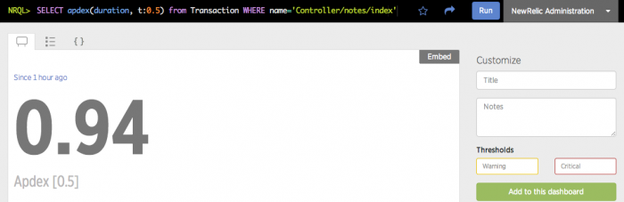
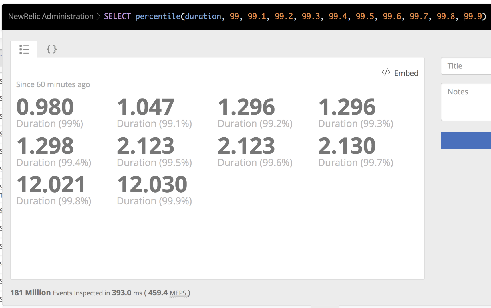
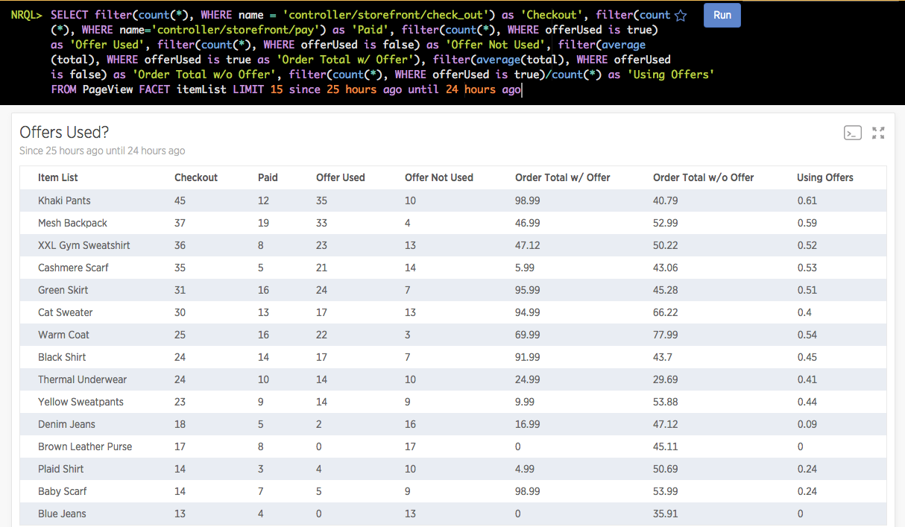

NRQL is a query language you can use to query the New Relic database. This document explains NRQL syntax, clauses, components, and functions.

## Syntax [#syntax]

This document is a reference for the functions and clauses used in a NRQL query. Other resources for understanding NRQL:

* [Intro to NRQL](/docs/query-data/nrql-new-relic-query-language/getting-started/introduction-nrql): explains what NRQL is used for, what data you can query with it, and basic NRQL syntax
* [Examine NRQL queries used to build New Relic charts](/docs/using-new-relic/user-interface-functions/view-your-data/standard-new-relic-ui-page-functions#view-query)
* [Learn how to query the `Metric` data type](/docs/telemetry-data-platform/get-data/apis/query-metric-data-type)
* [Use funnels to evaluate a series of related data](/docs/insights/new-relic-insights/features/funnels)
* [Format NRQL for querying with the Event API](/docs/insights/insights-api/get-data/query-insights-event-data-api)

## Query components [#clauses]

Every NRQL query will begin with a `SELECT` statement or a `FROM` clause. All other clauses are optional. The clause definitions below also contain example NRQL queries.

### Required clauses [#required]

<CollapserGroup>
  <Collapser
    className="freq-link"
    id="state-select"
    title={<>Required: <InlineCode>SELECT</InlineCode> statement</>}
  >
    ```
    SELECT attribute ...
    ```

    ```
    SELECT function(attribute) ...
    ```

    The `SELECT` specifies what portion of a data type you want to query by specifying an [attribute](/docs/using-new-relic/welcome-new-relic/get-started/glossary/#attribute) or a [function](#functions). It's followed by one or more arguments separated by commas. In each argument you can:

    * Get the values of all available attributes by using `*` as a wildcard. For example: `SELECT * from Transaction`.
    * Get values associated with a specified attribute or multiple attributes specified in a [comma separated list](#commas).
    * Get aggregated values from specified attributes by selecting an [aggregator function](#functions).
    * Label the results returned in each argument with [the `AS` clause](#sel-as).

    You can also [use `SELECT` with basic math functions](/docs/query-data/nrql-new-relic-query-language/getting-started/nrql-math-using-select).

    <CollapserGroup>
      <Collapser
        id="avg-resp-time-query"
        title="Avg response time since last week"
      >
        This query returns the average response time since last week.

        ```
        SELECT average(duration) FROM PageView SINCE 1 week ago
        ```
      </Collapser>
    </CollapserGroup>
  </Collapser>

  <Collapser
    className="freq-link"
    id="sel-from"
    title={<>Required: <InlineCode>FROM</InlineCode> clause</>}
  >
    ```
    SELECT ...
      FROM data type
      ...
    ```

    Use the `FROM` clause to specify the [data type](/docs/query-data/nrql-new-relic-query-language/getting-started/introduction-nrql#what-you-can-query) you wish to query. You can start your query with `FROM` or with [`SELECT`](#state-select). You can merge values for the same attributes across multiple data types in a [comma separated list](#commas).

    <CollapserGroup>
      <Collapser
        id="one-event"
        title="Query one data type"
      >
        This query returns the count of all [APM transactions](/docs/insights/new-relic-insights/decorating-events/insights-attributes#transaction-defaults) over the last three days:

        ```
        SELECT count(*) FROM Transaction SINCE 3 days ago
        ```
      </Collapser>

      <Collapser
        id="multiple-events"
        title="Query multiple data types"
      >
        This query returns the count of all [APM transactions](/docs/insights/new-relic-insights/decorating-events/insights-attributes#transaction-defaults) and [browser events](/docs/insights/new-relic-insights/decorating-events/browser-default-attributes-insights#browser-attributes-table) over the last three days:

        ```
        SELECT count(*) FROM Transaction, PageView SINCE 3 days ago
        ```
      </Collapser>
    </CollapserGroup>
  </Collapser>
</CollapserGroup>

### Optional clauses [#optional]

<CollapserGroup>
  <Collapser
    className="freq-link"
    id="sel-as"
    title={<><InlineCode>AS</InlineCode> clause</>}
  >
    ```
    SELECT ...
      AS 'label'
      ...
    ```

    Use the `AS` clause to label an attribute, aggregator, step in a funnel, or the result of a math function with a string delimited by single quotes. The label is used in the resulting chart.

    <CollapserGroup>
      <Collapser
        id="math-as"
        title={<>Query using math function and <InlineCode>AS</InlineCode></>}
      >
        This query returns the number of page views per session:

        ```
        SELECT count(*)/uniqueCount(session) AS 'Pageviews per Session'
          FROM PageView
        ```
      </Collapser>

      <Collapser
        id="funnel-as"
        title={<>Query using funnel and <InlineCode>AS</InlineCode></>}
      >
        This query returns a count of people who have visited both the main page and the careers page of a site over the past week:

        ```
        SELECT funnel(SESSION,
            WHERE name='Controller/about/main' AS 'Step 1',
            WHERE name = 'Controller/about/careers' AS 'Step 2')
            FROM PageView SINCE 1 week ago
        ```
      </Collapser>
    </CollapserGroup>
  </Collapser>

  <Collapser
    className="freq-link"
    id="sel-compare"
    title={<><InlineCode>COMPARE WITH</InlineCode> clause</>}
  >
    ```
    SELECT ... (SINCE or UNTIL) (integer units) AGO
      COMPARE WITH (integer units) AGO
      ...
    ```

    Use the `COMPARE WITH` clause to compare the values for two different time ranges.

    `COMPARE WITH` requires a `SINCE` or `UNTIL` statement. The time specified by `COMPARE WITH` is relative to the time specified by `SINCE` or `UNTIL`. For example, `SINCE 1 day ago COMPARE WITH 1 day ago` compares yesterday with the day before.

    The time range for the`COMPARE WITH` value is always the same as that specified by `SINCE` or `UNTIL`. For example, `SINCE 2 hours ago COMPARE WITH 4 hours ago` might compare 3:00pm through 5:00pm against 11:00am through 1:00pm.

    `COMPARE WITH` can be formatted as either a line chart or a billboard:

    * With `TIMESERIES`, `COMPARE WITH` creates a line chart with the comparison mapped over time.
    * Without `TIMESERIES`, `COMPARE WITH` generates a billboard with the current value and the percent change from the `COMPARE WITH` value.

    **Example:** This query returns data as a line chart showing the 95th percentile for the past hour compared to the same range one week ago. First as a single value, then as a line chart.

    ```
    SELECT percentile(duration) FROM PageView
      SINCE 1 week ago COMPARE WITH 1 week AGO

    SELECT percentile(duration) FROM PageView
      SINCE 1 week ago COMPARE WITH 1 week AGO TIMESERIES AUTO
    ```
  </Collapser>

  <Collapser
    className="freq-link"
    id="extrapolate"
    title={<><InlineCode>EXTRAPOLATE</InlineCode> clause</>}
  >
    You can use this clause with these data types:

    * `Transaction`
    * `TransactionError`
    * Custom events reported via APM agent APIs

    The purpose of `EXTRAPOLATE` is to mathematically compensate for the effects of [APM agent sampling of event data](/docs/agents/manage-apm-agents/agent-data/new-relic-events-limits-sampling) so that query results more closely represent the total activity in your system.

    This clause will be useful when a APM agent reports so many [events](/docs/using-new-relic/metrics/analyze-your-metrics/data-collection-metric-timeslice-event-data#event-data) that it often passes its [harvest cycle](/docs/using-new-relic/welcome-new-relic/getting-started/glossary#harvest-cycle) reporting limits. When that occurs, the agent begins to sample events.

    When `EXTRAPOLATE` is used in a NRQL query that supports its use, the ratio between the **reported events** and the **total events** is used to extrapolate a close approximation of the total unsampled data. When it is used in a NRQL query that doesn’t support its use or that hasn’t used sampled data, it has no effect.

    <Callout variant="important">
      Note that `EXTRAPOLATE` is most useful for homogenous data (like throughput or error rate). It's not effective when attempting to extrapolate a count of distinct things (like `uniqueCount()` or `uniques()`).
    </Callout>

    This clause works only with NRQL queries that use one of the following [aggregator functions](/docs/insights/nrql-new-relic-query-language/nrql-reference/nrql-syntax-components-functions#functions):

    * apdex
    * average
    * count
    * histogram
    * sum
    * percentage (if function it takes as an argument supports `EXTRAPOLATE`)
    * rate (if function it takes as an argument supports `EXTRAPOLATE`)
    * stddev

    <CollapserGroup>
      <Collapser
        id="extrapolate-example-1"
        title="Example of extrapolating throughput"
      >
        A query that will show the extrapolated throughput of a service named `interestingApplication`.

        ```
        SELECT count(*) FROM Transaction WHERE appName='interestingApplication' SINCE 60 minutes ago EXTRAPOLATE
        ```
      </Collapser>

      <Collapser
        id="extrapolate-example-2"
        title="Example of extrapolating throughput as a time series"
      >
        A query that will show the extrapolated throughput of a service named `interestingApplication` by transaction name, displayed as a time series.

        ```
        SELECT count(*) FROM Transaction WHERE appName='interestingApplication'
        SINCE 60 minutes ago FACET name TIMESERIES 1 minute EXTRAPOLATE
        ```
      </Collapser>
    </CollapserGroup>
  </Collapser>

  <Collapser
    className="freq-link"
    id="sel-facet"
    title={<><InlineCode>FACET</InlineCode> clause</>}
  >
    ```
    SELECT ...
      FACET attribute
      ...
    ```

    Use `FACET` to separate and group your results by attribute values. For example, you could `FACET` your `PageView` data by `deviceType` to figure out what percentage of your traffic comes from mobile, tablet, and desktop devices.

    Use the `LIMIT` clause to specify how many facets appear (default is 10). For more complex grouping, use [`FACET CASES`](#sel-facet-cases). `FACET` clauses support up to five attributes, separated by commas.

    The facets are sorted in descending order by the first field you provide in the `SELECT` clause. If you are faceting on attributes with more than 2,000 unique values, a subset of facet values is selected and sorted according to the query type.

    When selecting `min()`, `max()`, `percentile()`, `average()` or `count()`, `FACET` uses those functions to determine how facets are picked and sorted. When selecting any other [function](#functions), `FACET` uses the frequency of the attribute you are faceting on to determine how facets are picked and sorted.

    <CollapserGroup>
      <Collapser
        id="faceted-query"
        title={<>Faceted query using <InlineCode>count()</InlineCode></>}
      >
        This query shows cities with the highest pageview counts. This query uses the total number of pageviews per city to determine how facets are picked and ordered.

        ```
        SELECT count(*) FROM PageView FACET city
        ```
      </Collapser>

      <Collapser
        id="uniquecount"
        title={<>Faceted query using <InlineCode>uniqueCount()</InlineCode></>}
      >
        This query shows the cities that access the highest number of unique URLs. This query uses the total number of times a particular city appears in the results to determine how facets are picked and ordered.

        ```
        SELECT uniqueCount(pageUrl) FROM PageView FACET city
        ```
      </Collapser>

      <Collapser
        id="cohort-analysis"
        title="Grouping results across time"
      >
        [Advanced segmentation](/docs/insights/new-relic-insights/features/advanced-segmentation) and [cohort analysis](/docs/insights/new-relic-insights/features/cohort-analysis-grouping-results-across-time) allow you to facet on bucket functions to more effectively break out your data.

        Cohort analysis is a way to group results together based on timestamps. You can separate them into buckets that cover a specified range of dates and times.
      </Collapser>
    </CollapserGroup>
  </Collapser>

  <Collapser
    className="freq-link"
    title={<><InlineCode>FACET ... AS</InlineCode> clause</>}
  >
    Use `FACET ... AS` to name facets using the `AS` keyword in queries. This clause is helpful for adding clearer or simplified names for facets in your results. It can also be used to rename facets in [nested aggregation](/docs/query-your-data/nrql-new-relic-query-language/nrql-query-tutorials/nested-aggregation-make-ordered-computations-single-query) queries.

    `FACET ... AS` queries will change the facet names in results (when they appear as headers in tables, for example), but not the actual facet names themselves.

    ```
    FROM Transaction SELECT count(*) FACET response.headers.contentType AS 'content type'
    ```
  </Collapser>

  <Collapser
    className="freq-link"
    id="sel-facet-cases"
    title={<><InlineCode>FACET CASES</InlineCode> clause</>}
  >
    ```
    SELECT ...
      FACET CASES (
        WHERE <var>attribute</var> <var>operator</var> <var>value</var>, WHERE <var>attribute</var> <var>operator</var> <var>value</var>, ...
        )
      ...
    ```

    Use `FACET CASES` to break out your data by more complex conditions than possible with [`FACET`](#sel-facet). Separate multiple conditions with a comma `,`. For example, you could query your PageView data and `FACET CASES` into categories like less than 1 second, from 1 to 10 seconds, and greater than 10 seconds. You can combine multiple attributes within your cases, and label the cases with the [`AS`](#sel-as) selector. Data points will be added to at most one facet case, the first facet case that they match.

    You may also use a [time function](/docs/query-data/nrql-new-relic-query-language/nrql-query-examples/group-results-across-time) with your attribute, and you can use the `OR` operator to facet results that don't match any of your specified cases.

    <CollapserGroup>
      <Collapser
        id="facet-cases-basic"
        title={<>Basic usage with <InlineCode>WHERE</InlineCode></>}
      >
        ```
        SELECT count(*) FROM PageView FACET CASES (WHERE duration < 1, WHERE duration > 1 and duration < 10, WHERE duration > 10)
        ```
      </Collapser>

      <Collapser
        id="facet-cases-mixnmatch"
        title="Group based on multiple attributes"
      >
        This example groups results into one bucket where the transaction name contains `login`, and another where the URL contains `login` and a custom attribute indicates that the user was a paid user:

        ```
        SELECT count(*) FROM Transaction FACET CASES (WHERE name LIKE '%login%', WHERE name LIKE '%feature%' AND customer_type='Paid')
        ```
      </Collapser>

      <Collapser
        id="facet-cases-as-label"
        title={<>Label groups with <InlineCode>AS</InlineCode></>}
      >
        This example uses the [`AS`](#sel-as) selector to give your results a human-readable name:

        ```
        SELECT count(*) FROM Transaction FACET CASES (WHERE name LIKE '%login%' AS 'Total Logins', WHERE name LIKE '%feature%' AND customer_type='Paid' AS 'Feature Visits from Paid Users')
        ```
      </Collapser>

      <Collapser
        id="facet-cases-with-or"
        title={<>Facet non-matching data with <InlineCode>OR</InlineCode></>}
      >
        This example uses the `OR` operator to facet results that didn't match any of your cases:

        ```
        SELECT count(*) FROM Transaction FACET CASES (WHERE name LIKE '%login%', WHERE name LIKE '%feature%' AND customer_type='Paid') OR name
        ```
      </Collapser>
    </CollapserGroup>
  </Collapser>

  <Collapser
    className="freq-link"
    id="sel-facet-order"
    title={<><InlineCode>FACET ... ORDER BY</InlineCode> clause</>}
  >
    In NRQL, the default is for the first aggregation in the `SELECT` clause to guide the selection of facets in a query. `FACET ... ORDER BY` allows you to override this default behavior by adding an aggregate function with the ORDER BY modifier to specify how facets are selected. Specifically, the clause will override the priority by which facets are chosen to be in the final result before being limited by the `LIMIT` clause. This clause can be used in querying but not for alerts or streaming.

    This example shows how to use `FACET ... ORDER BY` to find the average durations of app transactions, showing the top 10 (default limit) highest durations by apps which have the highest response size. In this case, if `FACET ... ORDER BY` is not used, the query results will instead show the top 10 by highest durations, with response size being irrelevant to the app selection.

    ```
    FROM Transaction SELECT average(duration) TIMESERIES FACET appName ORDER BY max(responseSize)
    ```

    <Callout variant="tip">
      Because the operations are performed before the `LIMIT` clause is applied, `FACET ... ORDER BY` does not impact the sort of the final query results, which will be particularly noticeable in the results for non-timeseries queries.
    </Callout>

    <Callout variant="important">
      The `ORDER BY` modifier in this case works differently than the `ORDER BY` clause. When parsing queries that follow the format `FACET attribute1 ORDER BY attribute2`, New Relic will read these as `FACET ... ORDER BY` queries, but only if `ORDER BY` appears immediately after `FACET`. Otherwise `ORDER BY` will be interpreted by New Relic as a clause.
    </Callout>
  </Collapser>

  <Collapser
    className="freq-link"
    id="sel-limit"
    title={<><InlineCode>LIMIT</InlineCode> clause</>}
  >
    ```
    SELECT ...
      LIMIT count
      ...
    ```

    Use the `LIMIT` clause to control the maximum number of facet values returned by `FACET` queries or the maximum number of items returned by `SELECT *` queries. This clause takes a single integer value as an argument. If the `LIMIT` clause is not specified, or no value is provided, the limit defaults to 10 for `FACET` queries and 100 in the case of `SELECT *` queries.

    The maximum allowed value for the `LIMIT` clause is 2,000.

    <CollapserGroup>
      <Collapser title={<>Query using <InlineCode>LIMIT</InlineCode></>}>
        This query shows the top 20 countries by session count and provides 95th percentile of response time for each country for Windows users only.

        ```
        SELECT uniqueCount(session), percentile(duration, 95)
          FROM PageView WHERE userAgentOS = 'Windows'
          FACET countryCode LIMIT 20 SINCE YESTERDAY
        ```
      </Collapser>
    </CollapserGroup>
  </Collapser>

  <Collapser
    className="freq-link"
    id="sel-offset"
    title={<><InlineCode>OFFSET</InlineCode> clause</>}
  >
    ```
    SELECT ...
      LIMIT count OFFSET count
      ...
    ```

    Use the `OFFSET` clause with `LIMIT` to control the portion of rows returned by `SELECT *` or `SELECT column` queries. Like the `LIMIT` clause, `OFFSET` takes a single integer value as an argument. `OFFSET` sets the number of rows to be skipped before the selected rows of your query are returned. This is constrained by `LIMIT`.

    `OFFSET` rows are skipped starting from the most recent record.

    For example, the query `SELECT interestingValue FROM Minute_Report LIMIT 5 OFFSET 1` returns the last 5 values from `Minute_Report` except for the most recent one.
  </Collapser>

  <Collapser
    className="freq-link"
    id="sel-order-by"
    title={<><InlineCode>ORDER BY</InlineCode> clause</>}
  >
    The `ORDER BY` clause allows you to specify how you want to sort your query results in queries that select event attributes by row.

    This query orders transactions by duration.

    ```
    FROM Transaction SELECT appName, duration ORDER BY duration
    ```

    The default sort order is ascending, but this can be changed by adding the `ASC` or `DESC` modifiers.
  </Collapser>

  <Collapser
    className="freq-link"
    id="show-event-types"
    title={<><InlineCode>SHOW EVENT TYPES</InlineCode> clause</>}
  >
    ```
    SHOW EVENT TYPES...
    ```

    `SHOW EVENT TYPES` will return a list of all the data types present in your account for a specific time range. It is used as the first clause in a query instead of `SELECT`.

    <Callout variant="important">
      In this context, "event types" refers to the data types you can access with a NRQL query.
    </Callout>

    <CollapserGroup>
      <Collapser
        id="avg-resp-time-query"
        title="Data types in the last day"
      >
        This query will return all the data types present over the past day:

        ```
        SHOW EVENT TYPES SINCE 1 day ago
        ```
      </Collapser>
    </CollapserGroup>
  </Collapser>

  <Collapser
    className="freq-link"
    id="sel-since"
    title={<><InlineCode>SINCE</InlineCode> clause</>}
  >
    ```
    SELECT ...
      SINCE [numerical units AGO | phrase]
      ...
    ```

    The **default** value is **1 hour ago**.

    Use the `SINCE` clause to define the beginning of a time range for the returned data. You can specify a timezone for the query but not for the results. NRQL results are based on your system time.

    When using NRQL, you can set a UTC timestamp or a relative time range:
    - Timestamps use the format `YYYY-MM-DD HH:MM:SS ZZZZ`. For instance, `FROM Transaction SELECT count(*) SINCE '2021-12-25 00:00:00 +0000' UNTIL '2021-12-25 23:59:59 +0000'`.
    - We support the following relative time ranges: `YESTERDAY`, `TODAY`, `SUNDAY`, `MONDAY`, `TUESDAY`, `WEDNESDAY`, `THURSDAY`, `FRIDAY`, `SATURDAY`. For example, `SINCE YESTERDAY UNTIL NOW`.
    - We also support `YEAR`, `QUARTER`, `MONTH`, `WEEK`, `DAY`, `HOUR`, `MINUTE`, `SECOND`. For these cases, you can combine `SINCE` with `THIS` or `LAST`. For instance, `SINCE LAST MONTH UNTIL THIS WEEK`.

  </Collapser>

  <Collapser
    className="freq-link"
    id="slide-by"
    title={<><InlineCode>SLIDE BY</InlineCode> clause</>}
  >
    The `SLIDE BY` clause supports a feature known as sliding windows. With sliding windows,`SLIDE BY` data is gathered into "windows" of time that overlap with each other. These windows can help to smooth out line graphs with a lot of variation in cases where the rolling aggregate (such as a rolling mean) is more important than aggregates from narrow windows of time.

    To use `SLIDE BY`, place it in a query after the `TIMESERIES` clause. For example, this query pulls data in 5-minute windows with a 1-minute `SLIDE BY` interval, meaning that each window lasts 5 minutes, but window 1 starts at 0 minutes, window 2 starts at 1 minute, window 3 starts at 2 minutes, and so on.

    ```
    SELECT average(duration) FROM Transaction TIMESERIES 5 minutes SLIDE BY 1 minute
    ```

    To learn more about how and when you can use `SLIDE BY`, see [Create smoother charts with sliding windows](/docs/query-your-data/nrql-new-relic-query-language/nrql-query-tutorials/create-smoother-charts-sliding-windows).

    <CollapserGroup>
      <Collapser
        id="sliding-window-max-auto"
        title={<>Use <InlineCode>SLIDE BY</InlineCode> with <InlineCode>MAX</InlineCode> or <InlineCode>AUTO</InlineCode> interval</>}
      >
        You can use sliding windows in combination with `MAX` or `AUTO`. However, `MAX` or `AUTO` may not be placed between `TIMESERIES` and `SLIDE BY`.

        This query will automatically decide a `SLIDE BY` window interval.

        ```
        SELECT average(duration) FROM Transaction TIMESERIES 5 minutes SLIDE BY AUTO
        ```

        This query will set the SLIDE BY window to the maximum interval granularity.

        ```
        SELECT average(duration) FROM Transaction TIMESERIES 5 minutes SLIDE BY MAX
        ```

        <Callout variant="important">
          The `SLIDE BY` value as determined by `AUTO` or `MAX` can produce a step interval greater than the window size, which can cause gaps and unexpected results.
        </Callout>
      </Collapser>
    </CollapserGroup>
  </Collapser>

  <Collapser
    className="freq-link"
    id="sel-timeseries"
    title={<><InlineCode>TIMESERIES</InlineCode> clause</>}
  >
    ```
    SELECT ...
      TIMESERIES integer units
      ...
    ```

    Use the `TIMESERIES` clause to return data as a time series broken out by a specified period of time. Since `TIMESERIES` is used to trigger certain charts, there is no default value.

    To indicate the time range, use `integer units`. For example:

    * `TIMESERIES 1 minute`
    * `TIMESERIES 30 minutes`
    * `TIMESERIES 1 hour`
    * `TIMESERIES 30 seconds`

    `TIMESERIES` can be combined with arguments such as `MAX`, `AUTO`, and `SLIDE BY` to further tailor query results, as shown in the examples below.

    <Callout variant="important">
      For functions such as `average( )` or `percentile( )`, a large aggregation window can have a significant smoothing effect on outliers. This is true whether or not the query makes use of sliding windows.
    </Callout>

    <CollapserGroup>
      <Collapser
        id="set-interval"
        title="Use a set interval"
      >
        The value provided indicates the units used to break out the graph. For example, to present a one-day graph showing 30 minute increments:

        ```
        SELECT ... SINCE 1 day AGO TIMESERIES 30 minutes
        ```
      </Collapser>

      <Collapser
        id="timeseries-auto"
        title="Use an automatically set interval"
      >
        `TIMESERIES` can also be set to `AUTO`, which will divide your graph into a reasonable number of divisions. For example, a daily chart will be divided into 30 minute intervals and a weekly chart will be divided into 6 hour intervals.

        This query returns data as a line chart showing the 50th and 90th percentile of client-side transaction time for one week with a data point every 6 hours.

        ```
        SELECT average(duration), percentile(duration, 50, 90)
          FROM PageView SINCE 1 week AGO TIMESERIES AUTO
        ```
      </Collapser>

      <Collapser
        id="timeseries-max"
        title={<>Use <InlineCode>MAX</InlineCode> interval</>}
      >
        You can set `TIMESERIES` to `MAX`, which will automatically adjust your time window to the maximum number of intervals allowed for a given time period. This allows you to update your time windows without having to manually update your `TIMESERIES` buckets and ensures your time window is being split into the peak number of intervals allowed. The maximum number of `TIMESERIES` buckets that will be returned is 366.

        For example, the following query creates 4-minute intervals, which is the ceiling for a daily chart.

        ```
        SELECT average(duration) FROM Transaction since 1 day ago TIMESERIES MAX
        ```
      </Collapser>
    </CollapserGroup>
  </Collapser>

  <Collapser
    className="freq-link"
    id="sel-until"
    title={<><InlineCode>UNTIL</InlineCode> clause</>}
  >
    ```
    SELECT ...
      UNTIL integer units AGO
      ...
    ```

    The **default** value is **NOW**. Only use `UNTIL` to specify an end point other than the default.

    Use the `UNTIL` clause to define the end of a time range across which to return data. Once a time range has been specified, the data will be preserved and can be reviewed after the time range has ended.

    See [Use the time picker to adjust time settings](/docs/query-your-data/explore-query-data/dashboards/manage-your-dashboard/#dash-time-picker) for detailed information and examples.
  </Collapser>

  <Collapser
    className="freq-link"
    id="sel-where"
    title={<><InlineCode>WHERE</InlineCode> clause</>}
  >
    Use the `WHERE` clause to filter results. NRQL returns the results that fulfill the condition(s) you specify in the clause.

    ```
    SELECT function(attribute) ...
      WHERE attribute [operator 'value' | IN ('value' [, 'value]) | IS [NOT] NULL ]
      [AND|OR ...]
      ...
    ```

    * If you specify more than one condition, separate the conditions by the operators `AND` or `OR`.
    * If you want to [simulate a SQL join](/docs/insights/nrql-new-relic-query-language/using-nrql/simulate-sql-join-functions-insights), use custom attributes in a `WHERE` or `FACET` clause.

    <table id="where-operators">
      <thead>
        <tr>
          <th width={150}>
            **Operators that the `WHERE` clause accepts**
          </th>

          <th>
            **Description**
          </th>
        </tr>
      </thead>

      <tbody>
        <tr>
          <td>
            `=`, `!=`, `<`, `<=`, `>`, `>=`
          </td>

          <td>
            NRQL accepts standard comparison operators.

            Example: `state = 'WA'`
          </td>
        </tr>

        <tr>
          <td>
            `AND`
          </td>

          <td>
            Used to define an intersection of two conditions.
          </td>
        </tr>

        <tr>
          <td>
            `OR`
          </td>

          <td>
            Used to define a union of two conditions.
          </td>
        </tr>

        <tr>
          <td>
            `IS NULL`
          </td>

          <td>
            Determines if an attribute has a null value.
          </td>
        </tr>

        <tr>
          <td>
            `IS NOT NULL`
          </td>

          <td>
            Determines if an attribute does not have a null value.
          </td>
        </tr>

        <tr>
          <td>
            `IN`
          </td>

          <td>
            Determines if the string value of an attribute is in a specified set. Using this method yields better performance than stringing together multiple `WHERE` clauses.

            Example: `animalType IN ('cat', 'dog', 'fish')`
          </td>
        </tr>

        <tr>
          <td>
            `NOT IN`
          </td>

          <td>
            Determines if the string value of an attribute is not in a specified set. Using this method yields better performance than stringing together multiple `WHERE` clauses.

            Values must be in parentheses, separated by commas. For example:

            ```
            SELECT * FROM PageView WHERE countryCode NOT IN ('CA', 'WA')
            ```
          </td>
        </tr>

        <tr>
          <td>
            `LIKE`
          </td>

          <td>
            Determines if an attribute contains a specified sub-string.

            The string argument for the `LIKE` operator accepts the percent sign (%) as a wildcard anywhere in the string. If the substring does not begin or end the string you are matching against, the wildcard must begin or end the string.

            **Examples:**

            `userAgentName LIKE 'IE%'`

            * IE
            * IE Mobile

            `userAgentName LIKE 'o%a%'`

            * Opera
            * Opera Mini

            `userAgentName LIKE 'o%a'`

            * Opera

            `userAgentName LIKE '%o%a%'`

            * Opera
            * Opera Mini
            * Mozilla Gecko
          </td>
        </tr>

        <tr>
          <td>
            `NOT LIKE`
          </td>

          <td>
            Determines if an attribute does not contain a specified sub-string.
          </td>
        </tr>

        <tr>
          <td>
            `RLIKE`
          </td>

          <td>
            Determines if an attribute contains a specified Regex sub-string. Uses [RE2 syntax](https://github.com/google/re2/wiki/Syntax).

            **Examples:**

            `appName RLIKE r'z.*|q.*''`

            `hostname RLIKE r'ip-10-351-[0-2]?[0-9]-.*'`

            * `z-app`
            * `q-app`
            * `ip-10-351-19-237`
            * `ip-10-351-2-41`
            * `ip-10-351-24-238`
            * `ip-10-351-14-15`

            <Callout variant="important">
              Regex defaults to full-string matching, therefore `^` and `$` are implicit and you do not need to add them.
            </Callout>
          </td>
        </tr>

        <tr>
          <td>
            `NOT RLIKE`
          </td>

          <td>
            Determines if an attribute does not contain a specified Regex sub-string. Uses [RE2 syntax](https://github.com/google/re2/wiki/Syntax).
          </td>
        </tr>
      </tbody>
    </table>

    <CollapserGroup>
      <Collapser
        id="query-3-conditions"
        title="Example query with three conditions"
      >
        This query returns the browser response time for pages with `checkout` in the URL for Safari users in the United States and Canada over the past 24 hours.

        ```
        SELECT histogram(duration, 50, 20) FROM PageView
        WHERE countryCode IN ('CA', 'US') AND userAgentName='Safari' AND pageUrl LIKE '%checkout%'
        SINCE 1 day ago
        ```
      </Collapser>
    </CollapserGroup>
  </Collapser>

  <Collapser
    className="freq-link"
    id="with-metric-format"
    title={<><InlineCode>WITH METRIC_FORMAT</InlineCode> clause</>}
  >
    For information on querying metric data, see [Query metrics](#query-metrics).
  </Collapser>

  <Collapser
    className="freq-link"
    id="sel-timezone"
    title={<><InlineCode>WITH TIMEZONE</InlineCode> clause</>}
  >
    ```
    SELECT ... WITH TIMEZONE (selected zone)
      ...
    ```

    By default, query results are displayed in the timezone of the browser you're using.

    Use the `WITH TIMEZONE` clause to select a time zone for a date or time in the query that hasn't already had a time zone specified for it.

    For example, the query clause `SINCE Monday UNTIL Tuesday WITH TIMEZONE 'America/New_York'` will return data recorded from Monday at midnight, Eastern Standard Time, until midnight Tuesday, Eastern Standard Time.

    <table style={{ width: "auto" }}>
      <thead>
        <tr>
          <th colSpan={4}>
            Available Time Zone Selections
          </th>
        </tr>
      </thead>

      <tbody>
        <tr>
          <td>
            Africa/Abidjan
          </td>

          <td>
            Africa/Addis_Ababa
          </td>

          <td>
            Africa/Algiers
          </td>

          <td>
            Africa/Blantyre
          </td>
        </tr>

        <tr>
          <td>
            Africa/Cairo
          </td>

          <td>
            Africa/Windhoek
          </td>

          <td>
            America/Adak
          </td>

          <td>
            America/Anchorage
          </td>
        </tr>

        <tr>
          <td>
            America/Araguaina
          </td>

          <td>
            America/Argentina/Buenos_Aires
          </td>

          <td>
            America/Belize
          </td>

          <td>
            America/Bogota
          </td>
        </tr>

        <tr>
          <td>
            America/Campo_Grande
          </td>

          <td>
            America/Cancun
          </td>

          <td>
            America/Caracas
          </td>

          <td>
            America/Chicago
          </td>
        </tr>

        <tr>
          <td>
            America/Chihuahua
          </td>

          <td>
            America/Dawson_Creek
          </td>

          <td>
            America/Denver
          </td>

          <td>
            America/Ensenada
          </td>
        </tr>

        <tr>
          <td>
            America/Glace_Bay
          </td>

          <td>
            America/Godthab
          </td>

          <td>
            America/Goose_Bay
          </td>

          <td>
            America/Havana
          </td>
        </tr>

        <tr>
          <td>
            America/La_Paz
          </td>

          <td>
            America/Los_Angeles
          </td>

          <td>
            America/Miquelon
          </td>

          <td>
            America/Montevideo
          </td>
        </tr>

        <tr>
          <td>
            America/New_York
          </td>

          <td>
            America/Noronha
          </td>

          <td>
            America/Santiago
          </td>

          <td>
            America/Sao_Paulo
          </td>
        </tr>

        <tr>
          <td>
            America/St_Johns
          </td>

          <td>
            Asia/Anadyr
          </td>

          <td>
            Asia/Bangkok
          </td>

          <td>
            Asia/Beirut
          </td>
        </tr>

        <tr>
          <td>
            Asia/Damascus
          </td>

          <td>
            Asia/Dhaka
          </td>

          <td>
            Asia/Dubai
          </td>

          <td>
            Asia/Gaza
          </td>
        </tr>

        <tr>
          <td>
            Asia/Hong_Kong
          </td>

          <td>
            Asia/Irkutsk
          </td>

          <td>
            Asia/Jerusalem
          </td>

          <td>
            Asia/Kabul
          </td>
        </tr>

        <tr>
          <td>
            Asia/Katmandu
          </td>

          <td>
            Asia/Kolkata
          </td>

          <td>
            Asia/Krasnoyarsk
          </td>

          <td>
            Asia/Magadan
          </td>
        </tr>

        <tr>
          <td>
            Asia/Novosibirsk
          </td>

          <td>
            Asia/Rangoon
          </td>

          <td>
            Asia/Seoul
          </td>

          <td>
            Asia/Tashkent
          </td>
        </tr>

        <tr>
          <td>
            Asia/Tehran
          </td>

          <td>
            Asia/Tokyo
          </td>

          <td>
            Asia/Vladivostok
          </td>

          <td>
            Asia/Yakutsk
          </td>
        </tr>

        <tr>
          <td>
            Asia/Yekaterinburg
          </td>

          <td>
            Asia/Yerevan
          </td>

          <td>
            Atlantic/Azores
          </td>

          <td>
            Atlantic/Cape_Verde
          </td>
        </tr>

        <tr>
          <td>
            Atlantic/Stanley
          </td>

          <td>
            Australia/Adelaide
          </td>

          <td>
            Australia/Brisbane
          </td>

          <td>
            Australia/Darwin
          </td>
        </tr>

        <tr>
          <td>
            Australia/Eucla
          </td>

          <td>
            Australia/Hobart
          </td>

          <td>
            Australia/Lord_Howe
          </td>

          <td>
            Australia/Perth
          </td>
        </tr>

        <tr>
          <td>
            Chile/EasterIsland
          </td>

          <td>
            Etc/GMT+10
          </td>

          <td>
            Etc/GMT+8
          </td>

          <td>
            Etc/GMT-11
          </td>
        </tr>

        <tr>
          <td>
            Etc/GMT-12
          </td>

          <td>
            Europe/Amsterdam
          </td>

          <td>
            Europe/Belfast
          </td>

          <td>
            Europe/Belgrade
          </td>
        </tr>

        <tr>
          <td>
            Europe/Brussels
          </td>

          <td>
            Europe/Dublin
          </td>

          <td>
            Europe/Lisbon
          </td>

          <td>
            Europe/London
          </td>
        </tr>

        <tr>
          <td>
            Europe/Minsk
          </td>

          <td>
            Europe/Moscow
          </td>

          <td>
            Pacific/Auckland
          </td>

          <td>
            Pacific/Chatham
          </td>
        </tr>

        <tr>
          <td>
            Pacific/Gambier
          </td>

          <td>
            Pacific/Kiritimati
          </td>

          <td>
            Pacific/Marquesas
          </td>

          <td>
            Pacific/Midway
          </td>
        </tr>

        <tr>
          <td>
            Pacific/Norfolk
          </td>

          <td>
            Pacific/Tongatapu
          </td>

          <td>
            UTC
          </td>

          <td/>
        </tr>
      </tbody>
    </table>

    See [Set time range on dashboards and charts](/docs/insights/new-relic-insights/managing-dashboards-data/set-time-range-insights-dashboards-widgets) for detailed information and examples.
  </Collapser>
</CollapserGroup>

## Query metric data [#query-metrics]

Metric data is more complex than other types of data. There are specific tips for querying it well. We have two types of metric data, each with their own query guidelines:

* [Query dimensional metrics](/docs/data-ingest-apis/get-data-new-relic/metric-api/view-query-you-metric-data), which are reported by our Metric API and by some of our solutions that use that API (for example, our [Dropwizard integration](/docs/more-integrations/open-source-telemetry-integrations/dropwizard/dropwizard-reporter) or [Micrometer integration](/docs/more-integrations/open-source-telemetry-integrations/micrometer/micrometer-metrics-registry)). 
* [Query metric timeslice data](/docs/query-data/nrql-new-relic-query-language/nrql-query-tutorials/query-metric-timeslice-data-nrql), which is our original metric data type reported by our APM, mobile monitoring, and browser monitoring.

For more details about how we report metric data, see [Metric data types](/docs/using-new-relic/data/understand-data/new-relic-data-types#metrics).

## Functions [#functions]

In this section we explain NRQL functions, both [aggregator functions](#aggregator-functions) and [non-aggregator functions](#non-aggregator-functions).

### Aggregator functions [#aggregator-functions]

You can use aggregator functions to filter and aggregate data. Some tips for using these:

* See New Relic University tutorials for [Filter queries](http://newrelic.wistia.com/medias/8k4xbxlfwj), [Apdex queries](http://newrelic.wistia.com/medias/46dvx1mkm0), and [Percentile queries](http://newrelic.wistia.com/medias/j3htrz66l0). Or, go to the full online course [Writing NRQL queries](https://learn.newrelic.com/writing-nrql-queries).
* If you're using an aggregator function multiple times in the same query (for example, `SELECT median(one_metric), median(another_metric)`), it can cause problems in displaying results. To solve this, use the [`AS` function](/docs/query-your-data/nrql-new-relic-query-language/get-started/nrql-syntax-clauses-functions/#sel-as). For example:
  ```
   `SELECT median(one_metric) as 'med-a', median(another_metric) as 'med-b'`
  ```
* Data type "coercion" is not supported. Read about [available type conversion functions](#type-conversion).
* For how to display results over time, see [Group results over time](/docs/insights/new-relic-insights/features/cohort-analysis).

Examples:

```
SELECT histogram(duration, 10, 20) FROM PageView SINCE 1 week ago
```

<CollapserGroup>
  <Collapser
    className="freq-link"
    id="func-aggregationendtime"
    title={<InlineCode>aggregationendtime()</InlineCode>}
  >
    Use the `aggregationendtime()` function to return the time of the relevant aggregation. More specifically, for a given aggregate, the `aggregationendtime()` function provides the timestamp of the end of the time period of that aggregation. For example, in a timeseries query, for a data point that encompasses an hour’s worth of data, the function would return the timestamp of the end of that hour period.
  </Collapser>

  <Collapser
    className="freq-link"
    id="func-apdex"
    title={<InlineCode>apdex(attribute, t: )</InlineCode>}
  >
    Use the `apdex` function to return an [Apdex score](/docs/apm/new-relic-apm/apdex/apdex-measuring-user-satisfaction#score) for a single transaction or for all your transactions. The [attribute](/docs/insights/new-relic-insights/decorating-events/insights-attributes) can be any attribute based on response time, such as [`duration`](/docs/insights/insights-data-sources/default-events-attributes/apm-default-event-attributes#txn-duration) or [`backendDuration`](/docs/insights/insights-data-sources/default-events-attributes/browser-default-events-attributes-insights#backend-duration). The `t:` argument defines an [Apdex T](/docs/apm/new-relic-apm/apdex/apdex-measuring-user-satisfaction) threshold in the same unit of time as the chosen attribute. For instance, if the attribute is measured in seconds, `t` will be a threshold in seconds.

    The Apdex score returned by the `apdex( )` function is based only on execution time. It does not account for APM errors. If a transaction includes an error but completes in [Apdex T](/docs/apm/new-relic-apm/getting-started/glossary#apdex_t) or less, that transaction will be rated [satisfying](/docs/apm/new-relic-apm/apdex/apdex-measuring-user-satisfaction#bullet-satisfied) by the `apdex ( )` function.

    <CollapserGroup>
      <Collapser
        id="apdex-cust-attributes"
        title="Get Apdex for specific customers"
      >
        If you have [defined custom attributes](/docs/insights/new-relic-insights/decorating-events/insights-custom-attributes), you can filter based on those attributes. For example, you could monitor the Apdex for a particularly important customer:

        ```
        SELECT apdex(duration, t: 0.4) FROM Transaction
          WHERE customerName='ReallyImportantCustomer' SINCE 1 day ago
        ```
      </Collapser>

      <Collapser
        id="apdex-transaction"
        title="Get Apdex for specific transaction"
      >
        Use the `name` attribute to return a score for a specific transaction, or return an overall Apdex by omitting `name`. This query returns an Apdex score for the **Controller/notes/index** transaction over the last hour:

        

        <figcaption>
          The `apdex` function returns an [Apdex score](/docs/apm/new-relic-apm/apdex/apdex-measuring-user-satisfaction) that measures user satisfaction with your site. Arguments are a response time attribute and an Apdex T threshold in seconds.
        </figcaption>

      ```
      SELECT apdex(duration, t: 0.5) from Transaction
      WHERE name='Controller/notes/index' SINCE 1 hour ago
      ```
      </Collapser>

      <Collapser title="Get overall Apdex for your app">
        This example query returns an overall Apdex for the application over the last three weeks:

        ```
        SELECT apdex(duration, t: 0.08) FROM Transaction SINCE 3 week ago
        ```
      </Collapser>
    </CollapserGroup>
  </Collapser>

  <Collapser
    className="freq-link"
    id="func-average"
    title={<InlineCode>average(attribute)</InlineCode>}
  >
    Use the `average( )` function to return the average value for an attribute. It takes a single attribute name as an argument. If a value of the attribute is not numeric, it will be ignored when aggregating. If data matching the query's conditions is not found, or there are no numeric values returned by the query, it will return a value of null.
  </Collapser>

  <Collapser
    className="freq-link"
    id="func-buckets"
    title={<InlineCode>buckets(attribute, ceiling [,number of buckets])</InlineCode>}
  >
    Use the `buckets()` function to aggregate data split up by a `FACET` clause into buckets based on ranges. You can bucket by any attribute that is stored as a numerical value in the New Relic database.

    It takes three arguments:

    * Attribute name
    * Maximum value of the sample range. Any outliers will appear in the final bucket.
    * Total number of buckets

    For more information and examples, see [Split your data into buckets](/docs/insights/nrql-new-relic-query-language/nrql-query-examples/segment-your-insights-data-buckets).
  </Collapser>

  <Collapser
    className="freq-link"
    id="func-bucket-percentile"
    title={<InlineCode>bucketPercentile(attribute)</InlineCode>}
  >
    The `bucketPercentile( )` function is the NRQL equivalent of the [`histogram_quantile`](https://prometheus.io/docs/prometheus/latest/querying/functions/#histogram_quantile) function in Prometheus. It is intended to be used with dimensional metric data. Instead of the quantile, New Relic returns the percentile, which is the quantile \* 100.

    Use the `bucketPercentile( )` function to calculate the quantile from the histogram data in a Prometheus format.

    It takes the bucket name as an argument and reports percentiles along the bucket's boundaries:

    ```
    SELECT bucketPercentile(duration_bucket) FROM Metric SINCE 1 day ago
    ```

    Optionally, you can add percentile specifications as an argument:

    ```
    SELECT bucketPercentile(duration_bucket, 50, 75, 90) FROM Metric SINCE 1 day ago
    ```

    Because multiple metrics are used to make up Prometheus histogram data, you must query for specific Prometheus metrics in terms of the associated `<basename>`.

    For example, to compute percentiles from a Prometheus histogram, with the `<basename>` `prometheus_http_request_duration_seconds` using NRQL, use `bucketPercentile(prometheus_http_request_duration_seconds_bucket, 50)`. Note how \_bucket is added to the end of the `<basename>` as a suffix.

    See [the Prometheus.io documentation](https://prometheus.io/docs/concepts/metric_types/#histogram) for more information.
  </Collapser>

  <Collapser
    className="freq-link"
    id="func-cardinality"
    title={<InlineCode>cardinality(attribute)</InlineCode>}
  >
    Use the `cardinality( )` function to obtain the number of combinations of all the dimensions (attributes) on a [metric](/docs/using-new-relic/data/understand-data/new-relic-data-types#metrics).

    It takes three arguments, all optional:

    * Metric name: if present, `cardinality( )` only computes the metric specified.
    * Include: if present, the include list restricts the cardinality computation to those attributes.
    * Exclude: if present, the exclude list causes those attributes to be ignored in the cardinality computation.

    ```
    SELECT cardinality(metric_name, include:{attribute_list}, exclude:{attribute_list})
    ```
  </Collapser>

  <Collapser
    className="freq-link"
    id="func-count"
    title={<InlineCode>count(*)</InlineCode>}
  >
    Use the `count( )` function to return a count of available records. It takes a single argument; either `*`, an attribute, or a constant value. Currently, it follows typical SQL behavior and counts all records that have values for its argument.

    Since `count(*)` does not name a specific attribute, the results will be formatted in the default ["humanize"](/docs/insights/new-relic-insights/managing-dashboards-data/data-formatter-setting-default-formats-numeric-values#format) format.
  </Collapser>

  <Collapser
    className="freq-link"
    id="derivative"
    title={<InlineCode>derivative(attribute [,time interval])</InlineCode>}
  >
    `derivative()` finds the rate of change for a given dataset. The rate of change is calculated using a linear least-squares regression to approximate the derivative. Since this calculation requires comparing more than one datapoint, if only one datapoint is included in the evaluation range, the calculation is indeterminate and won't work, resulting in a `null` value.

    The `time interval` is the period for which the rate of change is calculated. For example, `derivative(attributeName, 1 minute)` will return the rate of change per minute.
  </Collapser>

  <Collapser
    className="freq-link"
    id="func-dimensions"
    title={<InlineCode>{'dimensions(include: {attributes}, exclude: {attributes})'}</InlineCode>}
  >
    Use the `dimensions( )` function to return all the dimensional values on a data type.

    You can explicitly include or exclude specific attributes using the optional arguments:

    * Include: if present, the include list limits `dimensions( )` to those attributes.
    * Exclude: if present, the `dimensions( )` calculation ignores those attributes.

    ```
    FROM Metric SELECT count(node_filesystem_size) TIMESERIES FACET dimensions()
    ```

    When used with a `FACET` clause, `dimensions( )` produces a unique timeseries for all facets available on the event type, similar to how Prometheus behaves with non-aggregated queries.
  </Collapser>

  <Collapser
    className="freq-link"
    id="latestrate"
    title={<InlineCode>latestrate(attribute, time interval)</InlineCode>}
  >
    Use the `latestrate( )` function to return the rate of change of a value based on the last 2 data points. It takes the attribute in question as the first argument and the unit of time for the resulting rate as the second argument. The function returns a result in units of `change in attribute/time interval`.

    This function can be useful to provide the most recent rate of change for an attribute in order to see leading-edge trends.

    <CollapserGroup>
      <Collapser title="Get the most recent rate of change of PageView Duration">
        This query returns the rate of change of duration based on the last 2 data points. It will be returned in units of `duration/second` because of the `1 SECOND` argument.

        ```
        SELECT latestrate(duration, 1 SECOND) FROM PageView
        ```
      </Collapser>
    </CollapserGroup>
  </Collapser>

  <Collapser
    className="freq-link"
    id="func-max"
    title={<InlineCode>max(attribute)</InlineCode>}
  >
    Use the `max( )` function to return the maximum recorded value of a numeric attribute over the time range specified. It takes a single attribute name as an argument. If a value of the attribute is not numeric, it will be ignored when aggregating. If data matching the query's conditions is not found, or there are no numeric values returned by the query, it will return a value of null.
  </Collapser>

  <Collapser
    className="freq-link"
    id="func-median"
    title={<InlineCode>median(attribute)</InlineCode>}
  >
    Use the `median( )` function to return an attribute's median, or 50th percentile. For more information about percentile queries, see [percentile()](#func-percentile).

    <Callout variant="tip">
      The `median( )` query is only available when using the [query builder](/docs/chart-builder/use-chart-builder/get-started/introduction-chart-builder).
    </Callout>

    <CollapserGroup>
      <Collapser title="Median query">
        This query will generate a line chart for the median value.

        ```
        SELECT median(duration) FROM PageView TIMESERIES AUTO
        ```
      </Collapser>
    </CollapserGroup>
  </Collapser>

  <Collapser
    className="freq-link"
    id="func-min"
    title={<InlineCode>min(attribute)</InlineCode>}
  >
    Use the `min( )` function to return the minimum recorded value of a numeric attribute over the time range specified. It takes a single attribute name as an argument. If a value of the attribute is not numeric, it will be ignored when aggregating. If data matching the query's conditions is not found, or there are no numeric values returned by the query, it will return a value of null.
  </Collapser>

  <Collapser
    className="freq-link"
    id="func-minOf"
    title={<InlineCode>minuteOf(attribute)</InlineCode>}
  >
    Use the minuteOf() function to extract only the minute portion (that is, seconds 0 to 59) of an attribute holding a valid timestamp value.
  </Collapser>

  <Collapser
    className="freq-link"
    id="func-mod"
    title={<InlineCode>mod(attribute, divisor)</InlineCode>}
  >
    Use the `mod( )` function to return the floor modulus after dividing the value of the provided numeric attribute (the first argument, or dividend) by a numeric value (the second argument, or divisor). This modulo operation can be used within a WHERE clause condition to filter to an arbitrary subset of results or within a FACET clause as a way to subdivide the result set.

    <CollapserGroup>
      <Collapser title={<><InlineCode>mod()</InlineCode> within a <InlineCode>WHERE</InlineCode> clause condition</>}>
        ```
        FROM Transaction SELECT * WHERE mod(port, 2) = 1
        ```
      </Collapser>
    </CollapserGroup>

    <CollapserGroup>
      <Collapser title={<><InlineCode>mod()</InlineCode> within a <InlineCode>FACET</InlineCode> clause</>}>
        ```
        FROM NrDailyUsage SELECT uniques(hostId, 10000) SINCE 1 day AGO FACET mod(hostId, 10)
        ```
      </Collapser>
    </CollapserGroup>
  </Collapser>

  <Collapser
    className="freq-link"
    id="func-percentage"
    title={<InlineCode>percentage(function(attribute), WHERE condition)</InlineCode>}
  >
    Use the `percentage( )` function to return the percentage of a target data set that matches some condition.

    The first argument requires an [aggregator function](#functions) against the desired attribute. Use exactly two arguments (arguments after the first two will be ignored). If the attribute is not numeric, this function returns a value of 100%.
  </Collapser>

  <Collapser
    className="freq-link"
    id="func-percentile"
    title={<InlineCode>percentile(attribute [, percentile [, ...]])</InlineCode>}
  >
    Use the `percentile( )` function to return an attribute's approximate value at a given percentile. It requires an attribute and can take any number of arguments representing percentile points. The `percentile()` function enables percentiles to displays with up to three digits after the decimal point, providing greater precision. Percentile thresholds may be specified as decimal values, but be aware that for most data sets, percentiles closer than 0.1 from each other will not be resolved.

    

    <figcaption>
      Percentile display examples
    </figcaption>

    Use `TIMESERIES` to generate a line chart with percentiles mapped over time.

    * Omit `TIMESERIES` to generate a billboard and attribute sheet showing aggregate values for the percentiles.

    If no percentiles are listed, the default is the 95th percentile. To return only the 50th percentile value, the median, you can also use [median()](#func-median).

    <CollapserGroup>
      <Collapser title="Basic percentile query">
        This query will generate a line chart with lines for the 5th, 50th, and 95th percentile.

        ```
        SELECT percentile(duration, 5, 50, 95) FROM PageView TIMESERIES AUTO
        ```
      </Collapser>
    </CollapserGroup>
  </Collapser>

  <Collapser
    className="freq-link"
    id="predictLinear"
    title={<InlineCode>predictLinear(attribute, [,time interval])</InlineCode>}
  >
    `predictLinear()` is an extension of the `derivative()` function. It uses a similar method of least-squares linear regression to predict the future values for a dataset.

    * The `time interval` is how far the query will look into the future. For example, `predictLinear(attributeName, 1 hour)` is a linear prediction 1 hour into the future of the query time window.
    * Generally, `predictLinear()` is helpful for continuously growing values like disk space, or predictions on large trends.
    * Since `predictLinear()` is a linear regression, familiarity with the dataset being queried helps to ensure accurate long-term predictions.
    * Any dataset which grows exponentially, logarithmically, or by other nonlinear means will likely only be successful in very short-term predictions.
    * New Relic recommends against using `predictLinear` in `TIMESERIES` queries. This is because each bucket will be making an individual prediction based on its relative timeframe within the query, meaning that such queries will not show predictions from the end of the timeseries forward.
  </Collapser>

  <Collapser
    className="freq-link"
    id="func-rate"
    title={<InlineCode>rate(function(attribute) [,time interval])</InlineCode>}
  >
    Use the `rate( )` function to visualize the frequency or rate of a given query per time interval. For example, you might want to know the number of pageviews per minute over an hour-long period or the count of unique sessions on your site per hour over a day-long period.

    * Use [`TIMESERIES`](#sel-timeseries) to generate a line chart with rates mapped over time.
    * Omit [`TIMESERIES`](#sel-timeseries) to generate a billboard showing a single rate value averaged over time.

    <CollapserGroup>
      <Collapser title="Basic rate query">
        This query will generate a line chart showing the rate of throughput for APM transactions per 10 minutes over the past 6 hours.

        ```
        SELECT rate(count(*), 10 minute) FROM Transaction SINCE 6 hours ago
        TIMESERIES
        ```
      </Collapser>
    </CollapserGroup>
  </Collapser>

  <Collapser
    className="freq-link"
    id="round"
    title={<InlineCode>round(attribute)</InlineCode>}
  >
    Use the `round( )` function to return the rounded value of an attribute.

    Optionally `round( )` can take a second argument, `to_nearest`, to round the first argument to the closest multiple of the second one. `to_nearest` can be fractional.

    ```
    SELECT round(n [, to_nearest])
    ```
  </Collapser>

  <Collapser
    className="freq-link"
    id="stddev"
    title={<InlineCode>stddev(attribute)</InlineCode>}
  >
    Use the `stddev( )` function to return one [standard deviation](https://en.wikipedia.org/wiki/Standard_deviation) for a numeric attribute over the time range specified. It takes a single argument. If the attribute is not numeric, it will return a value of zero.
  </Collapser>

  <Collapser
    className="freq-link"
    id="stdvar"
    title={<InlineCode>stdvar(attribute)</InlineCode>}
  >
    Use the `stdvar( )` function to return the [standard variance](https://en.wikipedia.org/wiki/Variance) for a numeric attribute over the time range specified.

    It takes a single argument. If the attribute is not numeric, it will return a value of zero.
  </Collapser>

  <Collapser
    className="freq-link"
    id="func-sum"
    title={<InlineCode>sum(attribute)</InlineCode>}
  >
    Use the `sum( )` function to return the sum recorded values of a numeric attribute over the time range specified.

    It takes a single argument. Arguments after the first will be ignored. If the attribute is not numeric, it will return a value of zero.
  </Collapser>

  <Collapser
    className="freq-link"
    id="func-uniqueCount"
    title={<InlineCode>uniqueCount(attribute)</InlineCode>}
  >
    Use the `uniqueCount( )` function to return the number of unique values recorded for an attribute over the time range specified.

    <Callout variant="tip">
      To optimize query performance, this function returns approximate results for queries that inspect more than 256 unique values.
    </Callout>
  </Collapser>

  <Collapser
    className="freq-link"
    id="func-uniques"
    title={<><InlineCode>uniques(attribute [,limit]</InlineCode><InlineCode>)</InlineCode></>}
  >
    Use the `uniques( )` function to return a list of unique values recorded for an attribute over the time range specified. When used along with the `facet` clause, a list of unique attribute values will be returned per each facet value.

    The `limit` parameter is optional. When it is not provided, the default limit of 1,000 unique attribute values per facet is applied. You may specify a different `limit` value, up to a maximum of 10,000. The `uniques( )` function will return the first set of unique attribute values discovered, until the limit is reached. Therefore, if you have 5,000 unique attribute values in your data set, and the limit is set to 1,000, the operator will return the first 1,000 unique values that it discovers, regardless of their frequency.

    The maximum number of values that can be returned in a query result is the product of the `uniques( )` limit times the `facet` limit. In the following query, the theoretical maximum number of values that can be returned is 5 million (5,000 x 1,000).

    Depending on the data set being queried, and the complexity of the query, memory protection limits may prevent a very large query from being executed.

    ```
    From Transaction SELECT uniques(host,5000) FACET appName LIMIT 1000
    ```

    <CollapserGroup>
      <Collapser title={<>Using <InlineCode>tuple</InlineCode></>}>
        If you'd like to know the unique combinations of a handful of attributes, you can structure a query in the format `` SELECT uniques(tuple(x, y, ... z)) ...` `` to get all the unique tuples of values, to maintain their relationship. In the following query, `tuple` is used on `index` and `cellName` together to find uniques where those two values occur in combination.

        ```
        FROM NodeStatus SELECT uniques(tuple(index, cellName), 5)
        ```
      </Collapser>
    </CollapserGroup>
  </Collapser>

  <Collapser
      className="freq-link"
      id="func-capture"
      title={<InlineCode>capture(attribute, regular expression)</InlineCode>}
  >
      Use the `capture()` to extract values from an attribute using a regular expression. Uses [RE2 syntax](https://github.com/google/re2/wiki/Syntax).
      It takes two arguments:

      * Attribute name
      * Regular expression with capture syntax. Regex expressions in NRQL use Python-like syntax, `r'...'`.
      When capturing, use the RE2 named-capture syntax `...(?P<name> pattern )...` to capture the contained pattern, given the specified name.
      Currently, only 1 capture group is supported.
      Please see the examples below.


      <CollapserGroup>
        <Collapser title={<><InlineCode>capture()</InlineCode> within a <InlineCode>SELECT</InlineCode> clause condition</>}>
          The following will select the domain name of the website, removing https:// and any paths following the .com

          ```
          SELECT capture(pageUrl, r'https://(?P<baseUrl>.*.com)/.+') FROM PageView SINCE 1 day ago
          ```

          The following will capture only the first word of the error message.

          ```
          SELECT capture(errorMessage, r'(?P<firstWord>\S+)\s.+') FROM Transaction SINCE 1 hour ago where errorMessage is not null
          ```
        </Collapser>
      </CollapserGroup>

      <CollapserGroup>
        <Collapser title={<><InlineCode>capture()</InlineCode> within a <InlineCode>FACET</InlineCode> clause condition</>}>
          The following will facet by the captured HTTP method.

          ```
           SELECT count(*) FROM Log WHERE message like '%HTTP%' FACET capture(message, r'.* "(?P<httpMethod>[A-Z]+) .*')
          ```
        </Collapser>
      </CollapserGroup>

      <CollapserGroup>
        <Collapser title={<><InlineCode>capture()</InlineCode> within a <InlineCode>WHERE</InlineCode> clause condition</>}>
          The following will filter the results based on Log events with `message` attribute that matches the regular expression where the captured job name is `ExampleJob`.

          ```
           SELECT message FROM Log WHERE capture(message, r'.*Job Failed: (?P<jobName>[A-Za-z]+),.*') = 'ExampleJob' SINCE 10 minutes ago
          ```
        </Collapser>
      </CollapserGroup>

      <CollapserGroup>
        <Collapser title={<><InlineCode>capture()</InlineCode> with a numeric cast</>}>
          The following will capture sum of CPU Time from log lines. You must explicitly cast to numeric to do mathematical operations.

          ```
          SELECT sum(numeric(capture(message, r'.*CpuTime:\s(?P<cpuTime>\d+)'))) FROM Log WHERE message like '%CpuTime:%' SINCE 1 hour ago
          ```
        </Collapser>
      </CollapserGroup>

    </Collapser>

</CollapserGroup>

### Non-aggregator functions [#non-aggregator-functions]

Use non-aggregator functions for non-numerical data in NRQL queries.

<CollapserGroup>
  <Collapser
    className="freq-link"
    title={<InlineCode>earliest(attribute)</InlineCode>}
  >
    Use the `earliest( )` function to return the earliest value for an attribute over the specified time range.

    It takes a single argument. Arguments after the first will be ignored.

    If used in conjunction with a `FACET` it will return the most recent value for an attribute for each of the resulting facets.

    <CollapserGroup>
      <Collapser title="Get earliest country per user agent from PageView">
        This query returns the earliest country code per each user agent from the PageView event.

        ```
        SELECT earliest(countryCode) FROM PageView FACET userAgentName
        ```
      </Collapser>
    </CollapserGroup>
  </Collapser>

  <Collapser
    className="freq-link"
    title={<InlineCode>eventType()</InlineCode>}
  >
    ```
    ...WHERE eventType() = 'EventNameHere'...
    ...FACET eventType()...
    ```

    Use the `eventType()` function in a [FACET](#sel-facet) clause to break out results by the selected data type or in a [WHERE](#sel-where) clause to filter results to a specific data type. This is particularly useful for targeting specific data types with the [filter()](#func-filter) and [percentage()](#func-percentage) functions.

    <Callout variant="important">
      In this context, "event type" refers to the types of data you can access with a NRQL query.
    </Callout>

    <CollapserGroup>
      <Collapser
        id="filter-eventtype"
        title={<>Use <InlineCode>eventType()</InlineCode> in <InlineCode>filter()</InlineCode> function</>}
      >
        This query returns the percentage of total `TransactionError` results out of the total `Transaction` results. You can use the `eventType()` function to target specific types of data with the filter() function.

        ```
        SELECT 100 * filter(count(*), where eventType() = 'TransactionError') / filter(count(*), where eventType() = 'Transaction') FROM Transaction, TransactionError WHERE appName = 'App.Prod' TIMESERIES 2 Minutes SINCE 6 hours ago
        ```
      </Collapser>

      <Collapser
        id="facet-eventtype"
        title={<>Use <InlineCode>eventType()</InlineCode> with <InlineCode>FACET</InlineCode></>}
      >
        This query displays a count of how many records each data type (`Transaction` and `TransactionError`) returns.

        ```
        SELECT count(*) FROM Transaction, TransactionError FACET eventType() TIMESERIES
        ```
      </Collapser>
    </CollapserGroup>
  </Collapser>

  <Collapser
    className="freq-link"
    id="func-filter"
    title={<InlineCode>filter(function(attribute), WHERE condition)</InlineCode>}
  >
    Use the `filter()` function to limit the results for one of the aggregator functions in your SELECT statement. You can use `filter()` in conjunction with `FACET` or `TIMESERIES`. Filter is only useful when selecting multiple different aggregations such as `SELECT filter(sum(x), WHERE attribute='a') AS 'A', filter(sum(x), WHERE attribute='b') AS 'B' ...`. Otherwise, it's better to just use the standard `WHERE` clause.

    <CollapserGroup>
      <Collapser title="Analyze purchases that used offer codes">
        You could use `filter()` to compare the items bought in a set of transactions for those using an offer code versus those who aren't:

        

        <figcaption>
          Use the `filter( )` function to limit the results for one of the aggregator functions in your SELECT statement.
        </figcaption>
      </Collapser>
    </CollapserGroup>
  </Collapser>

  <Collapser
    className="freq-link"
    id="func-funnel"
    title={<InlineCode>funnel(attribute, steps)</InlineCode>}
  >
    Use the `funnel()` function to generate a funnel chart. It takes an attribute as its first argument. You then specify steps as [`WHERE`](#sel-where) clauses (with optional [`AS`](#sel-as) clauses for labels) separated by commas.

    For details and examples, see the [funnels documentation](/docs/insights/nrql-new-relic-query-language/nrql-query-examples/funnels-evaluate-data-series-events).
  </Collapser>

  <Collapser
    className="freq-link"
    id="func-getfield"
    title={<InlineCode>getField(attribute, field)</InlineCode>}
  >
    Use the `getField()` function to extract a field from compound data types, such as [metric data](/docs/telemetry-data-platform/understand-data/new-relic-data-types/#metrics).

    It takes the following arguments:

    <table>
      <thead>
        <tr>
          <th style={{ width: "500px" }}>
            Metric type
          </th>

          <th>
            Supported fields
          </th>
        </tr>
      </thead>

      <tbody>
        <tr>
          <td>
            `summary`
          </td>

          <td>
            count, total, max, min, type
          </td>
        </tr>

        <tr>
          <td>
            `gauge`
          </td>

          <td>
            count, total, max, min, latest, type
          </td>
        </tr>

        <tr>
          <td>
            `distribution`
          </td>

          <td>
            count, total, max, min, type
          </td>
        </tr>

        <tr>
          <td>
            `counter`
          </td>
          <td>
            count, type
          </td>
        </tr>

        <tr>
          <td>
            `timeslice`
          </td>
          <td>
            count, total, totalExclusive, min, and max
          </td>
        </tr>

      </tbody>
    </table>

    Examples:

    ```
    SELECT max(getField(mySummary, count)) from Metric
    ```

    ```
    SELECT sum(mySummary) from Metric where getField(mySummary, count) > 10
    ```
  </Collapser>

  <Collapser
    className="freq-link"
    id="func-histogram"
    title={<InlineCode>histogram(attribute, ceiling [,number of buckets])</InlineCode>}
  >
    Use the `histogram( )` function to generate histograms. It takes three arguments:

    * Attribute name
    * Maximum value of the sample range
    * Total number of buckets (between 1 and 500, inclusive)

    <CollapserGroup>
      <Collapser
        id="histogram-response-times"
        title="Histogram of response times from PageView events"
      >
        This query results in a histogram of response times ranging up to 10 seconds over 20 buckets.

        ```
        SELECT histogram(duration, 10, 20) FROM PageView SINCE 1 week ago
        ```
      </Collapser>

      <Collapser
        id="histogram-prometheus"
        title="Prometheus histogram buckets"
      >
        `histogram( )` accepts Prometheus histogram buckets:

        ```
        SELECT histogram(duration_bucket, 10, 20) FROM Metric SINCE 1 week ago
        ```
      </Collapser>

      <Collapser
        id="distribution-metric"
        title="New Relic distribution metric"
      >
        `histogram( )` accepts [Distribution metric](/docs/data-ingest-apis/get-data-new-relic/metric-api/events-metrics-service-create-metrics#limits-rules) as an input:

        ```
        SELECT histogram(myDistributionMetric, 10, 20) FROM Metric SINCE 1 week ago
        ```
      </Collapser>

      <Collapser
        id="histogram-facet-heatmap"
        title="Histogram with a FACET clause"
      >
        Use `histogram( )` with a FACET clause to generate a heatmap chart:

        ```
        SELECT histogram(duration) FROM PageView FACET appName SINCE 1 week ago
        ```
      </Collapser>
    </CollapserGroup>
  </Collapser>

  <Collapser
    className="freq-link"
    id="keyset"
    title={<InlineCode>keyset()</InlineCode>}
  >
    Using `keyset()` will allow you to see all of the attributes for a given data type over a given time range. It takes no arguments. It returns a JSON structure containing groups of string-typed keys, numeric-typed keys, boolean-typed keys, and all keys.

    <CollapserGroup>
      <Collapser title="See all attributes for a data type">
        This query returns the attributes found for `PageView` events from the last day:

        ```
        SELECT keyset() FROM PageView SINCE 1 day ago
        ```
      </Collapser>
    </CollapserGroup>
  </Collapser>

  <Collapser
    className="freq-link"
    id="latest"
    title={<InlineCode>latest(attribute)</InlineCode>}
  >
    Use the `latest( )` function to return the most recent value for an attribute over a specified time range.

    It takes a single argument. Arguments after the first will be ignored.

    If used in conjunction with a `FACET` it will return the most recent value for an attribute for each of the resulting facets.

    <CollapserGroup>
      <Collapser title="Get most recent country per user agent from PageView">
        This query returns the most recent country code per each user agent from the PageView event.

        ```
        SELECT latest(countryCode) FROM PageView FACET userAgentName
        ```
      </Collapser>
    </CollapserGroup>
  </Collapser>

</CollapserGroup>

## Type conversion

NRQL does not support "coercion." This means that a float stored as a string is treated as a string and cannot be operated on by functions expecting float values.

You can convert a string with a numeric value or a boolean with a string value to their numeric and boolean types with these functions:

* Use the `numeric()` function to convert a number with a string format to a numeric function. The function can be built into a query that uses math functions on query results or NRQL aggregator functions, such as `average()`.
* Use the `boolean()` function to convert a string value of "true" or "false" to the corresponding boolean value.
