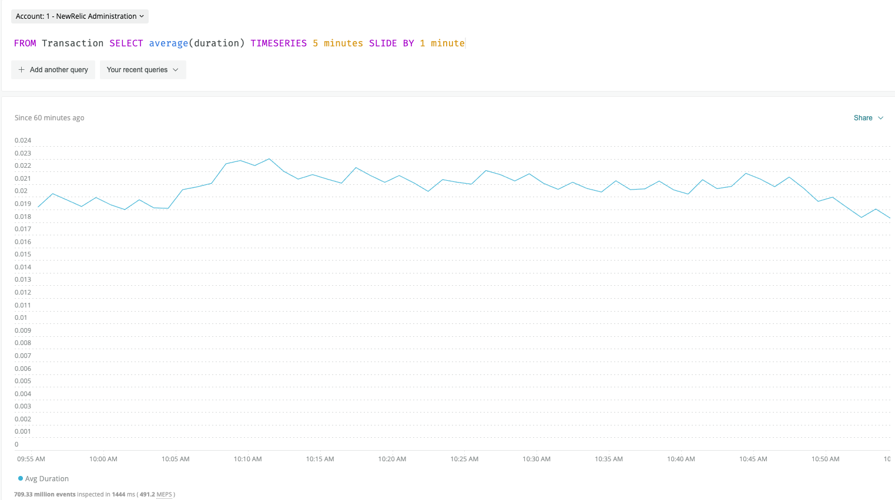

Sliding windows are a technique for generating charts using the `SLIDE BY` clause in conjunction with the `TIMESERIES` clause. With sliding windows, data is gathered in time "windows" that overlap with each other.

For example, in the image below, a query gathers data with 5 minute windows. The windows "slide" by 1 minute. Each window overlaps with the previous window by 4 minutes.


<figcaption>
  5-minute windows with 1-minute "slide"
</figcaption>

In contrast, with "tumbling" or "cascading" windows, the windows do not overlap. For example, in this `TIMESERIES 3 minutes` NRQL query, the windows are 3 minutes in length, with each beginning when the other ends. There is no overlap in the measurement interval.


<figcaption>
  3-minute windows with no overlap or "slide".
</figcaption>

## When to use sliding windows [#when-to-use]

Sliding windows are helpful when you need to smooth out "spiky" charts. One common use case is to use sliding windows to smooth line graphs that have a lot of variation over short periods of time in cases where the rolling aggregate (for example a rolling mean) is more important than aggregates from narrow windows of time.

In the example below, data varies greatly from one minute to another, so the 1-minute tumbling window chart shows many high peaks and low valleys.


<figcaption>
  TIMESERIES query without SLIDE BY clause
</figcaption>

However, in this example, 5-minute wide `TIMESERIES` windows are smoothed with the help of 1-minute `SLIDE BY` intervals. The query returns similar data but creates a much smoother chart.



<figcaption>
  TIMESERIES query with SLIDE BY clause
</figcaption>

## Valid NRQL syntax for `SLIDE BY` [#valid-syntax]

Valid NRQL syntax for the `SLIDE BY` clause will follow the format below.

```
SELECT ... TIMESERIES integer1 units SLIDE BY integer2 units
```

`integer1` specifies the sliding window width and `integer2` specifies the `SLIDE BY` interval. `units` is a time unit, such as `second`, `minute`, `hour`, or `day`. All standard NRQL time units are accepted.

Here’s a real-life example. It shows 5-minute `TIMESERIES` windows with a 1-minute `SLIDE BY` interval.

```
SELECT average(duration) from Transaction TIMESERIES 5 minutes SLIDE BY 1 minute
```

## Translation from PromQL-style queries [#translate-promql]

When applicable, a PromQL-style query is translated into a NRQL sliding window query.

For example, if your PromQL style query uses `rate(request_count[5m])` for the past 60 minutes with a 1-minute window overlap, the NRQL translation would be the query below.

```
SELECT rate(sum(request_count), 1 SECONDS) FROM Metric SINCE 3600 SECONDS AGO UNTIL NOW FACET dimensions() LIMIT 100 TIMESERIES 300000 SLIDE BY 60000
```

In the translation output, the default unit of millisecond is used for `TIMESERIES` and `SLIDE BY` clauses. For `TIMESERIES`, 300000 ms is 300 seconds, or 5 minutes, specifying a window size of 5 minutes. For `SLIDE BY`, 60000 ms is 60 seconds, specifying a slide interval of 1 minute.

## Use `SLIDE BY` with `MAX` and `AUTO` [#auto-max]

You can combine `SLIDE BY` with `MAX` and `AUTO` arguments to further tailor query results, as shown in the examples below.

```
SELECT average(duration) FROM Transaction TIMESERIES 5 minutes SLIDE BY MAX
```

```
SELECT average(duration) FROM Transaction TIMESERIES 5 minutes SLIDE BY AUTO
```

<Callout variant="tip">
  When paired with `SLIDE BY`, `TIMESERIES` does not support `AUTO` or `MAX`. The `TIMESERIES` value must be an integer time unit value. In other words, `SLIDE BY AUTO` or `SLIDE BY MAX` will work, but `TIMESERIES AUTO` or `TIMESERIES MAX` followed by `SLIDE BY` and `MAX`, `AUTO`, or a specific integer time unit is not supported.
</Callout>

<Callout variant="tip">
  The `SLIDE BY` value as determined by `AUTO` or `MAX` can produce a step interval greater than the window size, which will show up as gaps and unexpected results. If you experience these issues with query results, consider checking for instances of SLIDE BY where the step interval exceeds the window size.
</Callout>
