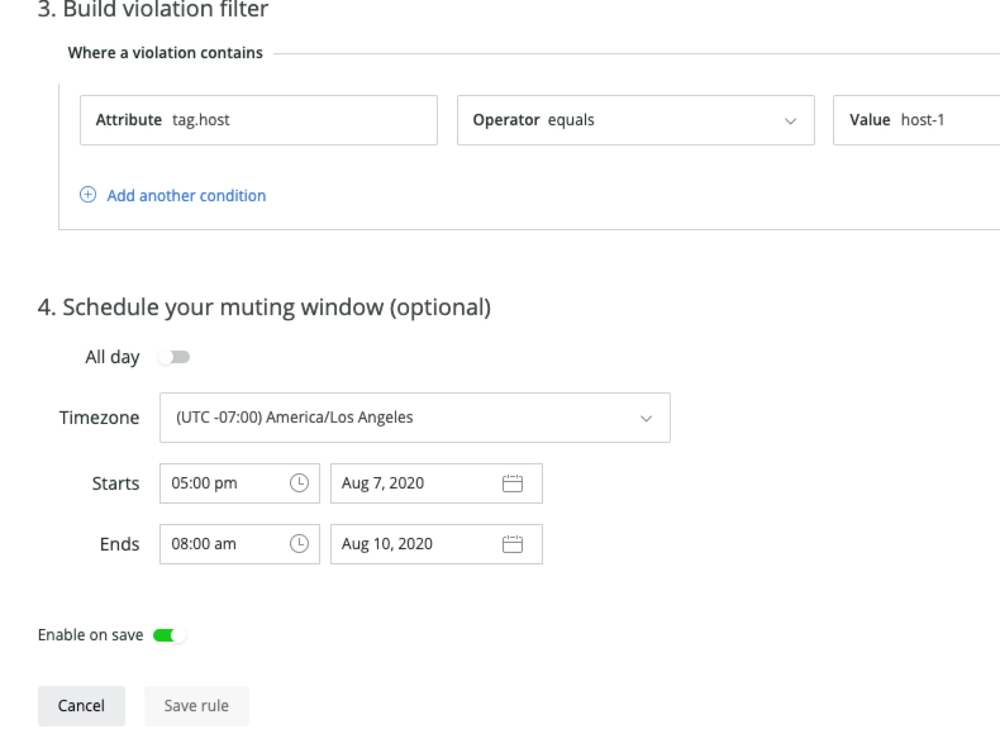

## Component: Muting Rules

### New

We added the ability to schedule the start date/time and the end date/time for Muting Rules. Details can be found in the documents here: [http://docs.newrelic.com/docs/muting-rules](http://docs.newrelic.com/docs/muting-rules)

Muting Rules can have one of the following statuses:

* **Active**: Muting is enabled and actively being applied.
* **Scheduled**: Muting is enabled but not currently active (there's a future schedule).
* **Ended**: Muting is enabled, but no longer active (there's no future schedule).
* **Inactive**: Muting is disabled.

The status is indicated in the Muting Rules list. In this list, you will also see

This feature can be managed by both GraphQL API for Muting Rules and in the Muting Rules UI.

In the Edit Muting Rules Screen, you will see the following at the bottom of the form:

Reminder : While a muting rule is active, the violations that are opened during that period will remain muted after the muting rule period is over.

What's next? Later in the year, we will be releasing support for recurring schedules. Watch this space.
