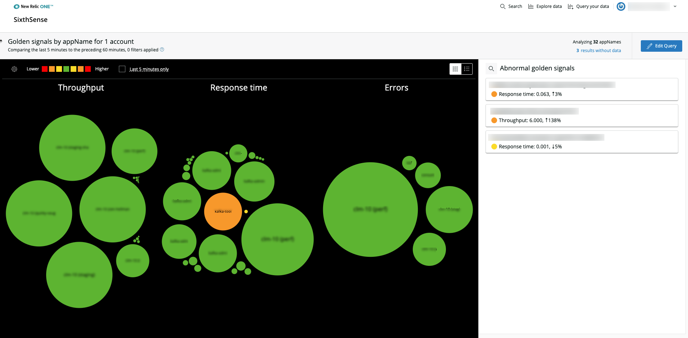

##Our new site

Github is a bit complicated, but it is exciting to use! Some of the most exciting aspects of it are:

* Open-source
* Fosters collaboration
* Allows us to communicate directly with our users

## Resources

There are a few resources you can use if you are struggling with Github:

* [Workflow doc](https://docs.google.com/document/d/1XqsaY4o6srP3G1eBKbfzIg2-ptq1zIWILaQ1nHGJkkE/edit#)
* [Markdown cheatsheet](https://guides.github.com/features/mastering-markdown/)

I want to try out an image to see where the various image fields end up:

