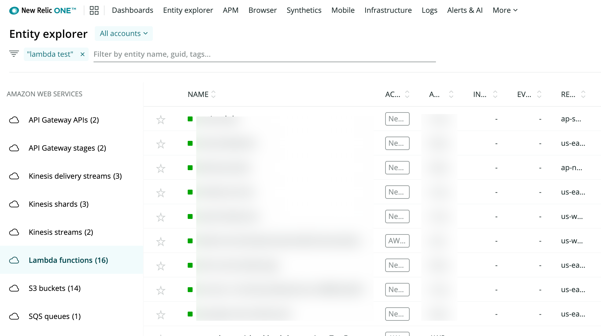

[Serverless monitoring for AWS Lambda](/docs/introduction-new-relic-monitoring-aws-lambda) offers in-depth performance monitoring for your Lambda functions. This document explains how to:

* [Find your Lambda data in the UI](#find-data)
* [Understand the UI components](#ui-pages)
* [Understand your chart data](#chart-data)
* [How to create custom charts](#chart-data)

## View your data [#find-data]

<figcaption>
  **[one.newrelic.com](https://one.newrelic.com/)> Explorer > Amazon Web Services > Lambda functions**: Click Lambda functions to see charts and details.
</figcaption>

To view your Lambda data in New Relic: Go to **[one.newrelic.com](https://one.newrelic.com/)**, click **Explorer.** In the left nav under **Amazon Web Services**, click **Lambda functions.**

For more about our UI, see [Intro to New Relic One](/docs/project-wanda-early-access-future-new-relic-platform).

<Callout variant="important">
  If you can't find your Lambda data:

  * Ensure you've followed the [instructions for enabling Lambda monitoring](/docs/install-enable-new-relics-monitoring-aws-lambda).
  * Note that this feature is different from our [infrastructure monitoring Lambda integration](/docs/integrations/amazon-integrations/aws-integrations-list/aws-lambda-monitoring-integration).
</Callout>

## UI pages

Here are descriptions of the UI pages available for our Lambda monitoring:

<table>
  <thead>
    <tr>
      <th style={{ width: "150px" }}>
        UI page
      </th>

      <th>
        Functionality
      </th>
    </tr>
  </thead>

  <tbody>
    <tr>
      <td>
        Summary
      </td>

      <td>
        The **Summary** page displays charts that give you a quick view into the most important performance data. If available, this will feature data gathered from [APM agent instrumentation](/docs/serverless-function-monitoring/aws-lambda-monitoring/get-started/enable-new-relic-monitoring-aws-lambda#instrument-lambda).
      </td>
    </tr>

    <tr>
      <td>
        CloudWatch metrics
      </td>

      <td>
        The **CloudWatch metrics** page displays Lambda data that comes from AWS CloudWatch. Charts include: invocation counts, duration, throttles, and error counts.
      </td>
    </tr>

    <tr>
      <td>
        Distributed tracing
      </td>

      <td>
        The **Distributed tracing** page shows distributed traces that include the monitored Lambda function. For details about this feature, see [Distributed tracing](/docs/apm/distributed-tracing/getting-started/introduction-distributed-tracing).
      </td>
    </tr>

    <tr>
      <td>
        Errors
      </td>

      <td>
        The **Errors** page displays errors (`AwsLambdaInvocationError` events). You can filter by error rate, error percentage, or error class. You can drill down into errors and see [attributes](/docs/using-new-relic/welcome-new-relic/getting-started/glossary#attribute) and, if available, stack traces.
      </td>
    </tr>

    <tr id="invocations">
      <td>
        Invocations
      </td>

      <td>
        The **Invocations** page lets you filter your invocations by attribute, and view duration, throughput, external calls, and invocation breakdowns.

        About invocation breakdowns: Some invocations will generate a breakdown if [distributed tracing is enabled during instrumentation](/docs/serverless-function-monitoring/aws-lambda-monitoring/get-started/enable-new-relic-monitoring-aws-lambda#instrument-lambda). Breakdowns are sampled; approximately 10% of invocations generate a breakdown. This sampling rate may be higher, depending on upstream sampling decisions.
      </td>
    </tr>

    <tr id="logs">
      <td>
        Logs
      </td>

      <td>
        The **Logs** page displays recent log messages from your Lambda function. For details about this feature, see [Logs](/docs/logs/new-relic-logs/get-started/introduction-new-relic-logs).
      </td>
    </tr>
  </tbody>
</table>

## Understand chart data [#chart-data]

Lambda data charts are generated by running [NRQL queries](/docs/insights/nrql-new-relic-query-language/using-nrql/introduction-nrql) of Lambda-related [event data](/docs/understand-your-lambda-data#data-structure). Reasons to view a chart's NRQL query include:

* To better understand what a chart is displaying
* To get ideas on how to create a custom NRQL query and chart

Related documentation:

* [Learn how to view a chart's query](/docs/using-new-relic/user-interface-functions/view-your-data/standard-page-functions#view-query).
* [Learn about Lambda data storage and structure](/docs/understand-your-lambda-data).