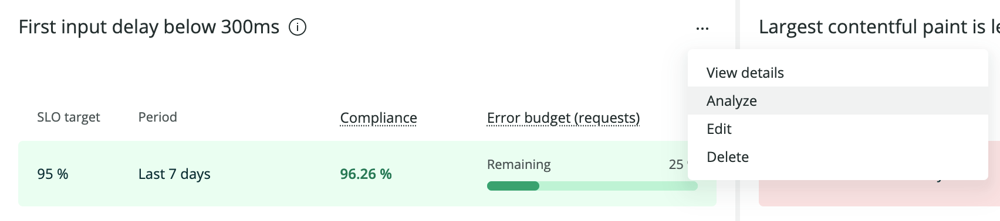
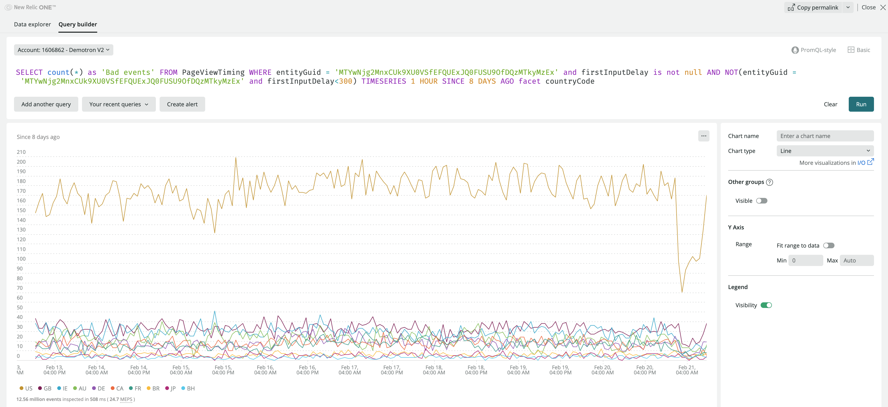

<Callout title="BETA FEATURE">
This feature is currently in [beta](/docs/licenses/license-information/referenced-policies/new-relic-pre-release-policy/).
</Callout>

After you create your set of SLIs and SLOs, New Relic will start generating SLI data. The first results will take a few minutes to appear in the [New Relic One UI](https://one.newrelic.com/). Find service levels:

* At the top nav bar, under **Service Levels** in the **More** menu (which you can customize). Here you can filter the SLIs by entity tags.
* At the previews of those [entities](/docs/new-relic-one/use-new-relic-one/core-concepts/what-entity-new-relic/) that have an SLI defined. You can find them all around the UI. For instance, click on an entity from the Explorer's [Navigator view](/docs/new-relic-one/use-new-relic-one/core-concepts/new-relic-explorer-view-performance-across-apps-services-hosts/#view-navigator).
* In **APM** services, at the reports section. 
* In any **workload** that contains the SLI entity, such as an APM service or browser application. If you want to group SLIs under a certain workload, make sure to add the APM service or browser app to an existing workload, or [create a new one](/docs/new-relic-one/use-new-relic-one/workloads/use-workloads/).

Click on any SLI to open the SLI card, which contains:

* The entity the SLI refers to, and the SLI name.
* Each row represents an SLO period with:
  * Target and time window.
  * Compliance in the SLO period. 
  * Remaining requests error budget.

### Check your SLOs state [#understand-slo]

Request-based SLOs are determined from SLIs defined as the ratio of the number of good responses to the total number of requests. This means a request-based SLO is met when that ratio meets or exceeds the goal for the SLO compliance period.

* If the SLO row has a green background, you’re doing good for the period. You may have not served successfully 100% of the requests, but you still have some remaining error budget to consume. 
* If the SLO row has a yellow background, your error budget is closer to being totally consumed, and you should be more cautious for the rest of the period.
* If the SLO row has a red background, you’ve not reached the target SLO in this period, and you’ve consumed all of your error budget. Be careful if you need to deploy, and plan some work to improve your SLIs. You can click on the SLO to see more data about the entity, such as the golden metrics, the latest deployments, anomalies, and ongoing issues. This data can help you understand when and why you missed the SLO targets.

You can define more than one SLO for the same SLI to check how fast you're consuming the error budget. For instance, if you have an error budget of 0,1% requests for a whole week, you may not want to consume most of it in a single day, or the SLO will be at risk for the rest of the week.

## Understand service levels details [#sl-details]

We provide SLI details for two main purposes:

* For SLO analysis: See in which time ranges the SLO targets were missed.
* For SLI/SLO configuration and fine tuning: Learn how New Relic calculated SLO values. 

The SLI card contains the following charts:

### Good and bad responses [#good-bad]

These are the [key concepts to analyze service levels](/docs/service-level-management/create-slm#request-response): 

* A valid request is any request that you want to count as meaningful for your SLIs. 
* A good response is any response that you consider to provide a good experience (for example, the service responded in less than 2 seconds, providing a good navigation experience for the end user).
* A bad response is any response that you consider to provide a bad experience (like the service responded with a server error, interrupting the user's flow). 

This chart shows the total number of valid requests that your service received, broken down by good or bad. 

This chart shows the actual throughput of your service, which you can use to see if there’s any correlation between the increase of throughput and bad responses.

### SLI attainment over time (%) [#sli-over-time]

It's the proportion of what you consider good responses over time. The line should stay close to 100%, meaning that most requests were served successfully.

### Compliance over the period [#compliance-time]

It's the ratio of good events (responses) to total events (requests), measured over the SLO compliance period. The closer to 100%, the closer your service is to meet the SLO target over the period. When this percentage goes below the SLO target, the chart will turn red: You need to put more effort in reliability.

### Remaining error budget (Requests) [#remaining-budget]

The error budget is an alternative way to read the SLO. It indicates what percentage of requests could still have a bad response over the SLO period, without compromising the objective. 

As the total amount of tolerated bad responses will vary with the request throughput, New Relic shows the percentage of remaining error budget: 

* As long as the remaining error budget is above 25%, you'll see green, and your SLO is good.
* When the error budget goes below 25%, it will turn yellow. This means you’re close to burning the whole budget for the period. You may want to be more careful with new deployments and changes, and plan for some reliability work.
* Once the error budget is completely spent, it will show in red.

### SLI attainment over time and SLO target (%) [#sli-attainment]

The last chart shows two time series: the (SLI attainment over time)[#sli-over-time], and the SLO target. When the SLI value is below the SLO target,your service is missing the SLO. Use this chart to learn in which time ranges your service missed the SLO target. 

## Analyze bad responses [#analyze-bad]

When an SLO is not compliant, you'll want to analyze the original data to better understand how it impacts your customers, with a special focus on what went wrong. To do this, use the **Analyze** option available on any service level. 

Click **Analyze** to open the [query builder](/docs/query-your-data/explore-query-data/query-builder/introduction-query-builder/) and drill down into the data to better understand the causes and impact of missing your SLO. You'll start from a query that represents the original NRDB bad events, that is, those events that compromised the compliance of the SLO. Next, we recommend that you use the [`FACET`](/docs/query-your-data/nrql-new-relic-query-language/get-started/nrql-syntax-clauses-functions/#sel-facet) clause to analyze a certain attribute (such as account, client id, requesting source, etc.), and detect if it particularly damages the SLO. We'll call these damaging values "detractors". 

For example, for [transaction](https://docs.newrelic.com/attribute-dictionary/?event=Transaction) data, try and facet by [`name`](https://docs.newrelic.com/attribute-dictionary/?event=Transaction&attribute=name) to see if any of the transactions for the service is returning more unsuccessful results than the rest. To learn which client is getting the highest number of unsuccessful results, try and facet by [`request.uri`](https://docs.newrelic.com/attribute-dictionary/?event=Transaction&attribute=request.uri). 

For browser [`PageViewTiming`](https://docs.newrelic.com/attribute-dictionary?event=PageViewTiming) events, you can try faceting by [`deviceType`](https://docs.newrelic.com/attribute-dictionary?event=PageViewTiming&attribute=deviceType), [`userAgentName`](https://docs.newrelic.com/attribute-dictionary/?event=PageViewTiming&attribute=userAgentName), [`userAgentOS`](https://docs.newrelic.com/attribute-dictionary/?event=PageViewTiming&attribute=userAgentOS) or [`countryCode`](https://docs.newrelic.com/attribute-dictionary/?event=PageViewTiming&attribute=countryCode).

When you detect that one or very few detractors are really degrading SLO compliance, you can take several actions: 
* First, troubleshoot the issue, and plan work to have the detractor meet the SLO. 
* You can also temporarily adjust the SLO target to a more realistic value, and plan work to improve reliability.

But if the detractor is really an exception that won't easily match the general expectations for your service performance and reliability, consider having a dedicated SLO for that case. We recommend these steps: 
* First, use a `WHERE` clause on the original SLI queries to filter out the detractor (for example, `WHERE countryCode != 'US'`). 
* Then, create a new SLI with a `WHERE` clause on the queries that only takes into account the detractor case (for example, `WHERE countryCode = 'US'`), and set a more realistic SLO target for it.
