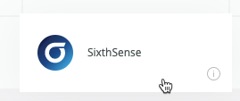
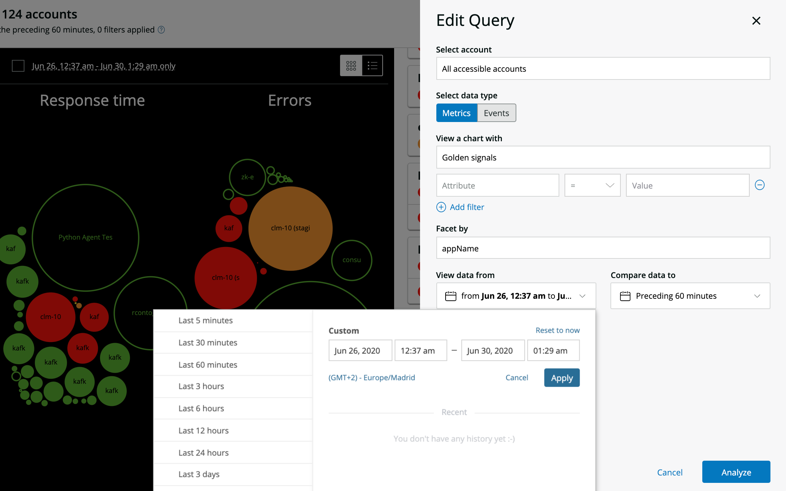

SixthSense provides visibility into your entire estate. It doesn't require any configuration — you can query anything in your estate that matters to you right now and understand your system as a whole, or dive deep into causes and effects, so you can quickly get the data you need to take action.

<Video
  type="wistia"
  id="8xh0262kj4"
/>

## Why it matters

SixthSense helps operations teams of any size to discover potential issues before they have an impact.

* Fill gaps in monitoring with full coverage out-of-the-box, without configuration or setup.
* Immediately see anything deviating from normal across your entire estate.
* Proactively spot emerging problems in a real-time visualization of all system components.
* Gain faster incidents resolution through automatically surfaced causes and effects.
* Analyze any data in New Relic database (NRDB), including third-party, open, and custom data.
* Launch into other areas of New Relic One for deeper understanding

## Get started with SixthSense

To access SixthSense, click the **Apps** button in New Relic One and locate the **SixthSense** launcher.

The default view provides insight into three key performance indicators broken down by application: **throughput**, **response time**, and **errors**. These metrics are analyzed to show how the data has behaved during the last five minutes compared to the prior hour.

**[one.newrelic.com](http://one.newrelic.com) > Apps > SixthSense**: Anything that significantly deviates from the trend is automatically discovered by SixthSense, which doesn't require any configuration.

### Circle visualization and table view [#circles]

Each application (or other facet) is represented by a circle. The size of the circles indicate the magnitude of the signal for that application and the color indicates whether the value was significantly higher or lower in the last 5 minutes, based on the standard deviation of the prior hour.

To change the color palette, click the gear icon by the low-high color legend. To get a table view of the same data, click the toggle on the right. You can also hover over each color to filter the view.

### Abnormal golden signals [#signals]

On the right, SixthSense displays the most significantly deviating applications (or other facet) in a side panel, weighted by both the magnitude of the performance indicators and the scale of their deviations. Details include the name of the key performance indicator, their magnitude during the recent time window, and the difference between the averages from one time compared to the other.

### Instant search [#search]

Click the magnifying glass icon in the side panel to open a search box. Typing into the search box filters the circles, table, and abnormal signals to applications (or other facets) that contain the text. This is a good way to quickly zoom to various subsystems. SixthSense doesn't rerun the analysis when using the instant search.

## Drill down into the details [#explore-the-data]

To analyze an application or facet, click a circle, table row, or abnormal golden signal. The details panel shows the degree of deviation of the performance indicator, a link to the affected [entity](/docs/new-relic-one/use-new-relic-one/core-concepts/what-entity-new-relic), and recent alert and deployment activity for that entity, when available.

There’s also an indication of whether the selected evaluation time period would be abnormal or not in reference to other comparison time windows, such as the same time yesterday or the same time last week. This allows you to quickly see if the abnormal behavior is odd in general, or just based on the comparison time window.

### Performance tab [#performance]

The default tab shows charts for other key performance indicators for the selected application or facet. The charts compare the two time windows being analyzed. You can clicking their titles to rerun the analysis, focusing on the selected key performance indicator.

When the target is a New Relic One application, we show the top transactions, error classes, external services, and database operations, alongside links to the relevant New Relic One features.

### Abnormal History tab [#history]

This section analyzes past performance of the selected signal and calls out any time periods with notable abnormalities. Each card represents an abnormal time window and can be clicked for more details. The charts will display any relevant violations and deployments in New Relic.

### Correlations tab [#correlations]

SixthSense can find other signals that began behaving differently around the same time as the selected signal. Clicking the name of the signal reruns the analysis, focusing on that key performance indicator. The chart titles link to New Relic One when there’s an associated entity in your account.

### Profile tab [#profile]

Based on the same technology as New Relic’s [error profiles](/docs/apm/applications-menu/error-analytics/apm-error-profiles-troubleshoot-trends), this tab compares the last 5 minutes to the prior hour by default (or whatever time windows you’ve selected with query editing) and surfaces any attributes that have significantly different distributions in the events being targeted by the selected signal.

For example, if a custom attribute indicated that a recent throughput spike came from one user, that would surface highly in Profiles if most of the traffic usually comes from many users.

### Traces tab [#traces]

If the entity has [distributed traces](/docs/understand-dependencies/distributed-tracing/get-started/introduction-distributed-tracing) available in the selected evaluated time window, the **Traces** section is enabled. Each card shows a summary of a trace and can be clicked for details. The **Explore all traces** links to the distributed traces application, filtered to the selected entity.

## Edit the SixthSense query [#edit-query]

To target signals and time windows beyond the default values, click the **Edit query** button.

To edit your SixthSense query:

1. Select the account or subaccount.
2. Select the [data type](/docs/using-new-relic/data/understand-data/new-relic-data-types) (metrics or events). Different functionality is available depending on the type.
3. In **View a chart with**, select the metric or event you are interested in. Default is golden signals (throughput, response time, and errors). You can also build custom queries (filters) to target a signal that isn't on the list.
4. In **Facet by**, select what the circles represent. Default is `appName`, but you can also choose `host` or any other facetable attribute available for the signal you’ve selected.
5. The default time windows analyzed by SixthSense are the last 5 minutes compared to the hour before. Use the time controls (**View data from** and **Compare data to**) to target other time windows.

   

   **[one.newrelic.com](http://one.newrelic.com) > Apps > SixthSense**: All event and metric data in the New Relic database can be queried using the **Edit query** feature.
6. Click **Analyze** to begin analyzing the signal you’ve selected.

## Example: Unusual increases in error count [#example-sixthsense-usage]

The default view of SixthSense shows application status across your estate, comparing the last 5 minutes to the hour before. Under regular operation, most large systems may have a handful of abnormalities, but usually most things will indicate normal behavior. Suddenly, several circles begin to change to red under the **Errors** section. This indicates that several applications are experiencing unusual increases in error count.

It may be that one or two circles for important systems are red, and perhaps much larger than they usually appear. Clicking one of these can provide more information on what is happening. You might see that the error rate is substantially elevated, even thousands of percent higher than normal. To troubleshoot this issue, here's what you might discover in the SixthSense tabs:

* **Performance** would show you data about other signals, illuminating the characteristics of the change in system dynamics.
* **Correlations** would surface other applications that are affected and how, as well as opportunities to pivot to other applications that may be closer to the underlying causes.
* **Traces**, in turn, would show distributed traces, which can provide specific examples of traffic running through those systems.
* **Abnormal history** would show other times in the past week with elevated errors, showing whether or not this problem happens regularly, such as every day at the same time or whenever there is a deployment.
* **Profiles** might show that all or most of the new errors share common properties, such as all being isolated to just one region/account/user.

Combining the information from these sections, not only can you get a sense of what is going on, but also where to focus actions to resolve the problem.

## Regulatory Audit

In the following table:

* A check <Icon style={{color: 'green'}} name="fe-check"/>
  indicates the SOC2 or FedRAMP authorized service was included in the most recent FedRAMP annual audit.
* An information circle icon <Icon name="fe-info"/>
  indicates the service will be included in upcoming annual audits and assessments.
* A caution icon <Icon style={{color: 'red'}} name="fe-alert-triangle"/>
  indicates the service is on the roadmap for regulatory framework compliance at a time frame to be determined.

<table>
  <thead>
    <tr>
      <th
        className="fcenter"
        style={{ width: "150px" }}
      >
        New Relic service
      </th>

      <th
        className="fcenter"
        style={{ width: "150px" }}
      >
        SOC2
      </th>

      <th style={{ width: "200px" }}>
        FedRAMP Moderate (Agency level ATO)
      </th>
    </tr>

    <tr>
      <td className="fcenter">
        Sixth Sense
      </td>

      <td className="fcenter">
        <Icon name="fe-info"/>
      </td>

      <td className="fcenter">
        <Icon name="fe-info"/>
      </td>
    </tr>
  </thead>
</table>
