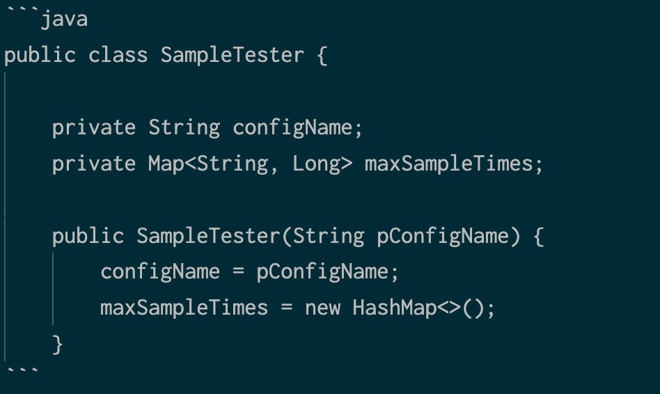

We use a variety of formatting to highlight code or other technical language. 

The following table provides some examples of our use of code format.

<table>
  <thead>
    <tr>
      <th width={200}>
        For this...
      </th>

      <th>
        Example
      </th>
    </tr>
  </thead>

  <tbody>

    <tr>
      <td>
        Command line utility names
      </td>

      <td>
        To install the utility, use `apt`.
      </td>
    </tr>
      
    <tr>
      <td>
        File paths and file names
      </td>

      <td>
        The agent looks for `newrelic.config` in the `%ALLUSERSPROFILE%\New Relic\.NET Agent` directory.
      </td>
    </tr>

    <tr>
      <td>
        Insights event names and attributes
      </td>

      <td>
        To analyze APM errors, use the `TransactionError` event.
      </td>
    </tr>

    <tr>
      <td>
        Method names
      </td>

      <td>
        To initialize the APM agent, use `startAgent()`.
      </td>
    </tr>

    <tr>
      <td>
        Non-clickable URLs
      </td>

      <td>
        In your web browser, navigate to the minion **Overview** page at `http://MINION_IP_ADDRESS`.

        The `<var>` formatting automatically applies color coding and italics in this situation.
      </td>
    </tr>
  </tbody>
</table>


These sections break down when to use specific types of code formatting.

<CollapserGroup>
  <Collapser
    id="inline-code"
    title="Inline code"
  >
    To format small code snippets within a sentence, surround the code with single backtick ( `` ` `` ) characters. For example, you might be talking about the `app_name` parameter in a sentence about agent configuration.
  </Collapser>

  <Collapser
    id="code-block"
    title="Code blocks"
  >
  To format one or more lines of code, insert three backticks ( `` ``` `` ) above and below your code. This essentially acts like the HTML &lt;pre&gt; tag.

  To add syntax highlighting to a code block, insert the language name following the first three backtacks. Here's an example that formats the handlebars template language:

  

  This is what the formatting looks like when it's published:

```handlebars
{{json data.tags}}
```

  Check in `gatsby-config.js` to see if the language you want to format is already set up in Gatsby. The list of currently supported languages appears under `prism`:

```
      prism: {
          languages: [
            'xml',
            'xml-doc',
            'c',
            'go',
            'handlebars',
            'java',
            'php',
            'phpdoc',
            'csharp',
            'python',
          ],
        },
```

  To add formatting support for a language that isn't listed, create a pull request where you add the language to the list in `gatsby-config.js`. 
  </Collapser>

  <Collapser
    id="annotate-var"
    title={<>Highlight user input with <InlineCode>&lt;var></InlineCode></>}
  >
    Use the `<var>` tag to highlight areas of a code block where a user is expected to supply their own value. For more context on when to use `<var>` tags, see [&lt;var> formatting guidelines](/docs/style-guide/writing-guidelines/code-formatting-guidelines#var).

    Follow these guidelines when you use `<var>` tags:

    * Address the reader directly
    * Use all caps and underscores `_` to separate words (also known as [SCREAMING_SNAKE_CASE](https://github.com/rubocop-hq/ruby-style-guide#screaming-snake-case)).
    * Don't use other punctuation (such as wrapping the text in angle brackets). Exception: REST API examples use a `${VARNAME}` syntax inspired by Bash conventions.

    Standard examples:

    ```
    echo "license_key: <var>YOUR_LICENSE_KEY</var>" | sudo tee -a /etc/newrelic-infra.yml
    ```

    ```
    msiexec.exe /qn /i <var>PATH\TO</var>\newrelic-infra.msi
    ```

    ```
    https://rpm.newrelic.com/accounts/<var>ACCOUNT_ID</var>/applications/<var>APP_ID</var>
    ```

    REST API v2 example:

    ```
    curl -X GET "https://api.newrelic.com/v2/applications/${<var>APPID</var>}/metrics/data.xml" \
         -H "X-Api-Key:${<var>APIKEY</var>}" -i \
         -d 'names[]=HttpDispatcher&values[]=average_call_time&values[]=call_count&from=2014-03-01T20:59:00+00:00&to=2014-03-01T21:59:00+00:00&summarize=true'
    ```
  </Collapser>

  <Collapser
    id="annotate-mark"
    title={<>Highlight important sections with <InlineCode>&lt;mark></InlineCode></>}
  >
    Use the `<mark>` tag to highlight areas of a code block that are particularly important. Most commonly, `<mark>` is used to highlight New Relic API methods in sample code that contains a lot of "other logic." When you use `<mark>`, you should usually follow the code block with a list of bullets that explain what each API call is doing and link to method syntax. For more context on when to use `<mark>` tags, see [&lt;mark> formatting guidelines](/docs/style-guide/writing-guidelines/code-formatting-guidelines#mark).

    Examples:

    <dt id="mark-example">
      Example of using the `<mark>` tag
    </dt>

    <dd>
      ```
      private void storeItem(long id) {
         Segment segment = NewRelic.getAgent().getTransaction().<mark>startSegment("storeItem")</mark>;

         segment.<mark>reportAsExternal(DatastoreParameters
                 .product("H2")
                 .collection(null)
                 .operation("insert")
                 .instance("localhost", 8080)
                 .databaseName("test")
                 .build())</mark>;

         // fire and forget
         DB_POOL.submit(() -> {
             <mark>segment.end()</mark>;
             insertData(id);
         });
      }
      ```

      The agent API calls in this sample are:

      * `startSegment(...)`: Begins the segment that will time the code. For method syntax, see the [Javadoc](https://example.com).
      * `reportAsExternal(DatastoreParameters())`: Associates the time with a datastore external call This will show up in APM with [datastore data](/docs/apm/applications-menu/features/analyze-database-instance-level-performance-issues). For more information, see [reportAsExternal API](http://newrelic.github.io/java-agent-api/javadoc/index.html?com/newrelic/api/agent/TracedMethod.html). For method syntax, see the [Javadoc](https://example.com).
      * `segment.end()`: Stops timing this segment. For method syntax, see the [Javadoc](https://example.com).
    </dd>
  </Collapser>

  <Collapser
    id="link-in-code-blocks"
    title="Link to other docs"
  >
    You can add `<a href>` tags inside your code blocks, just as you would any other content. However, make sure to use them judiciously since they can be easy to miss. A good example is the [Infrastructure config file template](/docs/infrastructure/new-relic-infrastructure/configuration/infrastructure-config-file-template-newrelic-infrayml), where each config element links to the relevant section of the main config doc.
  </Collapser>
  <Collapser
    className="freq-link"
    id="terminal-commands"
    title="Formatting terminal commands"
  >
If you have sentences that mention single-word system commands, surround these words in code tags (Markdown uses backticks ` for this) so translators don't confuse these words with words in general usage. Here are some words that translators or readers could confuse:

* `curl`: Sends http requests via a terminal session–not to be confused with the curls you do with weights at the gym.
* `cat`: Lists the first ten lines of a file–not a feline pet who ignores you.
* `date`: Displays the day, year, and time–not an outing that couples take.
* `tail`: Displays the last ten lines of a file–not the appendage on various mammals.
* `which`: Show the location of a program executable–not the pronoun.

The moral of the story: If you think a reader or translator might confuse a command with a general English word, just enclose it in backticks (`).
  </Collapser>
</CollapserGroup>