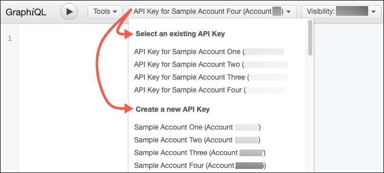
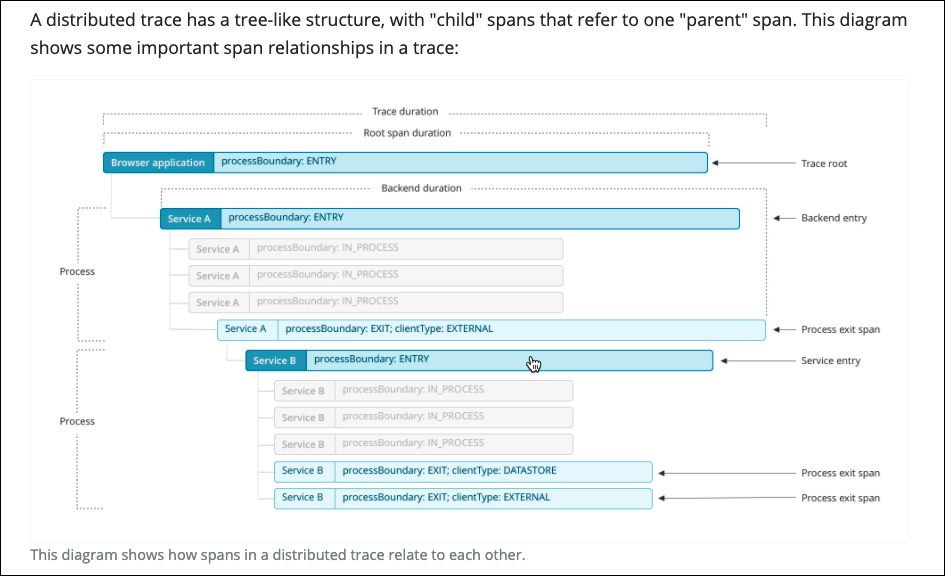

Images help to illustrate confusing UI paths, complex concepts like [config file overrides](/docs/agents/python-agent/installation-configuration/python-agent-configuration#options), or sometimes just to add visual interest. Whenever possible, send the Docs team a [permalink](/docs/accounts-partnerships/education/getting-started-new-relic/permalink) rather than an image.

The goal of this document it to give you some tips about creating images, but if you need help embedding them on our site, see [Embed images](/docs/style-guide/processes-procedures/embed-images).

## Guidelines for image types [#types]

Review the [Tech Docs team's five questions](/docs/style-guide/writing-guidelines/five-questions-help-write-docs#how) to decide how to write excellent docs and to convey information visually. Depending on the type of image, follow these guidelines.

<CollapserGroup>
  <Collapser
    id="icons"
    title="Icons"
  >
    Use the Feather icon library to [embed generic icons](/docs/style-guide/processes-procedures/embed-images#icons).
  </Collapser>

  <Collapser
    id="inline-images"
    title="Inline images"
  >
    Use [inline images](/docs/style-guide/processes-procedures/embed-images#inline-images) for buttons, icons, or other graphic elements in New Relic's user interface that Font Awesome icons cannot effectively represent.
  </Collapser>

  <Collapser
    id="graphics"
    title="Graphical illustrations"
  >
    Use graphical illustrations such as flow charts and diagrams to visualize complex ideas and as an alternative to screenshots.

    <table>
      <thead>
        <tr>
          <th style={{ width: "250px" }}>
            Best practices for graphical illustrations
          </th>

          <th>
            Comments
          </th>
        </tr>
      </thead>

      <tbody>
        <tr>
          <td>
            Choose the right level of abstraction.
          </td>

          <td>
            Make sure the flow chart or diagram clearly explains what you want to communicate but also is easy to scan.
          </td>
        </tr>

        <tr>
          <td>
            Label every item.
          </td>

          <td>
            Make sure that readers understand what each object represents.
          </td>
        </tr>

        <tr>
          <td>
            Label every connector (lines, arrows, etc.)
          </td>

          <td>
            Make sure that readers understand the relationship between connected objects.
          </td>
        </tr>

        <tr>
          <td>
            Define every use of color or shape.
          </td>

          <td>
            Make sure you use colors and shapes consistently. If two different colors do not mean two different things, then use the same color.
          </td>
        </tr>

        <tr>
          <td>
            Use nested objects to indicate independent purposes.
          </td>

          <td>
            If you need to nest objects within a larger object, make sure each object has a distinct meanings.
          </td>
        </tr>

        <tr>
          <td>
            Include a caption.
          </td>

          <td>
            Make sure your caption summarizes what the overall flow chart or diagram intends to communicate (see our caption tips below).
          </td>
        </tr>

        <tr>
          <td>
            Use sentence case.
          </td>

          <td>
            Make sure all labels are written in sentence case. Only capitalize the first letter of a first word, proper noun, acronym, or abbreviation.
          </td>
        </tr>
      </tbody>
    </table>
  </Collapser>

  <Collapser
    id="screenshots"
    title="Screenshots"
  >
   When the Docs team can't access the product or feature and the other alternatives aren't sufficient, keep in mind New Relic Security guidelines to capture screenshots or other images, and avoid private information from New Relic or from customers. In addition:

    * Always crop or mask sensitive information.
    * Avoid annotating them with text boxes, arrows, circles, etc.
    * Save the width at approximately 1200 to 1400 pixels.
    * Consider adding a caption (see our [tips](#captions) below).
  </Collapser>
</CollapserGroup>

## Guidelines for explaining images [#identify-images]

Supporting text can provide helpful context and explanation, especially for complicated screenshots and other images that may be tricky to understand on their own. While you should always include alt text for accessibility, the other types of supporting text are optional. Read on for guidelines and suggestions for when to use them.

* Alt text (required)
* Caption
* Surrounding text
* Annotations within the image

### Alt text (Required) [#alt-text]

Always include alt text in your image tags so visually impaired readers can use their screen readers to get useful information out of the images. This only applies to images that contain content or commands (for example, buttons).

<Callout variant="tip">
  Alt text doesn't apply to inline Font Awesome icons.
</Callout>

When using alt text:

* Use concise image descriptions.
* Do not repeat surrounding text—screen readers already read that.
* Aim for clarity. Complete sentences aren't required.
* Identify the type of image in some way:
  * ``
  * ``
  * ``

<CollapserGroup>
  <Collapser
    id="alt-text-example"
    title="Alt-text"
  >
    If you are using Chrome, you can view this alt-text example by right-clicking on the image and selecting **Inspect**.

    
  </Collapser>
</CollapserGroup>

### Caption [#captions]

Captions appear below images and give supporting context to readers.

Keep the following in mind:

* Keep captions short and don’t insert procedures.
* Only insert [navigation paths](/docs/style-guide/quick-reference/usage-dictionary#ui-path) in captions if navigation is a key part of the message.
* Insert complementary information not identical to surrounding text.
* Make captions that are easy to skim.
* Encourage readers to look at surrounding text.
* Do not put required information in captions that isn't available elsewhere.
* Captions aren't necessary in procedure screenshots because the procedure text should make things clear.
* Use "Figure X" to refer to images elsewhere. Include a link to the image.

<CollapserGroup>
  <Collapser
    id="caption-example"
    title="Preceding text and a caption"
  >
    Here’s an example that has preceding text and a caption:

    
  </Collapser>
</CollapserGroup>

### Surrounding text [#surrounding-texrt]

If you're not using captions or annotations, be sure to add text before or after the image to give helpful context.

If you're relying on surrounding text to explain your image:

* Use intuitive images.
* Keep the surrounding text concise so it's easier to make sense of the image.

<CollapserGroup>
  <Collapser
    id="surrounding-text-example"
    title="Text preceding and following an image"
  >
    Here's are images that don't need captions because the surrounding text explains them:

    
  </Collapser>
</CollapserGroup>

### Image annotations [#annotations]

Image annotations are text and shapes in screen captures or diagrams that help to explain the image. If an image has annotations that explain what readers need to know, captions may be redundant.

When using annotations:

* Be concise.
* Make sure annotations are easy to distinguish from UI text. For example, you may need to offset your boxes so they don't look like UI elements.
* Annotations aren't translated, so use them sparingly.
* Use our [New Relic SnagIt theme](https://github.com/newrelic/newrelic-doc-tools) (link only available to New Relic employees) to keep your annotations consistent. To import the New Relic theme:
  1. Open SnagIt.
  2. In the **Quick Styles** pane, select the **Theme** gear icon.
  3. Select **Import**.

<CollapserGroup>
  <Collapser
    id="annotations-example"
    title="Annotations as titles"
  >
    Here’s an example of an image that has an annotation at the top that acts like a title:

    
  </Collapser>
</CollapserGroup>
