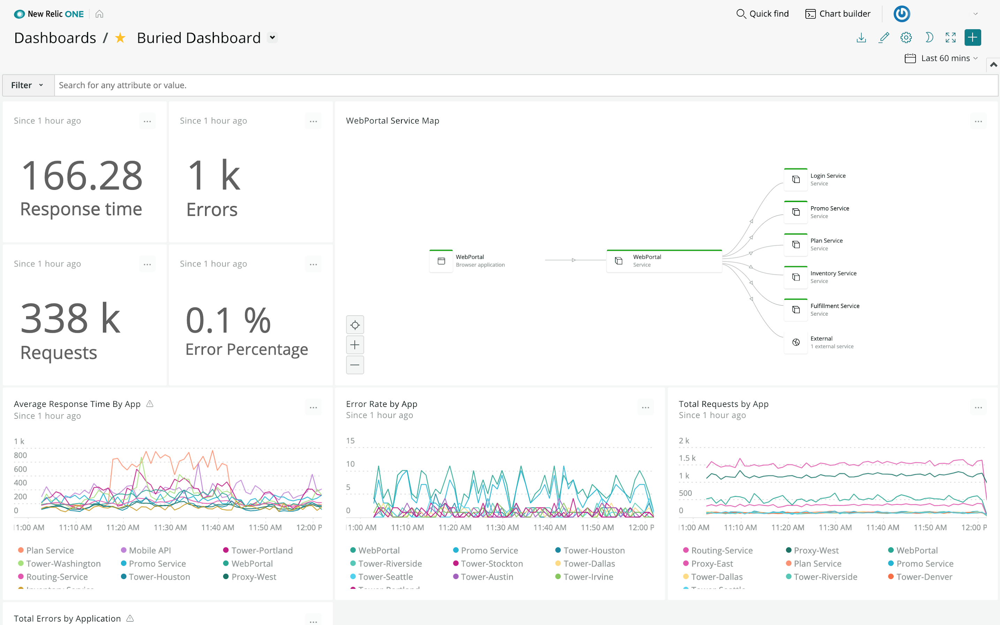

A well-chosen screenshot or image can greatly improve the readability and clarity of a doc. Too many images or an image that's tough to parse can really slow things down. 

Read on for more information about how to get an image added to one of our docs.

<Callout variant="important">
  If you're not part of the Docs team and you want to add an image to the docs site, create a [GitHub issue](https://github.com/newrelic/docs-website/issues/new/choose). 
  
  If you're a New Relic employee, contact `@hero` in the [#documentation](https://newrelic.slack.com/messages/documentation) Slack channel.
</Callout>

Here are some things to keep in mind when you're creating an image:

* Make sure your image provides useful information at a glance.
* Include a caption with helpful context for the image.
* For screenshot captions, include the path in bold.
* For video captions, include the approximate running time.

## Add an image [#add]

Our doc site images are stored in individual `images` directories at the root level of each taxonomy category. These `images` directories contain all the images used in the docs for that category. 

To add an image from scratch:
1. Find the images directory for your doc. For example, if your docs lives in `docs/style-guide/processes-procdures` you would use the `docs/style-guide/processes-procdures/images` directory. If the `images` directory does not exist, create one in [VScode](https://code.visualstudio.com/docs/getstarted/tips-and-tricks#_create-or-open-a-file) or Finder.
2. Place your image in the `images` directory. Give the image a descriptive file name: `fso-ui-overview.png` is much better than `123-go-dawgs.png`. 
3. Follow the [steps below](#embed) to embed the image in a doc. 

## Embed an image [#embed]

Use markdown to embed an image in a doc. The basic structure:

```
`
```

Here's a filled in example:

```
`
```

## Update an image [#update]

To update an image:
1. Delete the original image file in the corresponding `images` directory.
2. Place the new image file in the same `images` directory.
3. Ensure the name image file has the same name as the original file. 

## Write image captions [#labeling]

Descriptive captions help the reader know why the image matters. If it's a screenshot, it's helpful to include the path in bold in addition to a description. For example:



**[one.newrelic.com](https://one.newrelic.com) > Dashboards**: Quickly create information-dense custom views into the data that matters most to you with dashboards in New Relic One.

For more help with captions and other supporting text around images, see [Guidelines for explaining images.](/docs/style-guide/writing-guidelines/screenshots-images#identify-images)

## Add an inline image [#inline-images]

If you'd like to use an inline image, you'll use something like this:

```
From the Overview page, select your app's gear `` icon.
```

If the image is being used as an icon, always describe it first. When you embed the icon image, follow the image with the word "icon" in the text. For example, "select your app's gear  icon."

## Add a fixed width, block level image [#fixed-width-img]

Fixed width, block level images are similar in format to full column width images, except the original image width is smaller than the column width (800px) of a page. It's important that you edit the HTML like you would an inline image. This way the image will be rendered at 100% of the column width and also be responsive to smaller screen sizes.

Use these images when a screenshot is a small part of the page with a width of less than 800px, but when it still needs a caption like a full width image.

Here's an example of the HTML for a fixed width, block level image:

```
<div style="width: 100%; max-width: Npx;">
	   
	</div>
	
	<div class="dnd-legend-wrapper" style="width: 100%; max-width: Npx;">
	   <div class="meta"><p>CAPTION TEXT</p></div>
	</div>
```

## Icons

You can choose from a variety of icons to include in your docs: 

* Feather icons (prefixed with `'fe-`)
  <Callout variant="tip">
  Feather icons replace our previous Font Awesome icons.
  </Callout>
* New Relic icons (prefixed with `nr-`)
* Logos for third-party products (prefixed with `logo-`)

Here are the two places you can look to see if we have the icon you need. If the icons are in either of these locations, you can use them in your documents. At the moment, these locations have separate, non-overlapping buckets of icons (this may change):

* [Gatsby theme](https://github.com/newrelic/docs-website/tree/develop/src/%40newrelic/gatsby-theme-newrelic/icons): This is a subset of Feather, New Relic, and product logo icons that are available across the developer and docs sites.
* [Docs site Feather icons](https://github.com/newrelic/docs-website/blob/develop/src/@newrelic/gatsby-theme-newrelic/icons/feather.js#L100-L104): These are the Feather icons available in the docs project but are not included in the Gatsby theme.

### Insert icons as tag attributes

If your icon appears as an attribute inside another tag, prefix it with `icon` as in this example:

```
<LandingPageTileGrid>
  <LandingPageTile
    title="AWS Lambda"
    href="/docs/serverless-function-monitoring/aws-lambda-monitoring/get-started/monitoring-aws-lambda-serverless-monitoring"
    icon="logo-aws"
  >
</LandingPageTile>
```

### Insert inline icons

If your icon appears inside running text, use the `<Icon>` component. Here are some examples:

* Feather: `<Icon name="fe-database" />`
* New Relic:`<Icon name="nr-tdp" />` 
* Logos: `<Icon name="logo-apple" />`

### Install new Feather icons 

If you don't see the icon you want in either the [Gatsby theme](https://github.com/newrelic/gatsby-theme-newrelic/tree/develop/packages/gatsby-theme-newrelic#available-icons) or in the [docs site Feather icons](https://github.com/newrelic/docs-website/blob/develop/src/@newrelic/gatsby-theme-newrelic/icons/feather.js#L100-L104), you can add a new icon to the Gatsby theme. Here's an example of adding a "database" icon:
<Callout variant="tip">
Instead of following the instructions below, you can also ask developers to add the icon you want.
</Callout>
1. Go to [feathericons.com](https://feathericons.com/).
2. Download the "database" feather icon by clicking on the icon itself.
3. Once downloaded, open the SVG file in your text editor.
4. Grab the "guts" of the SVG, which is everything in between the `<svg>` tags. For example, if the SVG looks like this: `<svg><path m="1"></path></svg>`, then you'll grab only the `<path m="1"></path>` portion.
5. Open the list of feather icons at `src/@newrelic/gatsby-theme-newrelic/icons/feather.js`.
6. Add an entry for database and assign the code from step #4 to it. This particular icon has multiple paths, so you'll want that `<>` wrapper around it like you'll see with other icons.
7. Save that `feather.js` file.

The `fe-` prefix gets automatically added. Once that icon is added, you can use it with the Icon component, for example, `<Icon name="fe-database" />`.
