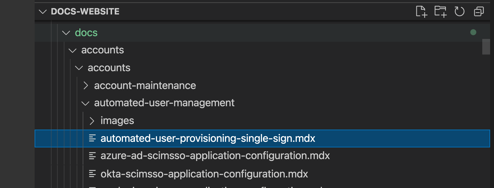
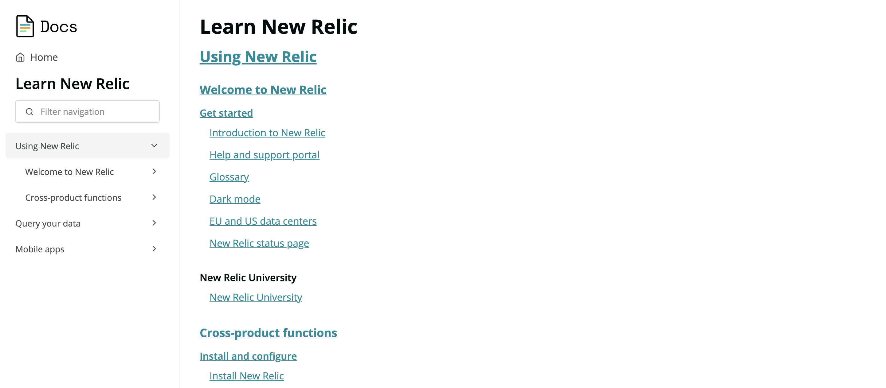

This doc contains information and procedures pertaining to the structure of the docs site, including: the nav files, the sidebar, docs category (index) views, and more. 

For succinct instructions, see [Procedures](#procedures), but it is highly recommended you understand the general concepts of how the docs site structure works if you will be doing larger docs site projects. 

## Terms [#terms]

When talking about the docs site structure, sometimes people use different words for the same things. Below is a list of terms that can help us communicate about the docs site structure: 

* **Nav files**: In the github docs site, there are yaml files under the `nav` folder that are used to determine the docs site structure that we display. This structure is exposed in the docs site left sidebar and when you view docs category views (also known as index views, like [this one](/docs/style-guide/quick-reference)). 
* **Folder**: In this context, "folders" refers to the actual docs site folder structure (those folders and files in the `content` section). Referring to "folders" can be a helpful way to differentiate between the actual folder structure and the displayed structure that's set using the nav files. 
* **Sidebar**: On public-facing docs, the sidebar is what is visible on the left hand side, showing the structure of that category of docs. The sidebar and index view are both determined by the structure set in the nav file. 
* **Category** or **sub-category**: we use these words a bit interchangeably to refer to specific areas of the docs site. For example, [this view](/docs/using-new-relic/welcome-new-relic/get-started) shows a list of docs in a specific category, as does [this higher level category view](/docs/using-new-relic). In this doc, we'll often use the phrase "category view" to indicate a page load of a specific category of docs.  
* **Auto-index pages**: This is another way, the more technical way, to refer to a category view of docs (for example, [this view](/docs/using-new-relic/welcome-new-relic/get-started)). "Auto-index page" and "category view" are used a bit interchangably in this doc, with "category view" being used as it's more informal and easy to parse. (Note that this use of "index" is a different use of "index" than the [authored index.mdx files](/docs/style-guide/article-templates/landing-page-template), which are used to display landing pages.)  

## Understand how the docs site structure works [#understand]

This section will explain some of the logic behind how the docs site structure is determined and how the structure we display to the public relates to the actual docs folder structure. 

### How is the displayed structure related to the actual folders? [#folders-vs-categories]

The actual docs folder structure (the folders and mdx files in the `content` folder) is entirely separate from the docs site structure that we display (e.g., the structure shown in the sidebar and auto-index pages like [this one](/docs/style-guide/quick-reference)). The displayed structure of the docs site is determined solely by the nav files (the yaml-format files in the `nav` folder). 

It's important to understand the above point. The divergence of the docs folder structure and the displayed docs site structure is necessary: we need a way to control the displayed site structure, which is used for the sidebar and auto-index pages, without requiring us to keep the folder structure and folder names and doc file names completely parallel and matching. Because these two things are so separate, it means we have some fairly complex behind-the-scenes logic to get them to work together. And this means that there can be fairly unintuitive aspects of how that logic works. 

We do have [procedures for common use cases](#procedures), but it will help you a lot to understand the specifics below of how the displayed structure is generated.

### What determines a doc's URL? [#doc-url]

Where a doc file (`mdx` file) is located in the `content` folder, and the associated folder and file names, are the only factors that govern that doc's URL. 
For example, consider the following doc file `automated-user-provisioning-single-sign.mdx`: 



This doc's URL is solely based on its folder location and the names of the folders. In this case, its URL is: 

```
docs.newrelic.com/docs/accounts/accounts/automated-user-management/automated-user-provisioning-single-sign
```

This has important implications, including: 

* When you move a doc from one folder to another, its URL changes, and this means that you will have to add a redirect to that doc of its original URL. 
* If you rename an mdx file name or a folder name, that changes its URL, so that means you would have to add a redirect to that doc for its original URL. 

### What does a nav file do? [#nav-file-contents]

The nav files are quite simple. A nav file controls these things: 

* The docs structure (the various levels of docs) for that category of docs. 
* The category headers, set by `title` (e.g., "On-host integrations list") and `path` (e.g., "/docs/integrations/on-host-integrations"). 
* The doc information, set by `title` (e.g., "NGINX integration") and `path` (the doc's URL).

A category and a doc in a nav file have the same elements: a `title` and a `path. What separates a category from a doc is that: 

* A category contains docs in the level below it. 
* If a category has a `path` (which isn't required but should be present for most docs), the `path` points to a `content` docs folder that has at least one doc in it. 

For more on nav file format, see [Nav file format](#nav-format)

### Where is the docs site structure exposed? [#exposed] 

The structure set in the nav files is exposed in two places: 

* The left sidebar of a doc that shows the structure of that category. When a category header in the sidebar is clicked, it shows a view of that docs site category. 
* Doc category views, also sometimes called [auto-index pages](#terms): for example, [this view](/docs/style-guide/quick-reference), which shows a particular section of docs. 

### What determines a doc's sidebar? [#doc-sidebar]

As stated above, the sidebar is just one way that the docs site structure governed by the nav files is exposed.

When a doc is loaded, the docs site searches for that URL in the nav files. If it finds a match, it displays that nav file in the sidebar with that doc highlighted. 
If it finds that doc in more than one nav file, it attempts to find the right nav file by choosing the nav that matches the top level category in the doc URL. For example, if a doc with a relative URL `/docs/accounts/accounts-billing/account-setup/create-your-new-relic-account` was in two nav files, the docs site code would search to see if one of the nav files has `docs/accounts` as its first `path` field. If it finds a match, it uses that nav file. 

For an example of a doc that is placed in two different nav files, for [this auto-index page](/docs/accounts/accounts-billing/general-account-settings) click the **Manage data** doc and see how, when it loads, it displays the sidebar for the nav file that better matches its URL. 

### When you click a sidebar category, what determines how that auto-index page displays? [#category-view]

When you click on a docs category header in the sidebar and an auto-index page loads ([like this one](/docs/apis/intro-apis)), what governs what is displayed there? Here is how this process works: 

1. A category header in the sidebar has an associated URL, which is set in the nav file. In the example nav file snippet below, the `Get started` category view has a `path` set to `/docs/apis/intro-apis`. This is what governs the sidebar heading title of "Get started" and tells it the URL to use. 


```
  - title: APIs
    path: /docs/apis
    pages:
      - title: Get started
        path: /docs/apis/intro-apis
        pages:
          - title: New Relic APIs
            path: /docs/apis/intro-apis/introduction-new-relic-apis
          - title: API keys
            path: /docs/apis/intro-apis/new-relic-api-keys
```

2. If the associated folder of that path has an `index` mdx file (representing a landing page, [like this one](/docs/agents/go-agent)), the docs site displays that landing page.

3. If there is no landing page, we display the docs and structure contained in that section of the nav file. For example, [this view](/docs/accounts/original-accounts-billing) is based on the nav file section under that category header. For this to work correctly, the docs site verifies that that `path` matches an actual docs site folder that has at least one mdx file. Put another way: if we used a completely arbitrary URL path for a category's `path`, like `docs/random-category/random-category-2`, it would not work. To display a nav file, the `path` requires an existing folder with at least one doc in there. 

Other aspects to consider:

* **A `path` is not required.** A category header in the nav file does not require a `path`; that is just what tells it to create a link and a URL for that view. If a category in a nav file lacks a `path`, it won't have a link or associated URL for it (for an example, see the ["New Relic University" category in this section](/docs/using-new-relic)). Having a category without an associated link/URL can be an acceptable choice if you are creating a category of docs that don't reside in that section and you simply want to give a helpful category view in the sidebar. 
* **Folder structure URLs aren't important.** Every folder in the docs site can be the basis for a URL, but we should only consider valuable the URLs we've chosen for inclusion in the nav files. For example, here's [a URL based on an actual folder containing one doc](/docs/accounts/accounts-billing/new-relic-one-pricing-users). But because there is no `path` in a nav file corresponding to that URL, it doesn't display anything. 

## Nav file format [#nav-format]

Below is a snippet of the [`agents.yml`](https://github.com/newrelic/docs-website/tree/develop/src/nav/agents.yml) nav file. Note that the file has indentation that corresponds to the level of the navigation hierarchy. When making changes or creating a new nav file, be sure to use the existing spacing format. 


```
yml
title: Agents
path: /docs/agents
pages:
  - title: Manage APM agents
    path: /docs/agents/manage-apm-agents
    pages:
      - title: Agent data
        path: /docs/agents/manage-apm-agents/agent-data
        pages:
          - title: Real time streaming
            path: /docs/agents/manage-apm-agents/agent-data/real-time-streaming
          - title: Custom instrumentation
            path: /docs/agents/manage-apm-agents/agent-data/custom-instrumentation
          - title: Agent attributes
            path: /docs/agents/manage-apm-agents/agent-data/agent-attributes
          - title: Custom events
            path: /docs/agents/manage-apm-agents/agent-data/collect-custom-events
          - title: Custom metrics
            path: /docs/agents/manage-apm-agents/agent-data/collect-custom-metrics
          - title: Manage errors
            path: /docs/agents/manage-apm-agents/agent-data/manage-errors-apm-collect-ignore-or-mark-expected
          - title: Link Kubernetes
            path: /docs/agents/manage-apm-agents/agent-data/link-your-applications-kubernetes
      - title: App naming
        pages:
          - title: Name your application
            path: /docs/agents/manage-apm-agents/app-naming/name-your-application
          - title: Use multiple names for an app
            path: /docs/agents/manage-apm-agents/app-naming/use-multiple-names-app
```

<Callout variant="tip">
  Navigation nesting is currently limited to a maximum of six levels deep.
  Please reach out to the engineering team if that is not enough.
</Callout>

Here are important elements of the nav file: 

<table>
  <thead>
    <tr>
      <th style="width:200px">Key</th>
      <th>Required?</th>
      <th>Description</th>
    </tr>
  </thead>
  <tbody>
    <tr>
      <td>`title`</td>
      <td>yes</td>
      <td>The text shown in the navigation, either of a doc or a category.</td>
    </tr>
    <tr>
      <td>`path`</td>
      <td>yes</td>
      <td>
        <p>The URL path to the doc or the category view. Do not use trailing slashes.</p>
        <p>For docs categories in the nav file, the `path` is required to create an index view. Without the `path`, a docs category won't be clickable as a link and won't display a view of those docs. [Learn more about index views.](#index-views) 
        </p>
      </td>
    </tr>
    <tr>
      <td>`rootNav`</td>
      <td>no</td>
      <td>`rootNav` controls whether a nav file will be displayed or hidden on the docs site home page. It is enabled by default. If you want to hide a category from the home page (as we do for our style guide docs, for example), you would set this to false, as shown below: 

```
title: Style guide
path: /docs/style-guide
```
      </td>
    </tr>    
    <tr>
      <td>`children`</td>
      <td>no</td>
      <td>This is hardly ever used. It indicates a sub-navigation node.</td>
    </tr>    

  </tbody>
</table>

## Procedures [#procedures]

Below are instructions for several common procedures. It may help you to review [the terms we use](#terms) before starting a procedure. 
Procedures include: 

* [Add a new docs category](#add-category)
* [Add a doc to sidebar/nav-file](#add-doc-to-nav)  
* [Move docs between folders or categories](#move-docs)
* [Move or delete folders](#move-delete-folders)
* [Create a "dummy" category for docs that don’t live in that area](#dummy-category)
* [Make a category heading clickable](#category-clickable)
* [Troubleshoot messed up category views](#troubleshoot-category)


### Overview of steps for a large docs site restructure project [#large-project]

For some smaller docs site edits, you can sometimes simply edit the nav files and not have to touch the doc files or folders. But for larger projects, you may want to or need to edit and move the docs files and folders themselves. Below is a broad overview of the chunks of work such larger projects generally entail. 

1. Plan out what the new nav file structure will look like, and plan out the work of moving docs files or creating new folders. It can help to write down the chunks of work a large project will entail. 
2. Move the affected doc files to their new folder locations, making sure to add redirects. For more on that, see [Move docs between folders](#move-docs-between-folders). 
3. Delete any empty folders. 
4. Edit the nav files to reflect the new desired structure and point to the new doc URLs. If there are category header `path` URLs that are no longer needed, add those URLs as redirects to specific docs (preferred) or the taxonomy redirects file. 

For more specific and granular procedures, keep reading. 

### Add a new category [#add-category]

We'll explain two procedures: adding a subcategory of docs in an existing nav file, and adding an entirely new nav file. 

#### Add a new nav file [#add-new-nav]

Adding an entirely new nav file should be rare, and something we only do occasionally during large overhauls of site structure. 

To add an entirely new nav file: 

1. Copy an existing file nav file, or create a new nav file.
2. Customize the new nav file with the categories and docs you want, using the structure of existing nav files as a template. For more on structure, see [nav format](#nav-format).
   <Callout variant="tip">
     You need at least one level of nesting inside the nav file. Without that, doc titles in the auto-generated category views will render as H2
     headings. For example, `src/content/level-one/level-two/doc` will work,
     but `src/content/level-one/doc` will produce strange formatting.
   </Callout>{' '}

#### Add a new category to a nav file [#add-nav-section]

To add a new category to a nav file: 

1. In an existing nav file, add a new category, represented by its `title` and `path`. 
2. If you're adding a `path` for that category (recommended), it must use the URL of an existing folder with at least one mdx file in it. 
3. Add the docs you want in that section. 
4. Ensure your new content matches the indenting of the surrounding nav file. 

To learn more about how this works, see:

* [How a doc's sidebar is determined](#doc-sidebar) 
* [How a doc category view is determined](#category-view)

If a category view isn't clickable, see [Make category view clickable](#category-clickable). 

### Add a doc to sidebar/nav-file [#add-doc-to-nav]

Once you [create a doc](/docs/style-guide/writing-guidelines/create-edit-content/#creating-docs), you need to place it in one or more nav files. To do this: 

1. In the nav file location where you want to locate it, add the `title` (its short title displayed in the sidebar and category views) and the `path`, which is the doc's URL. 
2. Ensure that you've emulated the indenting based on the surrounding nav file content or other nav files. 

#### Add doc in multiple sidebar locations [#add-to-multiple-sidebars]

To add a doc in more than one sidebar location, simply add that doc (its `title` and `path`) wherever you want it to be in the nav file. For more on how the sidebar is determined for docs in multiple nav files, see [Sidebar](#doc-sidebar).

You can add a doc URL in multiple nav file locations. 

### Move docs to other categories [#move-docs]

Because the nav file and the actual folder structure aren't connected, there are two different ways to "move docs": 

* Move a doc in the nav files: preferred and most common procedure.
* Move a doc between folders: less frequent, mainly when doing larger projects where we want to do a significant overhaul of the docs structure and want to ensure the folder structure doesn't become too divergent from the nav file structure. 

#### Move docs using nav file [#move-docs-in-nav-file]

You would move a doc in the nav file when you want to change its location in the displayed docs site structure (i.e., the sidebar and docs category views).

To move a doc from one place to another in the nav file: 

1. In the first nav file, copy the two rows representing that doc's entry (the `title` and `path` lines) and paste that content into the place you want it to live in the new nav file. 
2. In the new nav file section, make sure that new content is aligned properly with the surrounding nav file content. See [Nav format](#nav-format) for more about nav file structure. 

#### Move docs between folders [#move-docs-between-folders]

Note that moving docs between the folders should be relatively rare. The main reasons to do this are when the folder structure and nav file structure are becoming very different, which can be bad for a couple reasons: 

* Too much divergence can create issues with category view displays or sidebar actions. 
* Too much divergence can make finding and editing docs harder, so there can be value to keeping things fairly up to date and parallel. 

When you move a doc between folders or rename a doc, that changes its URL. Similarly, if you rename a folder, that changes the URL of all docs in that area. 

To move a doc between folders: 

1. Get the current URL of the doc you want to move and add that URL to its own list of redirects. Tips: 
	* One way to do this in VSCode is to right click the file and click "Get relative path". 
	* If you are moving many files, ask the team about ways to programmatically add redirects. 
	* Remove the trailing slash. 
2. Move the doc to the new folder. 
3. **Update nav files with the new URL**. This is easily overlooked but having the correct doc URL in the nav file, and not a redirect, is important. Note that a doc URL may be in more than one nav file so searching the site for that URL can help. 

### Move or delete a folder [#move-delete-folders]

Sometimes when we are doing a larger restructuring project, we may want to move or delete the actual folders instead of simply editing the nav files. 

If you are moving an entire folder or multiple folders to another folder, docs and all: 

1. Simply move these folders using your preferred method (e.g., using drag and drop) to the new location.
2. Next, because that move changes all the URLs of the docs and categories, you'll need to add redirects: 
  * For adding redirects for docs, see the [procedures for moving a doc between folders](#move-docs-between-folders). 
  * For category redirects: 
    1. For the section of the nav file affected by your folder editing, gather all the category URLs (`path` fields) that relate to the moved or deleted folders. **We don't need to redirect all folder-related URL paths**: we only need to redirect the nav file paths because those represent the paths that we actually link to in the docs (in other words: we aren't using folder-based URLs if they don't have a nav file `path`). 
    2. Add those category `path` URLs as redirects in specific docs or, if that won't work, in the `taxonomy-redirects` file. We should aim to add category redirects in specific docs and the reason for this is that the `taxonomy-redirects` file is hard to use and because it's a better customer experience to land on a doc versus a category if possible. In most cases, you'll be able to find a fitting doc to redirect to but if only a category view makes sense, use the taxonomy redirects file. 
3. For larger projects, this can be tough work, so you'll want to check out the build and make sure all the sidebar links and category headers are working as expected. 

For deleting folders, you'll want to essentially follow the same steps as above: either moving or deleting the docs in those folders first, gathering the affected category `path` URLs and adding them as redirects, adn then deleting the empty folders.  

### Create a "dummy" sub-category of docs that don't live in that category [#dummy-category]

Sometimes you want to create a category of docs that is there to help expose a related doc or set of docs. For example, in this view, we have added a category for 'New Relic University' even though that's not a doc that lives in that section; in this case, it's not even a doc on our site. 



In the example above, this 'New Relic University' category header is in regular text and not a link, and that's because it doesn't have a `path` set for it in the nav file. This also means that in the sidebar, this category header is not a clickable link and simply functions as a collapser/expander. This is acceptable if you don't mind it but below we explain how you can get a clickable category if you need it. 

To create a so-called "dummy" category: 

1. [Add the category structure](#add-nav-section) you want in the nav file. 
2. If you're okay not having a clickable category header, your new category doesn't require a `path`. If you want a clickable category header, you will need to use or create a folder that matches the new category `path` and that has at least one mdx file in it ([details](#category-view)). 
3. In the nav file, add the title and path information for the docs you want in that new category.
4. Test your new category to ensure it is working correctly. 

### Make a sidebar category heading clickable [#category-clickable] 

If there's a sidebar category that's only acting as an expander/collapser and doesn't have a link, that's because it either a) doesn't have a `path` set in the nav file, or b) that `path` goes to a folder that doesn't have a doc in it. For more on this, see the [instructions regarding clickable headers in the "dummy" category section](#dummy-category).

### Troubleshoot category views not working correctly [#troubleshoot-category]

If a docs category view is not working correctly, review [how category views are formed](#category-view). If this does happen, get another opinion from another tech writer to make sure you're not missing something, as we should rarely have problems.  

One reason that a category view might not work is specifically for `path` URLs that are also landing pages. In this case, if that `path` is used in more than one location in the same nav file, the docs site can be confused about which category view to use. We may fix this with a coding fix but in meantime: consider pointing to other URLs and not that path, so that there's only one use of that `path` per nav file. 


