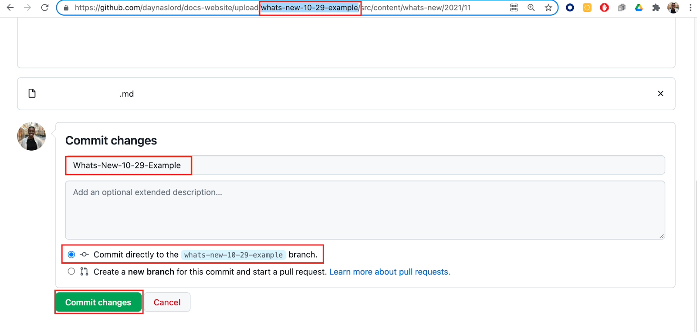

If you're a contributor who wants to create a "What's new" post about a new feature, here are instructions for publishing your announcement in the [New Relic UI](https://onenr.io/0Zyw4MX1MR3) and the [docs site](/whats-new/). The process takes from one to three days and looks like this:

1. You submit your PR (pull request) to the docs website.
2. A product marketing manager will review your post and work with you to make any content improvements.
3. The product marketing manager hands your work off for review and publication by the technical documentation team.

If you need more background about these posts, check out this [NerdLife article](https://nerdlife.datanerd.us/new-relic/whats-new-is-live-a889f7cc-fa4a-4f4f-8b4b-9b1517d573cc) or check out our [guidelines](/docs/style-guide/writing-docs/article-templates/whats-new-style-guidelines/) for the content. 

## Prerequisites [#prereqs]

Here are some tips to help you get started:

* These instructions refer to [VS Code](https://code.visualstudio.com/), but you can use any text editor you like.
* You should also download and save the “What’s new” markdown template (Updated Nov. 2021), which shows some tricks for formatting in Markdown.
* If you don’t already have one, create a personal GitHub account (not for Enterprise GitHub).
* The following instructions assume you’ll be working directly in the GitHub UI, but if you are familiar with Git, you can push your changes from your computer using the command line, GitHub CLI, GitHub Desktop, or related tools.

## Create a “What’s new” file [#create-a-file]

Create your Markdown file (.md) like this:

1. In VS Code, open the “What’s new” template.
2. Create a new file by clicking  **File > New File**. 
3. Copy everything in the “What’s new” template (CTRL + A) and paste it (CTRL + V) into the empty file.
4. Save the file to a convenient working directory and give it a name with this format: `whats-new-MM-DD-descriptive-words.md`(for example, `whats-new-5-28-in-context-alerting.md`).
5. In the new file, replace the template prompts with your own content. If you need more help with each section, see our [What’s new guidelines](/docs/style-guide/writing-docs/article-templates/whats-new-style-guidelines).
6. Save the photos you want embedded in your file to the same working directory on your computer. 

## Create or update a fork of the docs site

A fork is just a copy of the entire docs repository that will reside in your personal GitHub account. You'll add your changes into the fork, and then make a PR (pull request) asking us to merge the changes in your fork with the New Relic develop branch.

1. If you’ve never forked the docs site, go to [https://github.com/newrelic/docs-website](https://github.com/newrelic/docs-website), and click **Fork** at the top right corner of the page.

2. If you already have a fork of the docs site, update your repo by clicking **Fetch upstream** and then clicking the green **Fetch and merge** button. 

## Create a branch [#create-branch]

Once you have a fork, create a new branch for your post.

1. Click **develop**. 

2. In the **Find or create a branch....** box, enter a name for your new branch: ‘whats-new-[number of month]-[day]-[feature name]’ (for example, whats-new-10-25-aggregation-methods) and click **Create branch: [name you created in the box for your branch] from 'develop'**. 

## Add your "What's new" Markdown file [#upload-md]

Upload the `.md` file for your post:

1. Go to **src > content > whats-new > (current-year) > (current-month)**.

2. Click **Add File** and then **Upload files**.

3. Drag the “What’s new” file from your Finder (Mac) or Explorer (Windows) to the space or click choose your files and select your file.

4. Under **Commit changes**, enter a commit message that follows this pattern: `feat(whats-new): your-post-in-a-few-words`. This means you’re adding a post about a feature (feat). Example: `feat(whats-new): Add automap post`. 
 
 5. Select the option to **Commit directly to the [name of your branch] branch**, and then click the green **Commit changes** button.

<Callout variant="important">
Do not click the **Compare and pull request** green button in the yellow banner that appears at the top of your screen. You’ll do this later!
</Callout>

## Add image files to your post [#add-images]

Images are not required, but if you have them, the routine is similar to uploading your Markdown file:

1. Click the **src** folder. 

2. Click the **content** folder. 

3. Click the **whats-new** folder.

4. Click the folder for the current year.

5. Click the respective month’s folder (for example, January = 01; February = 02; etc.) If you don’t see a folder you need, see the instructions following this section.

6. To add the image(s) for your post, click the images folder. 

7. Click **Add file** and **Upload files**.

8. Drag the image(s) file(s) from your Finder (Mac) or Explorer (Windows) to the space or click **choose your files** and select the image(s) file(s). 

9. In the **Add files via upload** box, enter the name of your image from the “What’s new” file, select the option to **Commit directly to the [name of your branch] branch**, and then click the green **Commit changes** button. 

## Create a PR [#create-pr]

The PR (pull request) is the way you ask the Technical Publications team to merge your changes into their develop branch.

1. Click the Compare & pull request green button in the yellow banner that appears at the top of your screen.  

2. In the main field, create a brief title for the PR (for example, `"What's new" automap post`).

3. In the **Write** tab, remove the existing content and replace it with any instructions you have about the post. For example, include the date and time it should be published.

4. Click **Create pull request**.

After you finish making the PR, one of the Product Marketing Managers will review the post and reach out to you with any concerns. Once they approve it, they will pass it to the docs team to make finishing touches and publish it. If you need additional help, ask our documentation hero.

