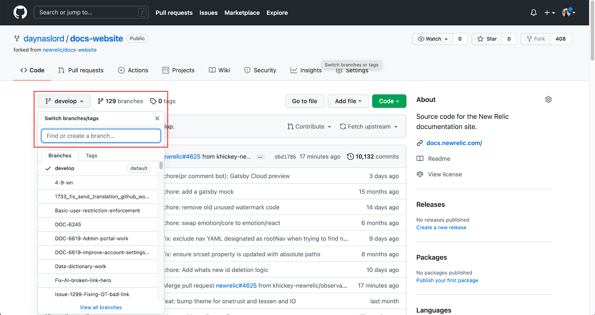
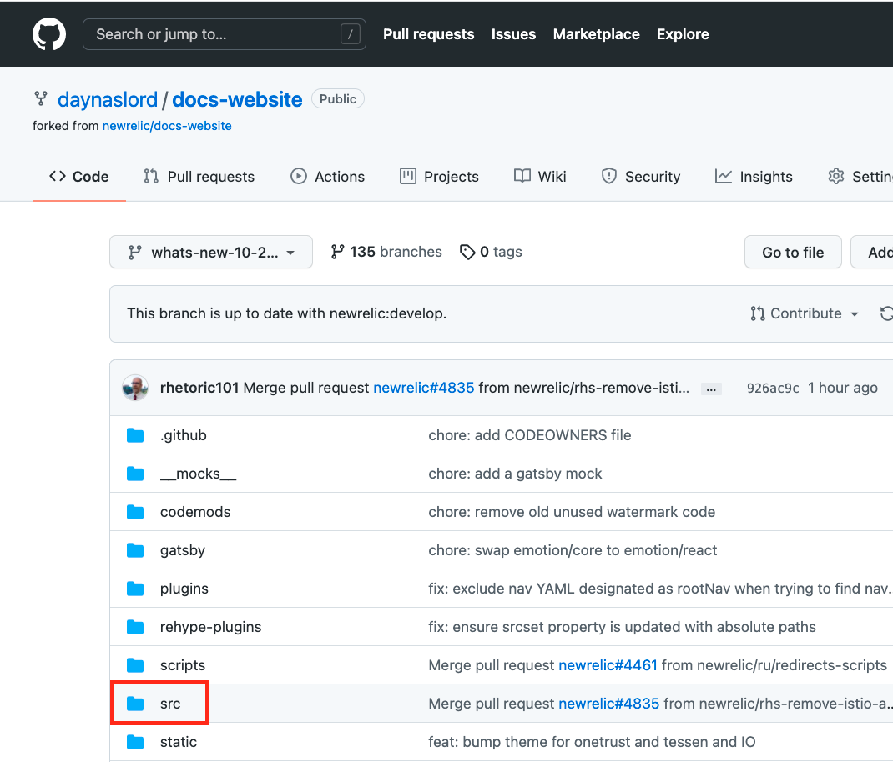
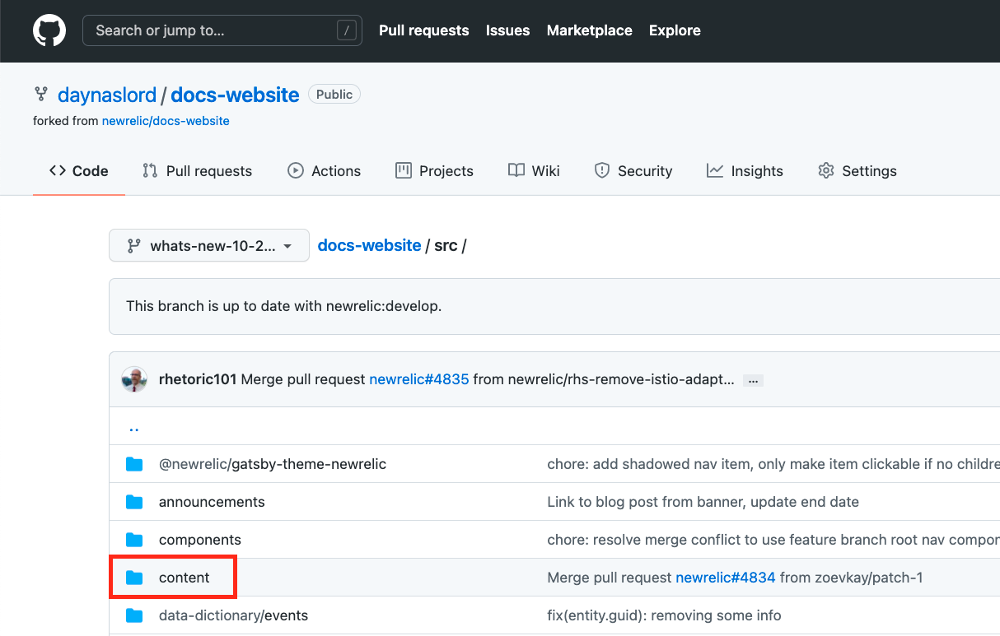
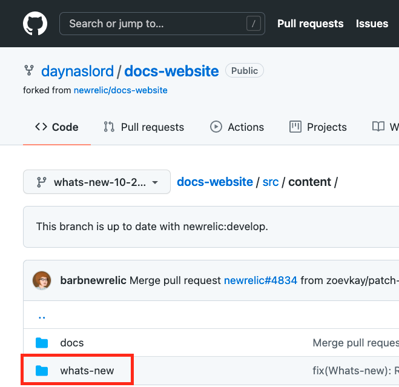
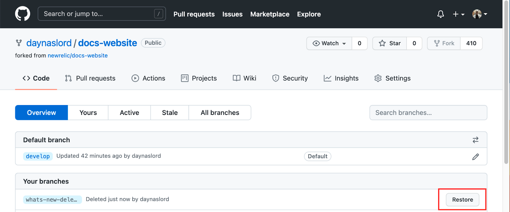
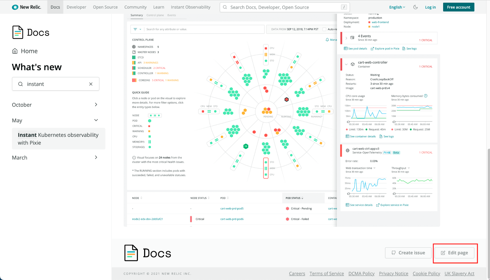

If you're a New Relic employee and want to make an announcement to customers about a new feature, one option is to use `What's new`. This is a carefully curated channel of timely, high-level announcements of major features. 

`What's new` posts supplement release notes and technical product deep-dives in our blog posts and community forums. The posts appear in the [New Relic UI](https://onenr.io/0Zyw4MX1MR3) (behind the megaphone icon) and the [docs site](/whats-new/).

The process to get a post published takes from one to three days and looks like this:

1. You submit your `What's new` pull request (PR) to the docs website.
2. A product marketing manager reviews your post and may suggest improvements.
3. The product marketing manager hands your work off to the technical documentation team for final review and publication.

## Before you start [#before-you-start]

Here are some tips to ensure a smooth process:

* These instructions refer to [VS Code](https://code.visualstudio.com/), but you can use any text editor you like.
* If you don't already have one, create a personal GitHub account (not for Enterprise GitHub) using a non-New Relic email address.
* The following instructions tell you how to do most of this directly in the GitHub UI, but if you are familiar with Git, you can push your changes from your computer using the command line, GitHub CLI, GitHub Desktop, or related tools.
* A detailed template is included below to help you format the content of your post. After you become familiar with making posts, you can reuse old posts and just change the details.

## Prepare the files for your post [#create-a-file]

`What's new` posts consist of a Markdown file (`.mdx`) explaining the feature, along with optional image files. Here's how to prepare your Markdown file and images:

1. In VS Code, create a new file by clicking  **File > New File**. 
2. Copy the sample template below and paste it into the new, empty file.

	```md
	---
	title: 'Insert a title here' 
	summary: 'Insert a brief description of the feature' 
	releaseDate: 'yyyy-mm-dd' 
	learnMoreLink: 'https://example.com' 
	getStartedLink: 'https://example.com'
	---
	## Front matter tips (remove section this before publishing)

	The front matter is the group of lines at the top of the post before your content begins. The front matter is sandwiched between lines containing three dashes. Here's what you need to know about each front matter line:

	* title (required): The title field is how your readers will browse through `What's new` and find what interests them. Make your titles as short as possible and include the most relevant product and feature names. The more specific you get, the more likely people will be to read the post. As with other pages on the site, use sentence case for titles (Only one capital letter at the beginning of the title). 
	* summary (required): A brief description of the feature that appears directly under the title in the left sidebar and at the top of the post. Make sure your summary is a single sentence and isn't more than about 10-20 words.
	* releaseDate (required): The date a feature is released. `What's new` posts are organized chronologically. This controls where a post will show on the list. If you have two or more posts on the same date, use the time field to control the post order.
	* learnMoreLink (optional): Learn more links are used to highlight blog posts or other marketing material that provides more information about the feature. Remove this if you are not using it!
	* getStartedLink (optional): This is a link to to documents that explain how to set up the feature. Remove this if you are not using it!

	## Word wrap (remove section this before publishing)

	If you're using VS Code and want to turn on text wrapping to make it easier to edit:

	* Windows: Ctrl + Shift + press the key `p`. Now on the command line, type Toggle Word Wrap and press Enter.
	* Mac: Command + Shift + press the key `p`. Now in the command line, type Toggle Word Wrap and press Enter.

	## Heading format (remove section this before publishing)

	Headings are not required, but they are helpful if you need to divide the material into at least two sections. We don't recommend headings unless you use them in pairs.

	Headings are preceded by two hash symbols and a space. Use sentence case, which means only one capital letter at the beginning.

	## Body format (remove section this before publishing)

	The body is all the copy after the front matter. It ranges from 150-400 words and is where you tell the story about your new feature. 

	TIP: If possible, include one or more screenshots or a video.

	The goal of the post is to inform people about the feature. Here are some questions to keep in mind:

	* What is the most important idea to communicate about this feature?
	* What problem does this feature solve?
	* How does it make using New Relic easier?
	* What's delightful about it?
	* Can you add a great, visually appealing screenshot or video?

	Don't include procedural how-to content. Use `getStartedLink` and `learnMoreLink` in the front matter to link to information about how to use the feature.

	## Links (remove section this before publishing)

	[Lorem ipsum](https://example.com)-You can have spaces between words in square brackets but not in the link inside parentheses.

	WARNING: Remember to use absolute URLs in links (for example, always include the protocol followed by the domain: "https://whatever_domain/path-to-doc")–including references to the New Relic docs site.

	## Videos (remove section this before publishing)

	Use embed code. The example below is an embedded YouTube video. You would replace the value for src with your link:

	<iframe width="560" height="315" src="https://www.youtube.com/embed/04JP0ky_hjI" frameborder="0" allow="accelerometer; autoplay; clipboard-write; encrypted-media; gyroscope; picture-in-picture" allowfullscreen></iframe>

	## Images (remove section this before publishing)

	Note that you need to use image files you upload to the repository. You can't link to images hosted on other sites.
  
  Here's the image format:

	

	Example: 

	You can add a caption to images with this HTML tag: <figcaption>Screenshot explaining the image</figcaption>.

	Remember to add your image(s) to "images" folder in the Github pull request. 

	## Bold format (remove section this before publishing)

	Use double asterisks to bold words for UI labels or simply for emphasis: **bold**

	## Lists (remove section this before publishing)

	Use this format to create an ordered list (used for sequential steps):
	1. Step one
	2. Step two
	3. Step three

	Use this format to create bullet lists (used for non-sequential information):
	* Important detail
	* Important detail
	* Important detail
	```

3. Replace the template examples with your copy. When you finish, it might look something like this finished post:

  ```md
  ---
  title: 'Control data ingest costs with ingest drill-down'
  summary: 'Analyze the data that you send to New Relic'
  releaseDate: '2021-06-30'
  learnMoreLink: 'https://docs.newrelic.com/docs/telemetry-data-platform/manage-data/manage-data-coming-new-relic/#facet-data-ingest'
  getStartedLink: 'https://one.newrelic.com/-/0gbRKzygzwE'
  ---

  Inspect your data consumption in New Relic to better manage your data ingest and costs. Understand your data usage by each data source, and analyze it using your existing metadata, such as by source, team, and any other data sample attribute.

  To get started, go to the **Data management hub** and select the **Data ingestion chart**. Get detailed insights by data source by clicking on the colored data band at any point in time that you’re interested in. Add "facets" to analyze your data by selected attributes. [**Learn more**](https://docs.newrelic.com/docs/telemetry-data-platform/manage-data/manage-data-coming-new-relic/#facet-data-ingest) and [**get started**](https://one.newrelic.com/-/0gbRKzygzwE).

  

  <figcaption>To find your data ingest consumption, click Manage your data, then click Data ingestion.</figcaption>

  

  <figcaption>Click the chart to see ingestion by data source.</figcaption>
  ```

4. Save the file to a convenient folder and give it a name with this format: `whats-new-MM-DD-descriptive-words.md`(for example, `whats-new-5-28-in-context-alerting.md`).
5. Save the images you reference in your Markdown file to the same folder on your computer. 
    * Make sure you don't have any spaces in image file names. You can replace spaces with dashes or underscores like this: `automap_preview.png`. 
    * Make sure all your references to images in the Markdown file are prefixed with `./images/` like this: `./images/automap_preview.png`. This is because you'll eventually upload  them to the `images` folder in GitHub.

## Create or update a fork of the docs site [#create-update-fork]

A fork is just a copy of the entire docs repository that will reside in your personal GitHub account. You'll add your changes into the fork, and then make a pull request asking us to merge the changes in your fork with the New Relic `develop` branch.

1. Go to [https://github.com/newrelic/docs-website](https://github.com/newrelic/docs-website), and if you haven't forked the site yet, click **Fork**. Skip to step 2 if you've already forked the docs site.
  

2. Update your repo by clicking **Fetch upstream** and then clicking **Fetch and merge**.
  

## Create a branch [#create-branch]

Once you have a fork, create a new branch for your post.

1. Click **develop**. 
  

2. In the **Find or create a branch....** box, enter a name for your new branch: `whats-new-[number of month]-[day]-[feature name]` (for example, `whats-new-10-25-aggregation-methods`) and click **Create branch: [name you created in the box for your branch] from 'develop'**. 
  

## Upload your Markdown file [#upload-md]

In this step, you click through various GitHub directories to find the appropriate one for the year and month of your post.

1. Click the **src** folder.

  

2. Click the **content** folder. 

  

3. Click the **whats-new** folder.  
  

4. Click the folder for the current-year, followed by the folder for the current month (for example, January = **01**; February = **02**; etc.).

5. Once you reach the folder for the appropriate year and month, click **Add File** and then **Upload files**.
  

6. Drag the “What's new” file from your Finder (Mac) or Explorer (Windows) to the upload box or click **choose your files** and select your file.
  

7. Under **Commit changes**, enter a conventional commit message that follows this pattern: `feat(whats-new): describe your post in a few words`. This format tells us you’re adding a post about a feature (feat). Example: `feat(whats-new): add automap post`. 
 
8. Select the option to **Commit directly to the [name of your branch] branch**, and then click **Commit changes**.
  

<Callout variant="important">
Do not click the **Compare and pull request** button in the banner that appears at the top of your screen. You'll do this later!
</Callout>

## Upload your image files [#add-images]

Note that if you use image files, they need to be ones you upload to the repository. You can't link to images hosted on other sites.

The routine is similar to uploading your Markdown file:

1. Click the **src** folder. 


2. Click the **content** folder. 


3. Click the **whats-new** folder.


4. Click the folder for the current-year, followed by the folder for the current month (for example, January = **01**; February = **02**; etc.).

5. Click the **images** folder. 

6. To upload your image files, click **Add file** and **Upload files**.
  

7. Drag the images files from your Finder (Mac) or Explorer (Windows) to the space or click **choose your files** and select the images files. 
  

8. Under **Commit changes**, enter a conventional commit message similar to what you did for the Markdown file (for example: `feat(whats-new): add automap images`). 

9. Select the option to **Commit directly to the [name of your branch] branch**, and then click **Commit changes**. 
  

## Create a pull request (PR) [#create-pr]

The pull request is the way you start the process to request a merge of your changes into the the main docs web site. 

1. Click **Compare &amp; pull request** that appears at the top of your screen.  
  

2. In the main field, create a brief title for the pull request (for example, `"What's new" automap post`).

3. In the **Write** tab, replace the writing prompts with any instructions you have about the post. Here are some important instructions to include:

    * Specify the date and the time window when it should be published (morning, mid-day, or evening). 
    * Tell us if this post doesn't need a review by a product marketing manager. 

4. Click **Create pull request**.
  

5. If you haven't already signed the CLA (contributor license agreement), you get a prompt in the pull request reminding you to sign it. Make sure you sign this to ensure the PR is accepted:
  

After you complete the pull request, one of the Product Marketing Managers will review the post and reach out to you with any concerns. Once they approve it, they will pass it to the docs team to make finishing touches and publish it. If you need additional help see the additional tasks below, or ask our documentation hero.

## Delete a branch to start over [#delete-a-branch]

Sometimes you might make a mistake and want to start over. Here’s how you delete a branch in your own fork:

1. Click the **Code** tab, and then click **branches**.
  

2. Find the branch you want to delete, and click the red trash can icon. 
  

3. If you accidentally delete a branch, you can always click **Restore**. 
  

## Edit a live post [#edit-live]

Sometimes you'll need to make changes to `What's new` posts that are already public:

1. Go to [https://docs.newrelic.com/whats-new/](https://docs.newrelic.com/whats-new/) and use one of these methods to find your post:
    * In the left-hand navigation pane, search for the post by date or by using the **Filter navigation** box.
    * Scroll to the date of the post on the main page and click the post.
  

2. Click **Edit page** at the bottom right of the page. 
  

3. In GitHub, click the pencil icon. 
  

4. Make your edits to the text or add/replace files by dragging and dropping, selecting or pasting them.

5. Click **Propose** changes at the bottom left of the page.
  

6. Review all your changes and once it looks good, click **Create pull request**.
  

7. When you see a second **Create Pull request** button, click it to finish submitting the pull request.
  
