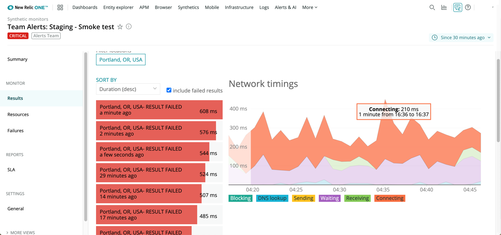

<LandingPageHero>
  <HeroContent>
    New Relic's synthetic monitoring simulates user traffic around the world so you can detect and resolve poor performance and outages before your customers notice. Use our suite of automated, scriptable tools to monitor your external and internal websites, critical business transactions, and API endpoints.

    To prevent slow results and failures, focus on three key areas:

    * **Availability:** Proactively ensure uptime, enforce SLAs, and ensure site reliability for your customers. Benchmark performance before, during, and after a cloud migration.
    * **Functionality:** Before and after you deploy new features or a new site, run tests and scripts to ensure everything works. Analyze actual or simulated end-user data about load time, availability, and errors.
    * **Performance:** Explore your data to understand the speed of your internal and external sites, individual page loads, assets rendering on pages, and API results.

    Your synthetic monitoring data is part of [New Relic One](/docs/new-relic-one/use-new-relic-one/get-started/introduction-new-relic-one). This immediately provides context about site failures against the health of your underlying applications (APM), end-user browser monitoring, and your infrastructure.

    <ButtonGroup>
<ButtonLink
 role="button"
 to="https://newrelic.com/signup"
 variant="primary"
>
 Sign up for free
</ButtonLink>
</ButtonGroup>
No credit card required. Already have an account? [Login](http://one.newrelic.com/).

  </HeroContent>

  

  <figcaption>
    This example shows how you can use synthetic monitoring in New Relic One to get actionable information about site availability, functionality, and performance.
  </figcaption>
</LandingPageHero>

<LandingPageTileGrid>
  <LandingPageTile
    title="Get started."
    icon="fe-check-square"
  >

    * Learn about our [synthetic monitoring capabilities.](/docs/synthetics/new-relic-synthetics/getting-started/introduction-new-relic-synthetics)
    * [Add monitors, scripted browsers, API tests, or containerized private minions](/docs/synthetics/new-relic-synthetics/using-monitors/add-edit-monitors) in Docker or Kubernetes cloud environments.
    * Use our [scripted browser examples](/docs/synthetics/new-relic-synthetics/scripting-monitors/scripted-browser-examples), or use our [reference of available functions](/docs/synthetics/new-relic-synthetics/scripting-monitors/synthetics-scripted-browser-reference-monitor-versions-050).
  </LandingPageTile>

  <LandingPageTile
    title="Troubleshoot and resolve problems."
    icon="fe-alert-triangle"
  >

    * Use [alerts](/docs/alerts/new-relic-alerts/getting-started/introduction-new-relic-alerts) and [Applied Intelligence](/docs/new-relic-one/use-new-relic-one/new-relic-ai/introduction-new-relic-ai) for key performance indicators.
    * [Monitor](/docs/synthetics/new-relic-synthetics/using-monitors) your internal and external websites, workflows, and [API endpoints](/docs/synthetics/new-relic-synthetics/scripting-monitors/write-api-tests).
    * [Compare page load time](/docs/synthetics/new-relic-synthetics/administration/compare-page-load-performance-browser-synthetics) between real user browser interactions and your synthetic monitors.
  </LandingPageTile>

  <LandingPageTile
    title="Optimize performance."
    icon="fe-tool"
  >

    * See real-time performance in the [UI](/docs/synthetics/new-relic-synthetics/pages).
    * Build [test scripts](/docs/synthetics/new-relic-synthetics/scripting-monitors/introduction-scripted-browser-monitors) to ensure critical processes like login and checkout always run smoothly.
    * [Query](/docs/using-new-relic/data/understand-data/query-new-relic-data) your data, and share [charts and dashboards](/docs/dashboards/new-relic-one-dashboards/get-started/introduction-new-relic-one-dashboards) showing patterns for improving site performance.
  </LandingPageTile>
</LandingPageTileGrid>

<ButtonLink
  role="button"
  to="/docs/synthetics/table-of-contents"
  variant="primary"
>
  View all synthetic monitoring docs
</ButtonLink>
