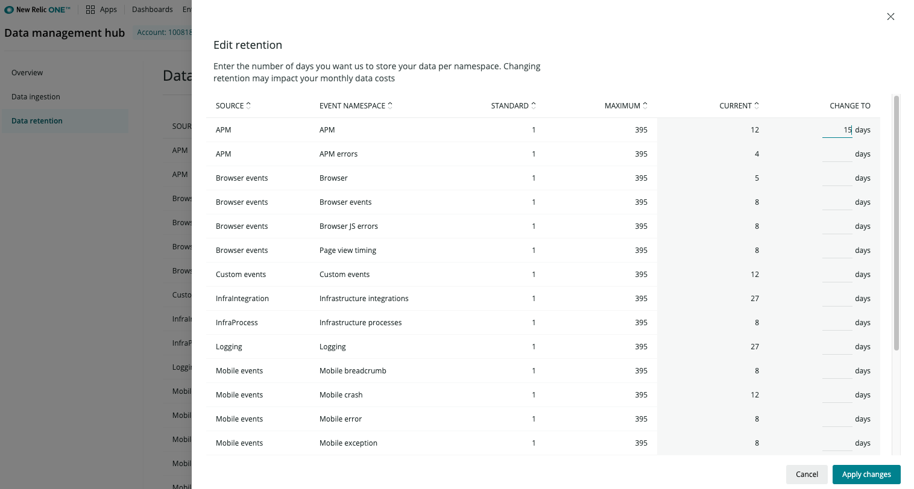

This doc applies to accounts on our [New Relic One pricing plan](https://docs.newrelic.com/docs/accounts/accounts-billing/new-relic-one-pricing-users/pricing-billing). If you're on our original product-based pricing plan, see [Original data retention](/docs/accounts/original-accounts-billing/product-based-pricing/overview-data-retention-components). Not sure which you're on? See [Overview of pricing and account/user structure](https://docs.newrelic.com/docs/transition-guide-our-new-pricing-plan-user-model).

Review and manage how long your data will be stored in the New Relic database (NRDB) on the **Data retention** page. You can also review the sources of data that you’re storing, when they were last updated, and the length the data is stored.

The ability to edit data retention periods differs depending on your [pricing tier](https://newrelic.com/pricing):

* Standard tier: your data retention is fixed, and falls between 8 and 395 days (about 13 months) of retention, depending on which capabilities of the New Relic platform you’re using. The prescribed retention levels ensure that you can explore your data and experience the value of New Relic. If you need to raise some of the retention limits for your particular business needs, you can purchase additional retention.
* Pro and Enterprise tier: users with a **Billing user** or **Data retention manager** role can change the retention periods for each data type. On the **Data retention** page, select the **Edit retention** button to manually change the number of days you want to store each type of retention.

From the Data retention page, which shows the source of data, you can click Edit settings to adjust the data retention for each source.

## Retention periods [#adjust-retention]

The following table shows the default retention settings for our [New Relic One pricing plan](https://docs.newrelic.com/docs/accounts/accounts-billing/new-relic-one-pricing-users/pricing-billing). To adjust retention settings, you must be on a [Pro or Enterprise](https://newrelic.com/pricing) tier.

<table>
  <thead>
    <tr>
      <th style={{ width: "250px" }}>
        Source
      </th>

      <th>
        Event namespace
      </th>

      <th>
        Days retained
      </th>
    </tr>
  </thead>

  <tbody>
    <tr>
      <td>
        APM
      </td>

      <td>
        APM
      </td>

      <td>
        8
      </td>
    </tr>

    <tr>
      <td>
        APM
      </td>

      <td>
        APM errors
      </td>

      <td>
        8
      </td>
    </tr>

    <tr>
      <td>
        Browser
      </td>

      <td>
        Browser
      </td>

      <td>
        8
      </td>
    </tr>

    <tr>
      <td>
        Browser
      </td>

      <td>
        Browser events
      </td>

      <td>
        8
      </td>
    </tr>

    <tr>
      <td>
        Browser
      </td>

      <td>
        Browser JS errors
      </td>

      <td>
        8
      </td>
    </tr>

    <tr>
      <td>
        Browser
      </td>

      <td>
        Browser page view timing
      </td>

      <td>
        8
      </td>
    </tr>

    <tr>
      <td>
        Custom events
      </td>

      <td>
        Custom events
      </td>

      <td>
        30
      </td>
    </tr>

    <tr>
      <td>
        Serverless
      </td>

      <td>
        Lambda
      </td>

      <td>
        8
      </td>
    </tr>

    <tr>
      <td>
        Serverless
      </td>

      <td>
        Lambda custom
      </td>

      <td>
        8
      </td>
    </tr>

    <tr>
      <td>
        Serverless
      </td>

      <td>
        Lambda spans
      </td>

      <td>
        8
      </td>
    </tr>

    <tr>
      <td>
        Logs
      </td>

      <td>
        Log
      </td>

      <td>
        30
      </td>
    </tr>

    <tr>
      <td>
        Infrastructure
      </td>

      <td>
        Infrastructure processes
      </td>

      <td>
        8
      </td>
    </tr>

    <tr>
      <td>
        Infrastructure
      </td>

      <td>
        Infrastructure integrations
      </td>

      <td>
        395 (13 months)
      </td>
    </tr>

    <tr>
      <td>
        Mobile
      </td>

      <td>
        Mobile crash event trails (breadcrumb)
      </td>

      <td>
        8
      </td>
    </tr>

    <tr>
      <td>
        Mobile
      </td>

      <td>
        Mobile exception
      </td>

      <td>
        8
      </td>
    </tr>

    <tr>
      <td>
        Mobile
      </td>

      <td>
        Mobile general
      </td>

      <td>
        8
      </td>
    </tr>

    <tr>
      <td>
        Mobile
      </td>

      <td>
        Mobile error
      </td>

      <td>
        8
      </td>
    </tr>

    <tr>
      <td>
        Mobile
      </td>

      <td>
        Mobile crash
      </td>

      <td>
        90
      </td>
    </tr>

    <tr>
      <td>
        Mobile
      </td>

      <td>
        Mobile session
      </td>

      <td>
        90
      </td>
    </tr>

    <tr>
      <td>
        Traces
      </td>

      <td>
        Traces
      </td>

      <td>
        8
      </td>
    </tr>
  </tbody>
</table>

## Metric data rollup

[Metric timeslice data](/docs/using-new-relic/data/understand-data/new-relic-data-types#timeslice-data) is generated by APM (both custom metrics and out-of-the-box metrics), Mobile, and Browser agents. MTS data is aggregated first to 1-minute rollups retained for 8 days, then aggregated to 1-hour roll-ups for 90 days, with key metric data in turn being stored indefinitely. We meter on the size of the initial 1-minute rollup, not on any of the subsequent rollups. Read on to learn the key metrics by product.

### Key metrics reported by APM, Browser, and Mobile

Here are the key metrics that are stored indefinitely.

<table>
  <thead>
    <tr>
      <th style={{ width: "200px" }}>
        **Product**
      </th>

      <th>
        **Key metrics**
      </th>
    </tr>
  </thead>

  <tbody>
    <tr>
      <td>
        APM
      </td>

      <td>
        * [Apdex](/docs/site/apdex-measuring-user-satisfaction), for app server
        * Throughput and page views
        * Response time, plus breakdown into [tiers](/docs/accounts-partnerships/education/getting-started-new-relic/glossary#tier) or categories on [your app's main **Overview** chart](/docs/apm/applications-menu/monitoring/apm-overview-page)
        * Page load time, plus breakdown into [segments](/docs/browser/new-relic-browser/page-load-timing-resources/page-load-timing-process#time-segments)
        * Error rate
        * CPU usage
        * Memory usage
      </td>
    </tr>

    <tr>
      <td>
        Browser
      </td>

      <td>
        * [Apdex](/docs/site/apdex-measuring-user-satisfaction), for browser
        * Browser page load time
        * Throughput total. After 90 days, there is no breakout by browser type, and only the combined average value is available for the time range requested.
      </td>
    </tr>

    <tr>
      <td>
        Mobile
      </td>

      <td>
        * Crash rate: For [iOS](/docs/mobile-monitoring/new-relic-mobile/getting-started/ios-agent-crash-reporting) and for [Android](/docs/mobile-monitoring/new-relic-mobile/getting-started/android-agent-crash-reporting)
        * [Network throughput](/docs/mobile-monitoring/mobile-monitoring-ui/network-pages/http-requests-page)
        * [Network response time](/docs/mobile-monitoring/mobile-monitoring-ui/network-pages/http-requests-page)
        * [Network error rates](/docs/mobile-monitoring/mobile-monitoring-ui/network-pages/errors-mobile-apps)
        * [Interaction traces](/docs/mobile-monitoring/mobile-monitoring-ui/mobile-app-pages/interactions-page)
      </td>
    </tr>
  </tbody>
</table>

### Metric raw data

Metric raw data, from APM, Prometheus remote-write API, metrics functionality of the Telemetry SDK, and integrations built on the Telemetry SDK, is handled a little differently. Raw sub-minute metric data is stored for 30 days. Beyond 30 days, 1-minute resolution roll-up events are created and retained for 13 months. As with Metric timeslice data, we meter and bill on the size of the raw ingest, not the subsequent rollups.

Metric retention periods are not editable.

## Account inheritance [#account-structure]

For organizations that have master/sub-account structures, data retention is inherited by a master account's sub-accounts. If a sub-account has its own retention settings, those override settings inherited from the master account.

## Copy retention values

If you have permission to edit retention settings, you can also copy retention values from one sub-account to other sub-accounts under the same master account. To do this, from within a sub-account, select the **Copy settings to other accounts** link, and then select the sub-accounts you want to apply the retention values to.

Select the sub-accounts you want to copy retention values to.

## Data deletion

Once [telemetry data](/docs/using-new-relic/data/understand-data/new-relic-data-types) (events, metrics, logs, traces) is reported to New Relic and available for querying, that data cannot be edited or deleted. This is a purposeful design decision that optimizes New Relic's speed and performance. Data will expire after its [data retention](/docs/manage-stored-data) ends.

## Original pricing plan differences [#original-pricing]

If you're on our original product-based pricing plan, you have different data retention rules. See [Original data retention](/docs/accounts/original-accounts-billing/product-based-pricing/overview-data-retention-components).
