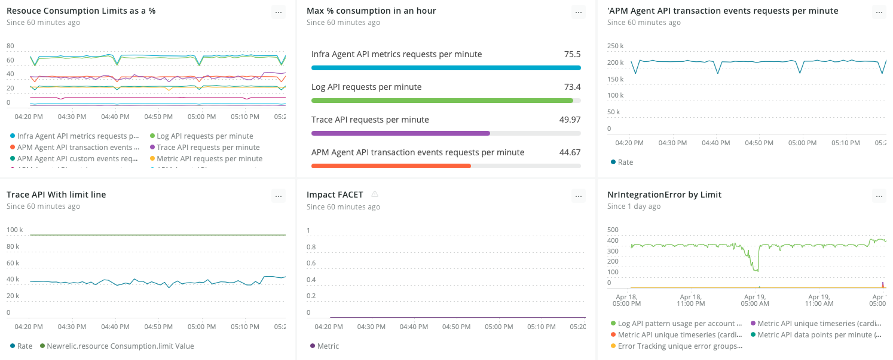

As you use the New Relic system there are resource limits in place to protect your experience, our systems, and our other customers. These limits range from the maximum number of characters you can have in a query, to API request rates, to how many events your queries inspect. And everywhere in between.

This page describes the limit metrics and NrIntegration events that enable you to view  your limits, your current data usage and overall resource consumption as compared to those limits, and the impact of experiencing a limit event. We also provide a handful of queries that, when compiled into a dashboard, can give you consistent insight into your limits status.

<Callout variant="important">
While `NrIntegration` events cover nearly all limits, resource metrics currently only cover request rate ingestion limits.
</Callout>

## What happens when you reach a limit 

Our response to reaching a limit depends on a handful of factors: the [type of limit that’s reached](/docs/telemetry-data-platform/ingest-manage-data/manage-data/view-system-limits/#violations), as well as the duration, frequency, and amount at which you exceed the limit.  Exceeding a limit doesn’t always mean you experience a limit event, such as dropped data, rejected traffic, or having your data turned off for the rest of the day. We sometimes allow a small buffer before enforcing a limit. That said, any resource consumed above 100% is at risk for limit impact at any time.

Many of our rate limits apply proportionally. That means if you’re barely exceeding the limit, we will take less action than if you're exceeding by 200%.

Limit status is only visible if you're sending data in to a corresponding `dataType` or `limitName` API. For example, if you send in data via the Metric API, you’ll see the Metric API resource metrics, but if you don't send any APM data in, you won't see APM resource metrics.

<Callout variant="tip">
Impact metrics will be generated regardless of impact; if there's no impact, you’ll see a 0.
</Callout>

An `NrIntegration` error is generated when you experience impact and is a good way to quickly see if you’re experiencing any limit events. See [View System Limits](/docs/telemetry-data-platform/ingest-manage-data/manage-data/view-system-limits/) for more information.

## Create a dashboard to view your limit status

Using three limit metrics together on a dashboard, you can quickly see detailed visuals of your `Ingest Resource Request Per Minute` limits, and with `NrIngration` errors get a view into more limits.



<figcaption>
  Dashboard displaying limits status using a handful of queries.  
</figcaption>

We used the following queries to create this dashboard. To make a dashboard like this in [New Relic One](https://one.newrelic.com/), select **Dashboards**, and then **Create a dashboard**. Then, add a new chart for each query you want to regularly monitor. The three limits metrics included in these queries are described in a separate section, below.

From left to right, top to bottom:

<CollapserGroup>
  <Collapser
    className="freq-link"
    id=""
    title="Resource Consumption Limits as a %"
  >

```
FROM Metric select rate(sum(newrelic.resourceConsumption.currentValue), 1 minute) /latest(newrelic.resourceConsumption.limitValue) * 100facet limitName where limitTimeInterval = '1 minute'timeseries
```
  </Collapser>
  <Collapser
    className="freq-link"
    id=""
    title="Max % Consumption in an hour"
  >
```
SELECT max(`usage`) FROM (FROM Metric select rate(sum(newrelic.resourceConsumption.currentValue), 1 minute) / latest(newrelic.resourceConsumption.limitValue) * 100 as 'usage' facet limitName timeseries ) facet limitName
```
  </Collapser>
  <Collapser
    className="freq-link"
    id=""
    title="APM Agent API transaction events request per minute"
  >
```
FROM Metric select rate(sum(newrelic.resourceConsumption.currentValue), 1 minute) where limitName = 'APM Agent API transaction events requests per minute' TIMESERIES
 ```
  </Collapser> 
  <Collapser
    className="freq-link"
    id=""
    title="Trace API With limit line"
  >
  ```
FROM Metric select rate(sum(newrelic.resourceConsumption.currentValue), 1 minute),latest(newrelic.resourceConsumption.limitValue) where limitName = 'Trace API requests per minute' TIMESERIES
 ```
  </Collapser>
  <Collapser
    className="freq-link"
    id=""
    title="Impact FACET"
  >
```
select rate(sum(newrelic.resourceConsumption.impact), 1 minute) facet dataType, impact, resource, reason,limitName TIMESERIES 1 minute
```
  </Collapser>
  <Collapser
    className="freq-link"
    id=""
    title="NrIntegrationError by limit"
  >
```
FROM NrIntegrationError select count(*) facet limitName TIMESERIES MAX  since 1 day ago limit max
 ```
  </Collapser>
  <Collapser
    className="freq-link"
    id=""
    title="Multi-Account limits (on time series charts only)"
  >
  If you want to see limits for multiple accounts on one chart:
  1.  run this query from one of the accounts: 
  ```
  FROM Metric select rate(sum(newrelic.resourceConsumption.currentValue), 1 minute) / latest(newrelic.resourceConsumption.limitValue) * 100 facet limitName, consumingAccountId where limitTimeInterval = '1 minute' timeseries limit max
  ```

  2. Click **Add another query**.
  3. Select a different account.
  4. Then run this query again:
  ```
   FROM Metric select rate(sum(newrelic.resourceConsumption.currentValue), 1 minute) / latest(newrelic.resourceConsumption.limitValue) * 100 facet limitName, consumingAccountId where limitTimeInterval = '1 minute' timeseries limit max
  ```
  5. Finally, save it.
  </Collapser>
  <Collapser
    className="freq-link"
    id=""
    title="Limit List and NrIntegration Error"
  >
```
FROM Metric, NrIntegrationError select rate(sum(newrelic.resourceConsumption.currentValue), 1 minute) as 'Per Minute Count',latest(newrelic.resourceConsumption.limitValue) as ' limit Value',(rate(sum(newrelic.resourceConsumption.currentValue), 1 minute)/latest(newrelic.resourceConsumption.limitValue)*100)as 'Percent Used', filter (count(*), where NrIntegrationError.limitValue is not null) as 'limit reached count' facet limitName limit 1000
```
  </Collapser>
</CollapserGroup>

## Limit metrics

These metrics, used in the dashboard queries above, can hone in on a single limit or resource. Or, with the help of `FACET limitName or Resource` provide a view across all your limits.

<CollapserGroup>
  <Collapser
    className="freq-link"
    id=""
    title="newrelic.resourceConsumption.limitValue"
  >
`limitValue` allows you to see the setting for a limit by `limitName` and understand more about what resource is linked to this limit. The following examples use the limit value metric in the query:

- Example for Metric API requests per minute.
```
FROM Metric select latest(newrelic.resourceConsumption.currentValue) where limitName = 'Metric API requests per minute'  limit 200
```
- To show all limits, add `FACET limitName` and consider grouping by `limitTimeInterval`.

```
FROM Metric select latest(newrelic.resourceConsumption.currentValue) WHERE limitTimeInterval = '1 minute' FACET limitName  limit 200
```

  </Collapser>
  <Collapser
    className="freq-link"
    id=""
    title="newrelic.resourceConsumption.currentValue"
  >
`currentValue` shows you how much of a given resource you’re currently consuming. To get a better glimpse into how our systems are viewing your consumption,  use a `rate()` function with the time period that aligns with the `limitWindow`. Limit 200.


- Example for Metric API request per minute:
```
FROM Metric select rate(sum(newrelic.resourceConsumption.currentValue),1 minute) where limitName = 'Metric API requests per minute' “  limit 200
```
- To show all limits, add `FACET limitName` and consider grouping by `limitTimeInterval`.
```
FROM Metric select rate(sum(newrelic.resourceConsumption.currentValue),1 minute) where limitTimeInterval = '1 minute' FACET limitName “  limit 200
```

  </Collapser>
  <Collapser
    className="freq-link"
    id=""
    title="newrelic.resourceConsumption.impact"
  >
`impact` lets you know for any given resource what impact limit events are having. Zeros mean you are not currently impacted.

The most granular we have is `dataType`. It is possible for multiple instances of `limitName` to impact a single type, such as Metric RPM and DPM. If we know, we will display `limitName`.

```
From Metric select rate(sum(newrelic.resourceConsumption.impact), 1 minute) facet dataType, resource, impact, limitName   TIMESERIES  limit 200
```
  </Collapser>
</CollapserGroup>

### Metric attributes

Attributes on `newrelic.resourceConsumption.limitValue`  and `newrelic.resourceConsumption.currentValue`:
- `limitName` - The Name of the limit for the metric data, i.e RPM Metric API.
- `dataType` - What kind of data the metric is tracking, i.e Metric, Log, or APM.
- `Resource` - What resource is being consumed, i.e. Requests, or DPM.
- `limitTimeInterval` - What time window this resource is evaluated for limiting.
- `account` -  


Attributes on `newrelic.resourceConsumption.impact`
- `dataType` - The kind of data that is being impacted, i.e Metric, Log, APM.
- `Resource` - What resource is being impacted, i.e Request Rate.
- `Impact` - A count of what is happening when resource has exceeded set limit, i.e dropped requests. 
- `account` - 

 

