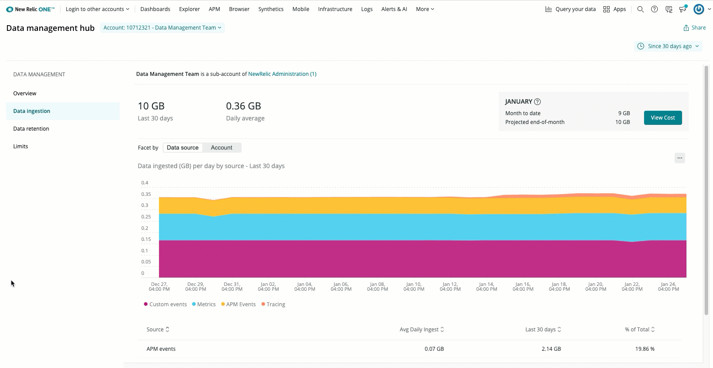

When you connect your data to New Relic, we process what we receive and apply data dropping and transformation rules. Then we count the bytes needed to represent your data in a standard format, like JSON. If you're on our [New Relic One pricing plan](/docs/accounts/accounts-billing/new-relic-one-pricing-users/pricing-billing), you're charged by the number of bytes written to our database, above and beyond the standard amount that’s free.

<Callout variant="important">
  This doc is for accounts on our [New Relic One pricing plan](/docs/accounts/accounts-billing/new-relic-one-pricing-users/pricing-billing). If you're on our original product-based pricing plan, see [Original data retention](/docs/accounts/original-accounts-billing/product-based-pricing/overview-data-retention-components). Not sure which you're on? See [Overview of pricing and user model](/docs/transition-guide-our-new-pricing-plan-user-model).
</Callout>

The **Data ingestion** page shows your ingest rates for a period you specify on the top-right of the Data management hub. **Since 30 days ago** is the default setting, but you can also set a custom date span.

The page shows your daily average GBs, and the total for the range you set. You can toggle between an overall ingest view and an account view to identify which of your accounts are sending the most data. The page also provides the current month-to-date, and the projected end-of-month total ingest rates. With this information, you can proactively drop data or turn off agents in order to manage ingest and, therefore, costs.

If you want to take a look at how we query the data, click the ellipsis icon (just above the chart) to slide out the chart query and open it in our query builder. And If you want to drill down further into your data usage, check out the [sample queries in the usage docs](/docs/accounts/accounts-billing/new-relic-one-pricing-users/usage-queries-alerts#data-queries).

<figcaption>
  From the **Login** drop-down, select **Manage your data**, and then select **Data ingestion**. This is the **Data ingestion** page with data source and account views.
</figcaption>

## Data ingestion sources [#sources-list]

The **Data ingestion** page describes which of your data sources provide the most data on average and during specific data ranges. The sources are described here.

<table>
  <thead>
    <tr>
      <th style={{ width: "200px" }}>
        Billable data sources
      </th>

      <th>
        Description
      </th>
    </tr>
  </thead>

  <tbody>
    <tr>
      <td>
        Timeslices (1-minute) and Metric:Raw
      </td>

      <td>
        Metrics are timeslices + MetricRaw

        Metric group: `MetricsBytes`

        Metric timeslice data averages to one-hour periods after eight days. After 90 days, the permanent metric data continues to be stored in one-hour periods. We currently store the raw metric data for 30 days.

        You are only billed for the initial ingest volume. You are not billed for subsequent rollups.
      </td>
    </tr>

    <tr>
      <td>
        APM (transactions and errors)
      </td>

      <td>
        [APM events](/docs/insights/insights-data-sources/default-data/apm-default-events-insights)

        Metric group: `ApmEventsBytes`
      </td>
    </tr>

    <tr>
      <td>
        InfraSamples:Raw
      </td>

      <td>
        Includes multiple [Infrastructure events](/docs/infrastructure/manage-your-data/data-instrumentation/default-infrastructure-events)
      </td>
    </tr>

    <tr>
      <td/>

      <td>
        Infrastructure host data

        Metric group:`InfraHostBytes`

        Information related to your servers and virtual machines coming from infrastructure agents, including storage and network data
      </td>
    </tr>

    <tr>
      <td/>

      <td>
        Infrastructure process data stored in ProcessSample.

        Metric group: `InfraProcessBytes`

        Data are metrics related to each process running on the hosts running the Infrastructure agent. This feature is turned off by default.
      </td>
    </tr>

    <tr>
      <td/>

      <td>
        Infrastructure integrations

        Metric group: `InfraIntegrationBytes`

        Performance data related to applications and services, typically managed by the customer, including data related to Docker containers, Windows services, Nagios checks, and cloud integrations such as managed services in AWS, Azure, and GCP.
      </td>
    </tr>

    <tr>
      <td>
        Logging
      </td>

      <td>
        Includes logs and any `Log_<value>` custom data partition created

        Metric group: `LoggingBytes`

        Log records are stored into the `Log` event type by default. Additional custom data partitions will create new event types, which are always prefixed with `Log_` and will be counted as part of the overall set of log data stored.

        With `LogExtendedRecord`, log messages longer than 4KB are split into multiple events that, when needed, are stitched together to display the original message; this reduces the size of message data.

        As of September 2021, log storage as blobs replaces `LogExtendedRecord`. With blob storage, NRDB can store up to 128,000 bytes for any attribute, not just messages. For more information, see our [blobs documentation for logs](/docs/logs/log-management/ui-data/long-logs-blobs).
      </td>
    </tr>

    <tr>
      <td>
        Default
      </td>

      <td>
        [Custom events](/docs/insights/insights-data-sources/custom-data/report-custom-event-data)

        Metric group: `CustomEventsBytes`
      </td>
    </tr>

    <tr>
      <td>
        Mobile error

        Mobile general

        Breadcrumb crash event trails

        Mobile session

        Mobile exception

        Mobile crash
      </td>

      <td>
        [Mobile events](/docs/insights/insights-data-sources/default-data/mobile-default-events-insights)

        Metric group: `MobileEventsBytes`
      </td>
    </tr>

    <tr>
      <td>
        Tracing
      </td>

      <td>
        Metric group: `TracingBytes`

        * `TracingBytes` includes `Span` and OpenTelemetry's `SpanEvent`.
        * You are not charged for `DistributedTraceSummary` events.
      </td>
    </tr>

    <tr>
      <td>
        Browser:EventLog

        Browser

        Browser:JSErrors

        PcvPerf (PageView timing)
      </td>

      <td>
        [Browser events](/docs/insights/insights-data-sources/default-data/browser-default-events-insights)

        Metric group: `BrowserEventsBytes`
      </td>
    </tr>

    <tr>
      <td>
        Lambda
      </td>

      <td>
        Serverless

        Metric group: `ServerlessBytes`
      </td>
    </tr>
  </tbody>
</table>

## Break down data to see what's contributing to your ingest [#facet-data-ingest]

You can inspect your data ingest to gain more information about your ingest health. This way, you'll know your baselines, and can more easily spot an anomaly like an ingest spike, as well as its source. 

To break down your ingested data, start from the chart on the **Data ingestion** page. Think of the data source bands as the Y axis, and the dates as the X axis. Click on the band you want to inspect at the spot in the X axis that corresponds with the date you want to investigate. 

<figcaption>
   This image shows the Metrics band for June 15 right before it's clicked. 
</figcaption>

A modal opens with the account, data source, and facet selected. You can do a handful of things on this page:

* Change the account, data source, or facet you want to drill down into.
* Change the date and time to investigate. 
* Review the results of the query in chart form. The chart displays the top 15 results for the facet query. 
* Open the NRQL query in the **Query builder** where you'll find additional facets that you can use.  

Learn more about [NRQL queries here](/docs/query-your-data/nrql-new-relic-query-language/get-started/introduction-nrql-new-relics-query-language/). 

### How we break your ingest data down

Some of the content in the UI is variable, depending on your account. This information is intended to help you understand how we're working with your ingest data.

* The chart on the **Data ingestion** page shows data usage for a little longer time frame than that covered by your retention settings for each data ingest source. If you choose a date outside of your designated retention period for an ingest source, you'll get the message that there's no chart data available. Select a more recent date to fix this problem.
*  If you inspect a data source for an account that has less than a terrabyte of data, we compute the ingest volume over a 24 hour period; otherwise, we compute it for a 1 hour period.
* The ingest value provided on the main **Data ingestion** chart will be slightly different from that reflected during inspection. This is because our facet computation is an estimate.

## Set alerts for data use [#set-alerts]

[Query and alert on usage data](/docs/accounts/accounts-billing/new-relic-one-pricing-users/usage-queries-alerts) describes how to set alerts to get notified if you're nearing data ingest limits you don't want to cross. For example, you might set an alert on logs, which can stack up quickly in an active system.

## Adjust your data ingest [#adjust-ingest]

**Drop data for lower retention costs and data compliance**

On ingest, we apply data dropping rules so you won't be charged for data that's not useful. Learn how to set additional [data dropping](/docs/accounts/accounts/data-management/drop-data-using-nerdgraph) rules yourself. Use NerdGraph to drop entire data types or drop data attributes from data types so they’re not written to NRDB. This enables you to focus on the data you want, reduces retention costs, and avoids writing sensitive data to the database. For dropping log data, see [Drop data with drop filter rules](/docs/logs/new-relic-logs/ui-data/drop-data-drop-filter-rules).

**Turn off agents and integrations**

If you don’t need data from specific agents or integrations that you have installed, you can uninstall/delete those tools. For instructions, see the specific documentation for an agent or integration.
