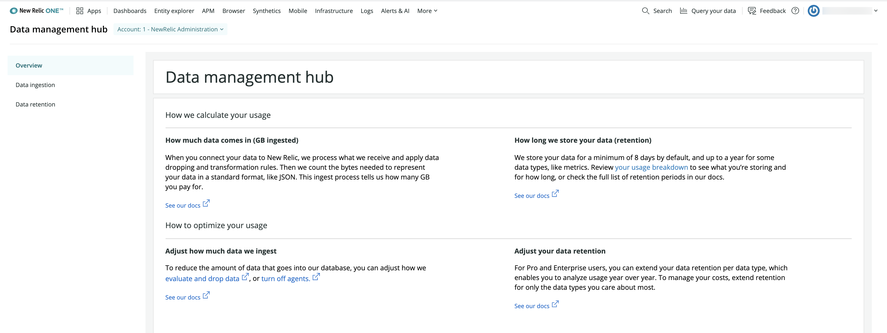

At New Relic, we're super proud of [NRDB](/docs/telemetry-data-platform/ingest-manage-data/get-started/nrdb-horsepower-under-hood), the New Relic database where we store your data. It gathers all your telemetry data in one place, gives you a connected view of all your data, and scales as your business grows.

We invite you to send all your metrics, events, logs, and traces to NRDB, including those from third-party sources. We also recognize that some data might not be necessary for your business goals. You shouldn’t have to wade through data you don’t need to get to the data you do. And you definitely shouldn’t have to pay for it. That’s where our data management tools come in: they let you decide what data you send to New Relic and how long it should be stored.

<figcaption>
  Data management hub: from the user profile drop down, select **Manage your data**.
</figcaption>

Coupled with user management tools, data management helps you get maximum value from your investment in New Relic, all while safeguarding your data.

<Callout variant="important">
  Not yet a New Relic customer? [Sign up](https://newrelic.com/signup) to create your free account in only a few seconds. Then ingest up to 100GB of data for free each month. Forever. 
</Callout>

## Where to find the Data management hub

To locate the data management UI: From [one.newrelic.com](https://one.newrelic.com) select the account dropdown, and select **Manage your data**. If you're on the [New Relic One user model](/docs/accounts/original-accounts-billing/original-product-based-pricing/overview-changes-pricing-user-model/#user-models), you can also find the Data management hub by selecting **Administration > Manage data**.

## Better cost, performance, and compliance [#benefits]

Collecting and storing data in New Relic allows you to analyze, visualize, and alert on all your metrics, events, logs, and traces from across all of your sources. However, it’s important to manage that data for cost, performance, and in some cases, compliance reasons. The data management hub provides the tools you need to understand and control where your data is coming from, and adjust what’s stored and for how long.

<Callout variant="important">
  If you're on our [original product-based pricing plan](/docs/accounts/original-accounts-billing/product-based-pricing/overview-data-retention-components), you'll see your data ingest, retention, and limits in the Data management hub. The primary difference is that you're not billed on ingest, as with our [New Relic One pricing plan](/docs/accounts/accounts-billing/new-relic-one-pricing-billing/new-relic-one-pricing-billing). Not sure which plan you're on? See [Overview of pricing and user model](/docs/transition-guide-our-new-pricing-plan-user-model). 
</Callout>

### Cost management [#calculate-data-retention]

The cost of data storage continually decreases, but storage is still an expense. The amount of data you process and store is closely related to the value you receive from New Relic, because it’s a key component of how you’re charged.

Our ingest process helps you hone your data. For example, data might arrive at our processing front door compressed and of varying quality. Through ingest, that data is uncompressed, decorated with queryable attributes, and evaluated. Elements are dropped or trimmed, all before we write it to NRDB. That way, the data you store is only the data you want most.

### Performance management

While NRDB is a phenomenally scalable database, it’s also a reality that queries across huge datasets might not return results in a timely enough fashion for your needs. You get better performance if you limit the data we store, or convert it into a format that keeps it easily queryable. [Drop data](/docs/accounts/accounts/data-management/drop-data-using-nerdgraph) to improve performance by reducing the amount of data that’s stored.

### Ingest and retention strategies

Depending on your goals, whether to reduce costs, increase specific retention rates, or pare down your data to what’s most essential, we have a strategy for you.

* Learn about reducing the amount of data that comes into NRDB in [Manage data coming into New Relic](/docs/manage-data-coming-in).
* Learn about customizing storage so you only store the data you want, for the period you want in [Manage data stored in New Relic](/docs/manage-stored-data).
* Learn about dropping data in [Drop data using NerdGraph](/docs/accounts/accounts/data-management/drop-data-using-nerdgraph). And for dropping log data, see [Drop data with drop filter rules](/docs/logs/new-relic-logs/ui-data/drop-data-drop-filter-rules).

