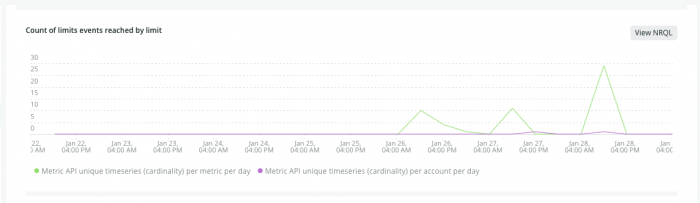
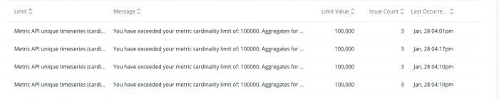

To ensure our systems are always up and ready to support you, and to keep you from unintended use, we place [limits on the amount of data](/docs/licenses/license-information/general-usage-licenses/new-relic-data-usage-limits-policies) you can send, query, and store.

## Responses to limit violations [#violations]

Limits are enforced per sub-account, and across our APIs. You might reach a limit if you start monitoring a new high-traffic application, or have a sudden data spike. When you do reach a limit, New Relic responds according to the type of data and the limit that’s reached. For example:

* We place a limit on the number of ingested requests per minute (RPM) per data type. When this limit is reached, we stop accepting data and return a 429 status code for the duration of the minute.
* For queries, we place limits on the number of records inspected (see [query limits](/docs/query-your-data/nrql-new-relic-query-language/get-started/rate-limits-nrql-queries)). When this limit is reached, New Relic will reject traffic from the source scanning the largest number of records and attempt to allow traffic from other sources.
* For metrics, we place a limit on the number of unique timeseries (cardinality) per account and per metric. When this limit is reached, aggregated data is turned off for the rest of the UTC day.

For every major limit violation, New Relic creates an [`NrIntegrationError` event](/attribute-dictionary?attribute_name=&events_tids%5B%5D=9451) for that account, which have these limit-related attributes:

<table>
  <thead>
    <tr>
      <td style={{ width: "210px" }}>
        **Attribute**
      </td>

      <td>
        **Description**
      </td>
    </tr>
  </thead>

  <tbody>
    <tr>
      <td>
        category
      </td>

      <td>
        'RateLimit' or 'ApiLimit'. The 'RateLimit' category is used for limits based on a unit of time such as the number of requests ingested per minute. The 'ApiLimit' is used for constant limits, such as the number of attributes on a record.
      </td>
    </tr>

    <tr>
      <td>
        limitName
      </td>

      <td>
        The name of the limit.
      </td>
    </tr>

    <tr>
      <td>
        message
      </td>

      <td>
        Describes the limit and the impact.
      </td>
    </tr>

    <tr>
      <td>
        limitValue
      </td>

      <td>
        The limit reached.
      </td>
    </tr>
  </tbody>
</table>

## System limits UI [#limits-ui]

The system **Limits** page (from the [account dropdown](/docs/using-new-relic/welcome-new-relic/get-started/glossary#account-dropdown), click `Manage your data` and click `Limits` on the left) displays when your account has encountered a rate limit in the specified time period. The page displays a default period of 24 hours; you can set a custom range from the top-right of the page.

Non-limit-related `NrIntegrationError` events are not displayed here. In addition, this page does not display information about limits you have not hit, or how close you are to reaching a limit. For more on creating queries and alerts for data ingest and billing metrics, see [Query billing/usage data](/docs/accounts/accounts-billing/new-relic-one-pricing-users/usage-queries-alerts).

<figcaption>
  **[one.newrelic.com](https://one.newrelic.com) > [account dropdown](/docs/using-new-relic/welcome-new-relic/get-started/glossary#account-dropdown) > Manage your data > Limits**: An example of a chart on the **Limits** UI page displaying a cardinality violation limit issue.
</figcaption>

To add more detail, or build a dashboard, click the **View NRQL** button on the chart to see the NRQL powering this view. The graph displays each unique limit type that was reached during the selected time-period. This can help you find any trends based on time.

The **Limits** page also provides a table where you can find the limit name, the limit event message associated with it, and last occurrence time and date. If you click a limit in the table, you see more about what happened, and when.

<figcaption>
  **[one.newrelic.com](https://one.newrelic.com) > [account dropdown](/docs/using-new-relic/welcome-new-relic/get-started/glossary#account-dropdown) > Manage your data > Limits**: An example of a limit events table on the **Limits** UI page.
</figcaption>

## Troubleshooting limits

To troubleshoot limits when you reach them, click the limit info in the table, and then follow the docs link that's provided. Different limits have different solutions.

## For more information

See [Troubleshoot Metric API with NRIntegrationError events](/docs/telemetry-data-platform/get-data/apis/troubleshoot-nrintegrationerror-events)
