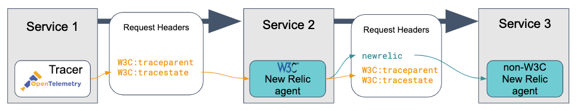

Here are some technical details about how New Relic [distributed tracing](/docs/understand-dependencies/distributed-tracing/get-started/introduction-distributed-tracing) works:

* [How trace sampling works](#sampling)
* [How trace data is structured](#trace-structure)
* [How trace data is stored](#trace-storage)
* [How trace context is passed between applications](#headers)

<Callout variant="tip">
  For instructions about setting up distributed tracing, see [Overview: Enable distributed tracing](/docs/understand-dependencies/distributed-tracing/enable-configure/overview-enable-distributed-tracing).
</Callout>

## How trace sampling works [#sampling]

We offer the following types of sampling:

* [Head-based sampling (standard distributed tracing)](#head-based)
* [Tail-based sampling (Infinite Tracing)](#tail-based)

### Head-based sampling (standard distributed tracing) [#head-based]

Distributed tracing requires the reporting and processing of a large amount of data. For this reason, we have limits on data reporting, and we use sampling to capture a representative sample of activity. Ideally, the sampled data represents the characteristics of your larger data set and provides the detail you need for troubleshooting.

Standard distributed tracing applies filters to individual spans before all spans in a trace arrive. This is called head-based sampling, which means decisions about whether to accept spans is made at the head (beginning) of the filtering process.

Here are some details about the head-based sampling in standard distributed tracing:

<CollapserGroup>
  <Collapser
    id="trace-origin-sampling"
    title="Adaptive sampling process (APM agents)"
  >
    APM agents use adaptive sampling to capture a representative sample of system activity. The following is an explanation of how adaptive sampling works. (AWS Lambda monitoring uses a [different sampling process](/docs/serverless-function-monitoring/aws-lambda-monitoring/ui-data/understand-lambda-data-structure#data-structure).)

    For the first service in a distributed trace, 10 requests are chosen to be sampled. The throughput to that service is used to adjust how frequently requests are sampled. This is explained in more detail below.

    The first service we monitor in a distributed trace is called the trace origin. The trace origin chooses requests at random to be traced. That decision propagates to the downstream services touched by that request. When the request has completed, all of the spans created by the services touched by that request are available in the UI as a complete end-to-end trace.

    APM agents have a limit on the number of transactions collected per minute (this can vary, depending on agent) and a limit on the number of spans collected per minute (1000 per agent instance). To adhere to these limits, the default number of traces at the trace origin is 10 traces per minute.

    An APM agent spreads out the collection of these 10 traces over a minute in order to get a representative sample over time. The exact sampling rate depends on the number of transactions in the previous minute. The rate responds to changes in transaction throughput, going up or down.

    For example, if the previous minute had 100 transactions, the agent would anticipate a similar number of transactions and select 1 out of every 10 transactions to be traced.
  </Collapser>

  <Collapser
    id="agent-limits-sampling"
    title="Span limits and sampling (APM agents)"
  >
    An APM agent instance using head-based sampling has a limit of 1000 spans per minute. The agent attempts to keep all spans that are marked to be sampled as part of a distributed trace.

    In many distributed systems, the average microservice may generate 10 to 20 spans per request. In those cases, the agent span limit can accommodate all spans chosen, and that service will have full detail in a trace.

    However, some requests to services will generate many spans, and the agent span limit will be reached. As a result, some traces will not have full detail for that service. One solution to this would be to custom instrument an agent to report less activity and therefore report fewer spans.
  </Collapser>

  <Collapser
    id="browser-spans"
    title="Browser span reporting"
  >
    Browser monitoring reports all spans, but [APM samples a percentage of spans](#trace-origin-sampling). This means that there will likely be many more browser spans than back-end spans, which can result in browser app spans disconnected from back-end spans. For tips on querying for traces that contain front and back-end spans, see [Find browser span data](/docs/browser/new-relic-browser/browser-pro-features/browser-data-distributed-tracing#find-data).
  </Collapser>

  <Collapser
    id="span-rate-limiting"
    title="Trace rate limiting"
  >
    If the above sampling methods still result in too much trace data, we may limit incoming data by sampling traces after they're received. By making this decision at the trace level, it avoids fragmenting traces (accepting only part of a trace).

    This process works similarly to [adaptive sampling](#trace-origin-sampling). The total spans received in a minute are totaled. If too many spans are received, fewer spans may be accepted in the following minute, in order to achieve a floating-average throughput rate.
  </Collapser>
</CollapserGroup>

### Tail-based sampling (Infinite Tracing) [#tail-based]

Tail-based sampling is available in Infinite Tracing, an additional option available for distributed tracing. Infinite Tracing uses tail-based sampling to accept and analyze 100% of your span data.

Tail-based sampling means that filtering decisions are done at the tail end of processing after all the spans in a trace have arrived. Only traces that contain the most actionable data, such as errors or unusual latency, are forwarded for you to view in the UI.

<CollapserGroup>
  <Collapser
    id="infinite-architecture"
    title="Architecture"
  >
    For Infinite Tracing, agents or integrations send 100% of all instrumented spans to a trace observer. The trace observer is a distributed tracing service residing in a cluster of services on AWS called New Relic Edge.

    <Callout variant="tip">
      Only your spans go to the trace observer—all other data such as metrics, custom events, and transaction traces are sent the normal route to New Relic and are subject to local sampling.
    </Callout>

    You configure a unique trace observer endpoint for the AWS region you want to send data to. You can request multiple endpoints, one per AWS region. The endpoint represents a trace observer for a particular workload. For example, all spans from a single trace (request) must go to that endpoint.

    Here are two architectural diagrams: one showing how data flows if you use APM agents and another if you use New Relic integrations like OpenTelemetry exporters:

    

    The trace observer holds traces open while spans for that trace arrive. Once the first span in a trace arrives, a session is kept open for 10 seconds. Each time a new span for that trace arrives, the expiration time is reset to 10 seconds. Traces that haven't seen a span arrive within the last 10 seconds will automatically expire.
  </Collapser>

  <Collapser
    id="tail-sampling-strategy"
    title="Tail-based sampling algorithms"
  >
    By default, each trace observer offers traces to three samplers: one looking for duration outliers, one looking for traces with errors, and one trying to randomly sample across all trace types. Each sampler keeps a target percentage of traces that match their criteria.

    Here are details about each sampler:

    <Table>
      <thead>
        <tr>
          <th style={{ width: "100px" }}>
            Sampler
          </th>

          <th>
            Matching criteria
          </th>

          <th>
            Target percent
          </th>
        </tr>
      </thead>

      <tbody>
        <tr>
          <td>
            Duration
          </td>

          <td>
            Traces with an outlier duration, using two algorithms:

            * Gaussian (Assumes a normal distribution and a threshold at the 99th percentile)
            * Eccentricity (Assumes no distribution and a threshold based on cluster)
          </td>

          <td>
            100%
          </td>
        </tr>

        <tr>
          <td>
            Error
          </td>

          <td>
            Traces having at least one span with an error
          </td>

          <td>
            100%
          </td>
        </tr>

        <tr>
          <td>
            Random
          </td>

          <td>
            All traces
          </td>

          <td>
            1% (This is configurable. See [Infinite Tracing: Random trace filter](/docs/understand-dependencies/distributed-tracing/other-requirements/infinite-tracing-random-trace-filter))
          </td>
        </tr>
      </tbody>
    </Table>

    If the matching criteria matches the trace, each sampler looks at the trace’s shape. A trace’s shape is the unique combination of the root span’s entity name and span name. This is a simple way to separate traces using the entry point of the request.

    Once the shape is determined, the sampler makes a decision to keep or reject the trace based on its target sampling percent. If it’s 100%, the trace is automatically kept. If it’s anything less, the probability the sampler keeps a given trace is determined by the target percent. For example, the default target percent is 1 for random traces, so 1% of those traces are kept. If you prefer, you can [change the random filter percentage](/docs/understand-dependencies/distributed-tracing/other-requirements/infinite-tracing-random-trace-filter).

    Because the trace observer uses percentages of throughput, the number of traces selected will vary with that throughput.
  </Collapser>
</CollapserGroup>

## How trace data is structured [#trace-structure]

Understanding the structure of a distributed trace can help you:

* Understand [how traces are displayed in our UI](/docs/apm/distributed-tracing/ui-data/understand-use-distributed-tracing-data)
* Help you [query trace data](/docs/apm/distributed-tracing/ui-data/example-queries-distributed-trace-data)

A distributed trace has a tree-like structure, with "child" spans that refer to one "parent" span. This diagram shows some important span relationships in a trace:

This diagram shows how spans in a distributed trace relate to each other.

This diagram shows several important concepts:

* **Trace root.** The first service or process in a trace is referred to as the **root** service or process.
* **Process boundaries**. A process represents the execution of a logical piece of code. Examples of a process include a backend service or Lambda function. Spans within a process are categorized as one of the following:
  * **Entry span**: the first span in a process.
  * **Exit span**: a span is a considered an exit span if it a) is the parent of an entry span, or b) has `http.` or `db.` attributes and therefore represents an external call.
  * **In-process span**: a span that represents an internal method call or function and that is not an exit or entry span.
* **Client spans**. A client span represents a call to another [entity](/docs/using-new-relic/welcome-new-relic/get-started/glossary#entity) or external dependency. Currently, there are two client span types:
  * **Datastore**. If a client span has any attributes prefixed with `db.` (like `db.statement`), it's categorized as a datastore span.
  * **External**. If a client span has any attributes prefixed with `http.` (like `http.url`) or has a child span in another process, it's categorized as an external span. This is a general category for any external calls that are not datastore queries.
* **Trace duration**. A trace's total duration is determined by the length of time from the start of the earliest span to the completion of the last span.

You can query span relationship data with the [NerdGraph GraphiQL explorer](/docs/apis/graphql-api/tutorials/query-distributed-trace-data-using-graphql-api) at [https://api.newrelic.com/graphiql](https://api.newrelic.com/graphiql).

## How trace data is stored [#trace-storage]

Understanding how we store trace data can help you [query your trace data](/docs/apm/distributed-tracing/ui-data/example-queries-distributed-trace-data).

We save trace data as:

* `Span`: A [span](/docs/using-new-relic/welcome-new-relic/getting-started/glossary#span) represents operations that are part of a distributed trace. The operations that a span can represent include [browser-side interactions](/docs/browser/new-relic-browser/browser-pro-features/browser-data-distributed-tracing), datastore queries, calls to other services, method-level timing, and [Lambda functions](/docs/serverless-function-monitoring/aws-lambda-monitoring/get-started/introduction-new-relic-monitoring-aws-lambda). One example: in an HTTP service, a span is created at the start of an HTTP request and completed when the HTTP server returns a response. Span attributes contain important information about that operation (such as duration, host data, etc.), including trace-relationship details (such as traceId, guid). For span-related data, see [span attributes](/attribute-dictionary?attribute_name=&events_tids%5B%5D=8337).
* `Transaction`: If an [entity](/docs/using-new-relic/welcome-new-relic/getting-started/glossary#alert-entity) in a trace is monitored by an agent, a request to that entity generates a single `Transaction` event. Transactions allow trace data to be tied to other New Relic features. For transaction-related data, see [transaction attributes](/attribute-dictionary?attribute_name=&events_tids%5B%5D=8236).
* Contextual metadata. We store metadata that shows calculations about a trace and the relationships between its spans. To [query this data](/docs/apis/graphql-api/tutorials/query-distributed-trace-data-using-graphql-api), use the [NerdGraph GraphiQL explorer](https://api.newrelic.com/graphiql).

## How trace context is passed between applications [#headers]

We support the W3C Trace Context standard, which makes it easier to trace transactions across networks and services. When you [enable](/docs/understand-dependencies/distributed-tracing/enable-configure/overview-enable-distributed-tracing) distributed tracing, New Relic agents add HTTP headers to a service's outbound requests. HTTP headers act like passports on an international trip: They identify your software traces and carry important information as they travel through various networks, processes, and security systems.

The headers also contain information that helps us link the spans together later: metadata like the trace ID, span ID, the New Relic account ID, and sampling information. This header information is passed along each span of a trace, unless the progress is stopped by something like middleware or agents that don't recognize the header format (see Figure 1).

Figure 1

To address the problem of header propagation, we support the W3C Trace Context specification that requires two standardized headers. Our latest W3C New Relic agents send and receive these two required headers, and by default, they also send and receive the header of the prior New Relic agent:

* W3C (`traceparent`): The primary header that identifies the entire trace (trace ID) and the calling service (span id).
* W3C (`tracestate`): A required header that carries vendor-specific information and tracks where a trace has been.
* New Relic (`newrelic`): The original, proprietary header that is still sent to maintain backward compatibility with prior New Relic agents.

This combination of three headers allows traces to be propagated across services instrumented with these types of agents:

* W3C New Relic agents
* Non-W3C New Relic agents
* W3C Trace Context-compatible agents

<Callout variant="important">
  If your requests only touch W3C Trace Context-compatible agents, you can opt to turn off the New Relic header. See the [agent configuration](/docs/agents/manage-apm-agents/configuration/configure-agent) documentation for details about turning off the `newrelic` header.
</Callout>

The scenarios below show various types of successful header propagation.

<CollapserGroup>
  <Collapser
    id="three-agents"
    title="Scenario 1: Trace touching three agent types"
  >
    This shows the flow of headers when a request touches three different agent types:

    
  </Collapser>

  <Collapser
    id="middleware-success"
    title="Scenario 2: Trace with W3C New Relic and middleware"
  >
    This shows the combination of headers sent by a W3C New Relic agent to some middleware.

    
  </Collapser>

  <Collapser
    id="another-w3c-agent"
    title="Scenario 3: Trace with any W3C-compliant agent and a New Relic agent."
  >
    This shows the two required W3C headers from another vendor accepted by a W3C New Relic agent.

    
  </Collapser>
</CollapserGroup>
