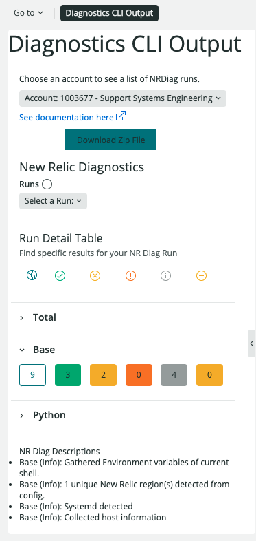

After executing the Diagnostics CLI from your terminal, you will see the results for each task as they are completed. Tasks that result in a `Warning` or `Failure` status code will log additional details regarding possible issues found during execution, along with troubleshooting suggestions and relevant links to documentation.  If you use the `-attach` flag, you will be able to view your results in [New Relic One](/docs/using-new-relic/cross-product-functions/diagnostics-cli-nrdiag/interpret-nrdiag-output/#diag-in-nr1)

<figcaption>
  The Diagnostics CLI outputs any issues it found with your installation, along with troubleshooting suggestions.
</figcaption>

## File output

The Diagnostics CLI outputs three files:

<table>
  <thead>
    <tr>
      <th style={{ width: "200px" }}>
        Diagnostics output files
      </th>

      <th>
        Comments
      </th>
    </tr>
  </thead>

  <tbody>
    <tr>
      <td>
        `nrdiag-output.zip`
      </td>

      <td>
        A flattened folder structure with one or more config files and any existing New Relic logs. Attach this file to your New Relic Account. This archive also contains a copy of `nrdiag-output.json`
      </td>
    </tr>

    <tr>
      <td>
        `nrdiag-output.json`
      </td>

      <td>
        Output of the individual tests. Attach this output to your New Relic Account.
      </td>
    </tr>

    <tr>
      <td>
        `nrdiag-filelist.txt`
      </td>

      <td>
        A list of files found. The `nrdiag-output.zip` file that you attach to your New Relic Account automatically includes this list. You do not need to attach this `.txt` file separately.
      </td>
    </tr>
  </tbody>
</table>

## Result status codes [#status-codes]

The Diagnostics CLI returns the following status codes after running:

<table>
  <thead>
    <tr>
      <th style={{ width: "125px" }}>
        Status code
      </th>

      <th>
        Definition
      </th>
    </tr>
  </thead>

  <tbody>
    <tr>
      <td>
        `Success`
      </td>

      <td>
        Task successfully executed with no issues detected.
      </td>
    </tr>

    <tr>
      <td>
        `Warning`
      </td>

      <td>
        Task successfully executed. However, possible issues detected.
      </td>
    </tr>

    <tr>
      <td>
        `Failure`
      </td>

      <td>
        Task failed with issues detected.
      </td>
    </tr>

    <tr>
      <td>
        `Error`
      </td>

      <td>
        Task unable to execute. This could be due to a permissions issues.
      </td>
    </tr>

    <tr>
      <td>
        `None`
      </td>

      <td>
        Task was determined irrelevant to detected environment and was not executed.
      </td>
    </tr>
  </tbody>
</table>

## Diagnostics CLI Output in NR1 [#diag-in-nr1]
* To examine the output of `nrdiag-output.json` in NR1, go to Apps -> then search for Diagnostics CLI Output
  * Click the star next to the icon to add to your favorites
* Select an account from the dropdown
  * This account is associated with the the license key that was validated by the Diagnostics CLI for upload
* Select a from a list of your previous Diagnostics CLI runs for that account
* For each task, a list of results each result status will be available to filter between
  * Click on each button to list the specific results by status code for each task
* The right-hand of the screen will display a raw JSON of your results

`

