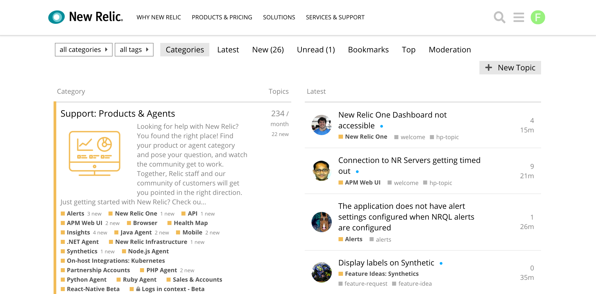
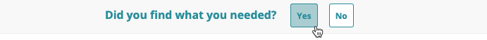

New Relic offers a variety of support options, including online help, a troubleshooting tool, a documentation library with detailed procedures and troubleshooting tips, and support assistance.

* [Ask in New Relic's Explorers Hub.](#nr-forum)
* [Run the New Relic Diagnostics tool.](#diagnostics)
* [Find answers in New Relic Docs and New Relic University.](#find-answers)
* [Give us feedback about our documentation.](#send-feedback)
* [File a ticket in the support portal.](#file-ticket)
* [Check the status of our systems.](#check-status)
* [Read about our licenses, data security, and compliance information.](#licenses-policies)

## Ask in New Relic's Explorers Hub, our free forum [#nr-forum]

[New Relic's Explorer Hub](https://discuss.newrelic.com/) is our forum that's free for all users. New Relic users and employees engage every day in conversations to troubleshoot and solve issues, find workarounds, and discuss new features.

[**discuss.newrelic.com**](https://discuss.newrelic.com/): The Explorer Hub is our public forum. Use it to ask questions and find answers. Join our community of users to learn more about New Relic and get some inspiration.

## Run the New Relic Diagnostics tool [#diagnostics]

[New Relic Diagnostics](/docs/using-new-relic/cross-product-functions/troubleshooting/new-relic-diagnostics) is our automated diagnostic tool for Linux, Windows, and Mac. If it detects a problem with any of our agents, it suggests solutions and saves troubleshooting logs that you can attach to tickets.

## Find answers in New Relic Docs and New Relic University [#find-answers]

New Relic's [Docs site](https://docs.newrelic.com/) contains helpful installation, configuration, and troubleshooting tips. From the [main page](http://docs.newrelic.com), select from frequently-used categories and topics, like [release notes](/docs/release-notes). Or, [search from any page](http://docs.newrelic.com/search).

For a library of additional videos, webinars, and other information about using New Relic features, visit [New Relic University](https://learn.newrelic.com/) and [newrelic.com/resources](https://newrelic.com/resources/videos).

## Give us feedback about our documentation [#send-feedback]

If you still can't find an answer in the documentation, leave a comment using our feedback widget.

[**docs.newrelic.com**](http://docs.newrelic.com): At the top of each page you can find a feedback widget. Use it to send your comments to the docs team.

## File a ticket in the support portal [#file-ticket]

If none of the above methods worked, go to [support.newrelic.com](https://support.newrelic.com/home). The Support portal gives you access to unified search across all of New Relic's help resources. If you can't find what you are looking for and your subscription level includes technical support, you can [file a support ticket](https://support.newrelic.com/tickets).

<Callout variant="important">
  Support for beta or limited release features may not be available.
</Callout>

To file a new ticket:

1. Go to **[support.newrelic.com](https://support.newrelic.com) > Login**.
2. From the Support portal, select the area of New Relic where you need help.
3. Select your account.
4. Provide as many details as possible. Include the URL, if applicable, or select **Attach file** to include a log file, a New Relic Diagnostics file, screenshots, or other useful attachments.
5. Click **Submit**.

## Check the status of our systems [#check-status]

It's always a good idea to visit [status.newrelic.com](https://status.newrelic.com/) to check the status of our systems. If there are open incidents, you'll be able to find more information.

## Licenses and security information [#licenses-policies]

* Review New Relic's [licenses, attributions, and other notices](/docs/licenses).
* Read about our [data security, privacy, and compliance policies](/docs/security).
