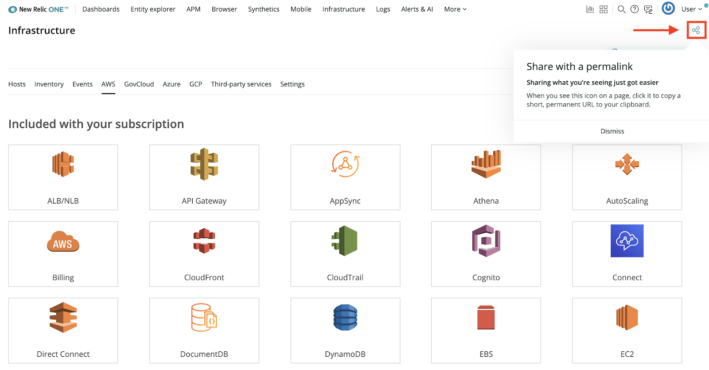

Sharing insights, dashboards, and curated views from anywhere in New Relic One just got easier. In New Relic One, click the permalink icon to automatically copy a short, permanent URL to your clipboard. Then, you can share that observability throughout your organization.

Use the permalink button to share what you're seeing with other people in your organization.
