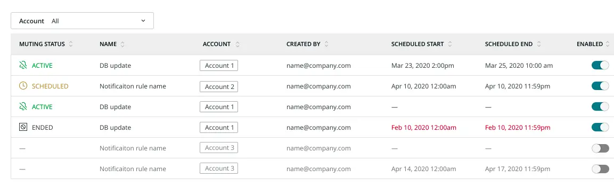

When you have a deployment or maintenance scheduled, the last thing you want is a bunch of alerts firing, stealing your time and distracting you from what could possibly be real issues. Wouldn’t it be nice to be able to schedule alert muting for those cases? We thought so, too!

Now you can schedule a window of quiet when you know important work is coming. Check out this post on the [Explorer’s Hub](https://discuss.newrelic.com/t/release-muting-rules-single-occurrence-scheduling/110098).
