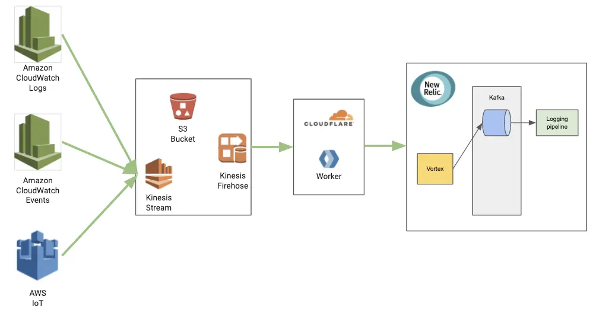

New Relic can now ingest data from Amazon Web Services (AWS) Kinesis Data Firehose, making it easier than ever to gain visibility into your cloud stack. The Kinesis Data Firehose is a fully managed service for delivering real-time streaming data to AWS services like Amazon Simple Storage Service (Amazon S3), Amazon Redshift, and a wide array of external destinations.

Log data flows from AWS through Kinesis Data Firehose and Cloudflare into New Relic.

This integration brings a wide range of additional advantages:

* Fully managed: Amazon Kinesis is fully managed and runs your streaming applications without requiring you to manage any infrastructure.
* Scalability: Amazon Kinesis can handle any amount of streaming data and process data from hundreds of thousands of sources with very low latencies.
* Integrated with various AWS data sources: Amazon Kinesis can be used to easily collect Virtual Private Cloud (VPC) Flow Logs, CloudWatch Logs, CloudWatch Events, and AWS Internet of Things (IoT).
* Real time: Amazon Kinesis enables you to ingest, buffer, and process streaming data in real time, so you can derive insights in seconds or minutes instead of hours or days.
* Easily configurable: With the release of Kinesis Data Firehose HTTP endpoint delivery, you can easily configure data streams to automatically ingest and forward data to New Relic. You can also configure Kinesis Data Firehose to transform your data before delivering it. You don't need to write applications, manage resources, or create [AWS Lambda](http://aws.amazon.com/lambda) functions, which makes it easier to manage and estimate costs for your data based on data volume.
