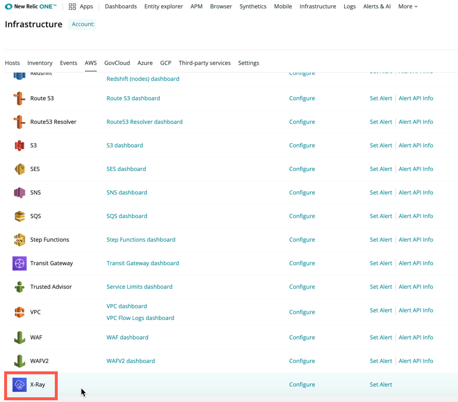

Whether you’re managing Amazon EC2 instances or writing AWS Lambda functions, AWS X-Ray is a critical distributed tracing tool for getting visibility across your AWS services, but it doesn’t automatically capture all calls outside of AWS.

Conversely, New Relic Distributed Tracing provides automatic tracing for any application where the New Relic agent is installed—including on-prem and monolithic applications. One thing it lacked was visibility into trace and performance data from AWS-managed services where the agent couldn’t be installed.

Now, you can ingest AWS X-Ray distributed tracing data into New Relic to easily query, alert, and view application trace data from your managed AWS services on the same screen as the rest of your distributed tracing data for applications where the New Relic agent is installed.

## Get started

If you’re an existing New Relic user and you’ve already [connected your AWS account](https://docs.newrelic.com/docs/integrations/amazon-integrations/get-started/connect-aws-infrastructure), go to your [New Relic Infrastructure AWS settings](https://infrastructure.newrelic.com) and activate X-Ray (see below).

After you enable the X-Ray integration, AWS X-Ray trace data will automatically display in any distributed tracing view throughout the New Relic platform.
