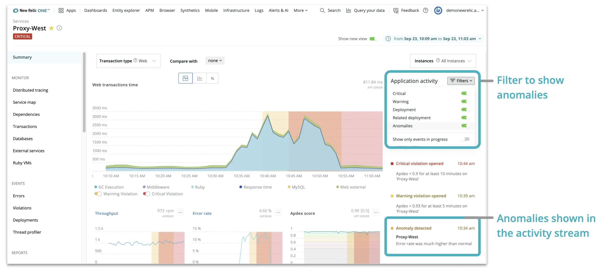
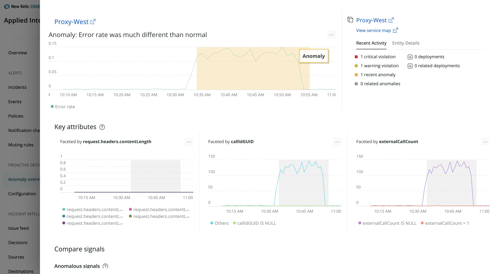

The activity stream, visible from the New Relic One homepage, APM summary page, and APM list page, streams recent events from alerts and deployments and provides a direct view into what has changed in your system so that you can fix outages quickly.

To expand your view of your system and data to help speed incident response, we’ve further integrated [Applied Intelligence](https://newrelic.com/platform/applied-intelligence) capabilities into New Relic One by providing detected anomalies in context alongside APM information in the activity stream of the New Relic One homepage and on the APM summary page.

Bringing anomalies into your common workflows will save you time and increase your situational awareness, so that you can more quickly understand changes and respond to incidents faster.

After you configure your application within Proactive Detection, Applied Intelligence will post open and closed events to the activity stream for specific time windows. For faster troubleshooting, click on any event in the activity stream for event analysis— including related anomalies—suggested queries, and other relevant metrics. Additionally, you can configure Proactive Detection to send anomaly notifications and analysis to Slack and other notification channels or the [Telemetry Data Platform](https://newrelic.com/platform/telemetry-data-platform) for future analysis.
