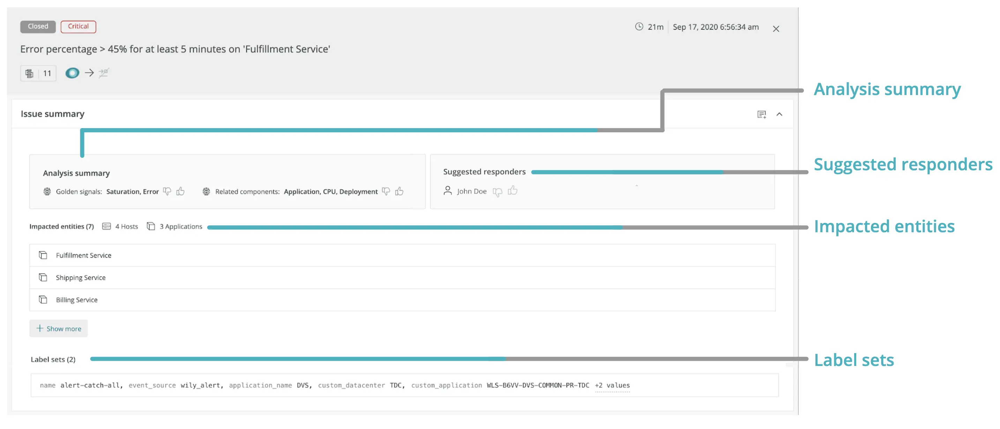

When trying to find the root cause of an issue, access to contextual information is crucial. Knowing that, we’ve made it easier to find relevant issue information and analysis.

The issue summary provides bottom-line insights to get you information faster. Depending on the issue, it can contain up to four sections:

* **Analysis summary:** Surfaces related components and SRE [golden signals](https://landing.google.com/sre/sre-book/chapters/monitoring-distributed-systems/#xref_monitoring_golden-signals) (for example, error rate, throughput, saturation, and latency)
* **Suggested responder:** Suggests the most relevant responders who can help to resolve the issue
* **Impacted entities:** Shows a summary of any entities we monitor with one-click access to anomaly analysis if you’ve configured Proactive Detection
* **Labels sets:** Shows incidents from third-party sources (for example, PagerDuty, AWS CloudWatch, etc.)

With these updates to the issue summary and analysis, more information is always a click away.

