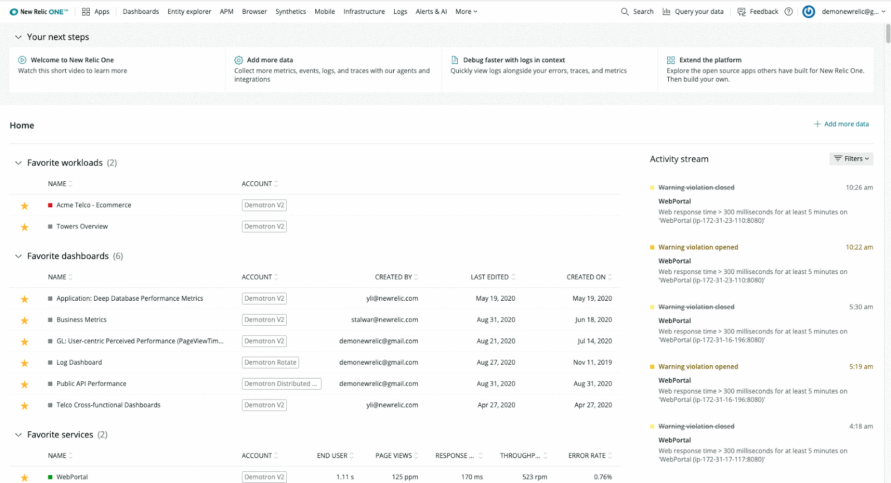

You wanted it, and we delivered. Dark mode is here! Head to the account dropdown to switch between dark mode and light mode.

## UI walkthrough

<iframe
  allow="autoplay; fullscreen"
  allowfullscreen=""
  allowtransparency="true"
  class="wistia_embed"
  frameborder="0"
  height="100%"
  msallowfullscreen=""
  name="wistia_embed"
  scrolling="no"
  src="https://fast.wistia.net/embed/iframe/ej8rjucux9?videoFoam=true"
  title="Check Out New Relic One Video"
  width="100%"
/>
