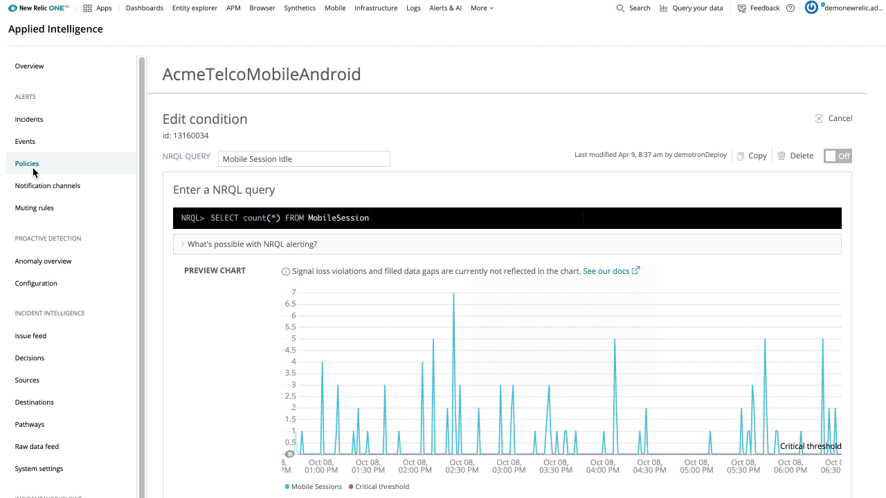

At times, for a variety of reasons, an incoming signal can be lost and it’s important to know if this is a delay or if it’s the beginning of a much larger problem. New Relic One now provides official support for loss of signal detection on any NRQL Alert Condition.

To see if it’s simply a delay in signal or something worse, you can now configure loss of signal detection by specifying how many seconds the system should wait, from the time the last data point was detected, before considering the signal to be lost. If the signal does not return before your specified time expires, you can choose to be notified that the signal has been lost, or you can simply choose to close any related open violations if you expected the entity or signal to disappear.

We know that not all signals or time series that are being monitored have a consistent flow of data points. Because New Relic evaluates incoming data in specific windows of time, in many cases, the telemetry signals you send to New Relic can have gaps, meaning that some time windows will not have data. You now have the option to implement multiple strategies for how those gaps should be filled–sometimes called extrapolation strategies–including setting a static value, using the previously detected value, or not doing anything.

When editing a NRQL Alert Condition, you can configure loss of signal detection under **Condition settings > Set your condition thresholds** and gap filling under **Condition settings > Fine-tune advanced signal settings**.

