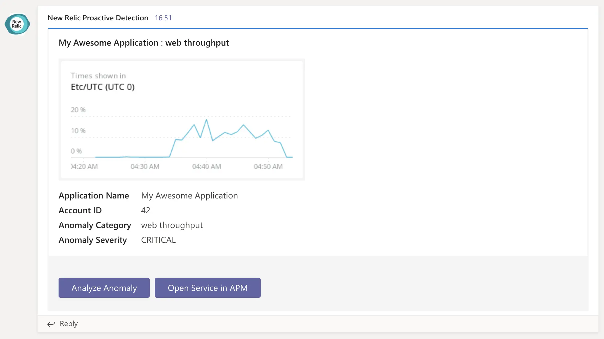
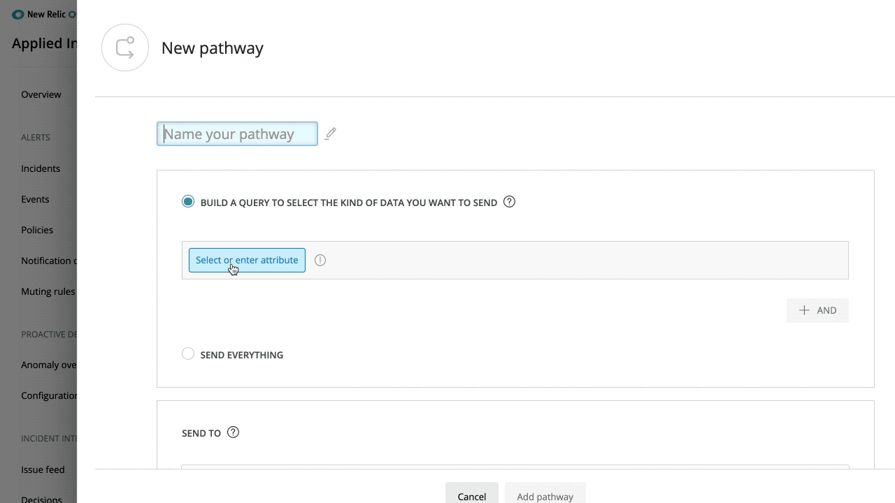

Always getting better and smarter, webhooks set up in Applied Intelligence now automatically deliver anomaly charts and a quick link to the analysis page in any notification tool.

When using webhooks as a destination in Incident Intelligence, you can further reduce alert fatigue by only being notified when issues contain the number of correlated incidents you specify.

### Adding anomaly charts to your notifications

* Creating a new configuration? Good news: you don’t need to do anything! The necessary fields are there by default.
* Have an existing webhook? If you’re using a default payload, you’ll receive this by default. If you’re using a custom webhook, you can update it by visiting your relevant configuration and updating the payload to include the new image and analyze attributes.

  

### Reduce the noise and only receive correlated notifications

If you’re using a webhook as a destination, you’re receiving every update that is sent out, which can often be too many. You can configure pathways in Incident Intelligence to only send notifications when incidents are correlated to reducing noise and helping you focus on the notifications that should take priority.

Now, any webhooks you configure also have this ability by using two new attributes to specify the minimum number or correlated incidents an issue should contain before sending a notification. For example if you choose three, you’ll only be notified of issues containing three or more correlated incidents.

The two attributes below, used when naming your pathway, allow you to do this:

* `is_correlated` which is a binary value that can be set to true or false
* `incidents_count` which requires an operator and numerical value

