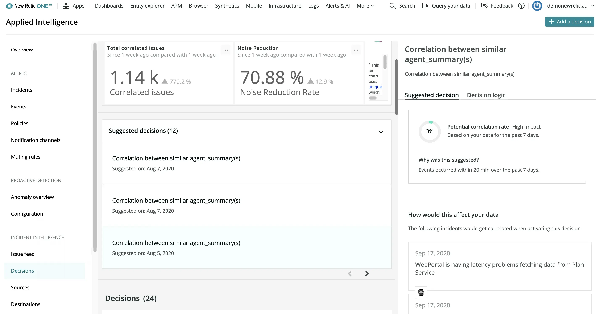

Incident Intelligence continuously analyzes alerts and incident data to find patterns in event sequences and offers suggested correlation decisions that merge incidents to reduce alert noise further.

Suggested decisions use machine learning to tailor correlations based on your data. Usually, we can create suggestions after a few weeks of use and data ingestion. However, if you’re an existing New Relic user, we can now leverage your historical alerts data to bring you tailored suggested decision logic in a matter of days.

You won’t need to perform any additional configuration—choose the alert policies you want to feed in for correlation as usual, and we’ll take care of the rest. The more policies you add, and the more data we have access to, the better suggestions you’ll receive. Be sure to set up your [alerts source](/docs/alerts-applied-intelligence/applied-intelligence/incident-intelligence/get-started-incident-intelligence#configure-source-nr-alerts) to take advantage of this new capability.

