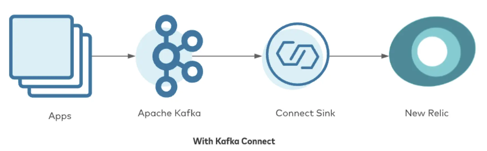

The New Relic connector for Kafka Connect allows you to ingest data from Apache Kafka topics into the New Relic platform without writing a single line of code. Because we’re working with Kafka Connect, the connector is purely driven by configuration, which you apply using the Kafka Connect REST API. Retries, error handling, and dead letter queues are handled for you by Kafka Connect and can be customized as required.

The connector supports the [Metric](https://docs.newrelic.com/docs/telemetry-data-platform/get-data/apis/introduction-metric-api) and [Event](https://docs.newrelic.com/docs/telemetry-data-platform/ingest-manage-data/ingest-apis/use-event-api-report-custom-events) telemetry data types, and we are working on releasing code for Logs and Traces soon.

To get started, head over to [Confluent Hub](https://www.confluent.io/hub/newrelic/newrelic-kafka-connector) and follow the instructions to install the connector into your local Kafka cluster.

