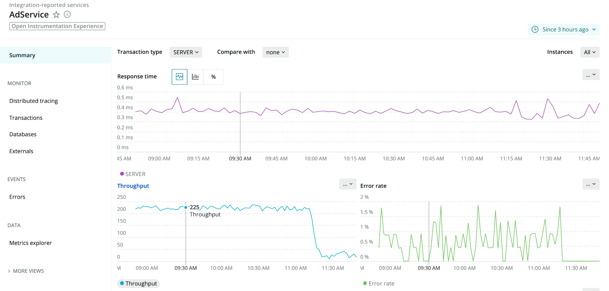

New Relic One now has a UI dedicated to providing full APM functionality for your OpenTelemetry data. With this curated experience, you can find the root cause of incidents quickly, and optimize the performance of your applications and services.

Send your OpenTelemetry data to New Relic using one of the [OpenTelemetry exporters](https://docs.newrelic.com/docs/integrations/open-source-telemetry-integrations/open-source-telemetry-integration-list/new-relics-opentelemetry-integration) and quickly discover and analyze your data using one of these key pages:

* **Explorer:** The [New Relic Explorer](https://docs.newrelic.com/docs/new-relic-one/use-new-relic-one/ui-data/new-relic-one-entity-explorer-view-performance-across-apps-services-hosts) gives you a unified view of every entity so you can see everything you monitor in one place and quickly zoom into what you care about most.
* **Summary page:** The summary page provides an overview of “golden signals” for a service or application, such as response time, throughput, and error rate.
* **Transactions page:** Use the [APM transactions](https://docs.newrelic.com/docs/apm/apm-ui-pages/monitoring/transactions-page-find-specific-performance-problems) page to identify transactions that might be causing the problem.
* **Distributed Tracing:** With [distributed tracing](https://docs.newrelic.com/docs/understand-dependencies/distributed-tracing/get-started/how-new-relic-distributed-tracing-works), you can get an end-to-end view of a single request across your services and quickly identify slow and error traces.
* **Externals:** The [external services](https://docs.newrelic.com/docs/apm/apm-ui-pages/monitoring/external-services-page-view-web-cloud-network-data) page captures calls to out-of-process services such as web services, resources in the cloud, and other network entities.
* **Databases:** The [databases](https://docs.newrelic.com/docs/apm/apm-ui-pages/monitoring/databases-page-view-operations-throughput-response-time) page shows an application’s database and cache data with charts to view throughput, response time and operations.
* **Metric explorer:** Use the [metrics explorer](https://docs.newrelic.com/docs/insights/use-insights-ui/explore-data/metric-explorer-search-chart-metrics-sent-new-relic-agents) to view your metrics and facet by various dimensions and create dashboards.

