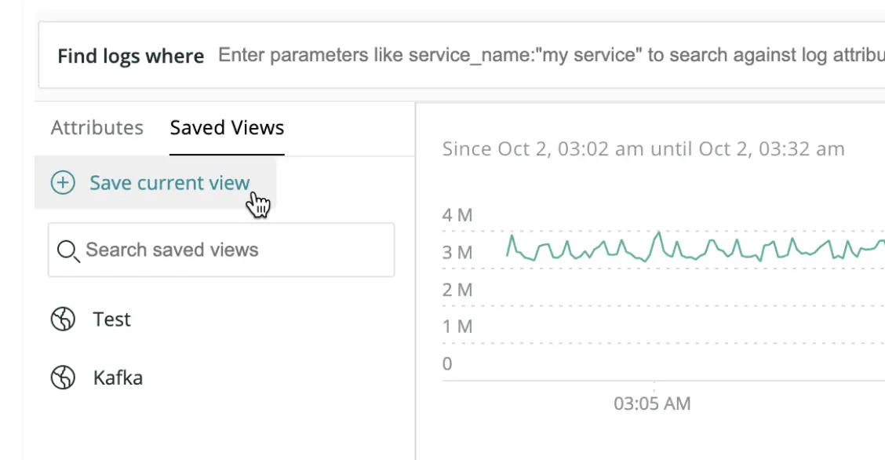

Expanding on the log management user analytics, you can now create saved views. This provides the ability to save your table column, time range, and other specific settings with the search in an easy to navigate UI.

**[one.newrelic.com](https://one.newrelic.com/all-capabilities) > Logs > Saved Views**
