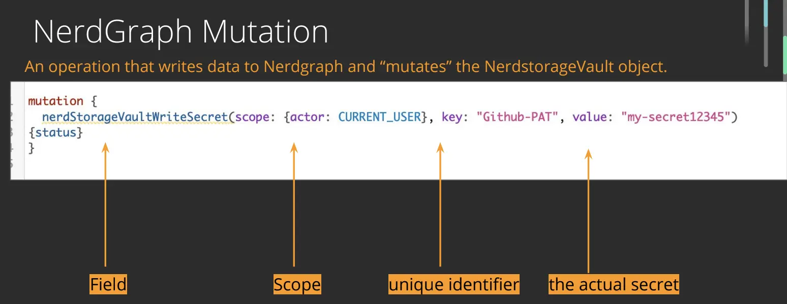

[NerdGraph](https://developer.newrelic.com/collect-data/get-started-nerdgraph-api-explorer) allows you to access your New Relic data, but when you want to fetch third-party data, NerdStorageVault allows you to safely store a secret to authenticate with a third-party service.

NerdStorageVault provides you with a secure and encrypted storage location where you can safely store:

* Personal access tokens
* License keys
* API keys
* Third-party secrets

NerdStorageVault is currently only available in the alpha release of the [nr1-community](https://www.npmjs.com/package/@newrelic/nr1-community/v/1.3.0-alpha.5) component library and is not available in the [New Relic One core components](https://developer.newrelic.com/explore-docs/intro-to-sdk) library. The feature uses AES-256 encryption.
