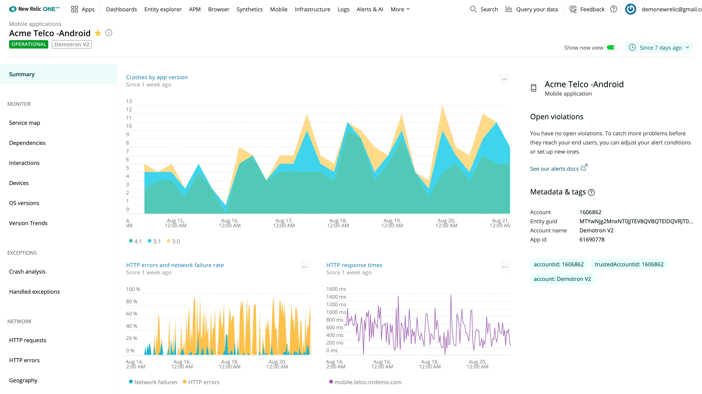

The New Relic iOS and tvOS agents will now be distributed as the [New Relic XCFramework Agent 7.0.0](https://docs.newrelic.com/docs/release-notes/mobile-release-notes/xcframework-release-notes/xcframework-agent-700). This agent supports iOS, tvOS, and the newly added [iOS for Mac Catalyst](https://developer.apple.com/mac-catalyst). Additionally, the New Relic XCFramework Agent will be distributed as a [dynamically linked library](https://developer.apple.com/library/archive/documentation/DeveloperTools/Conceptual/DynamicLibraries/100-Articles/OverviewOfDynamicLibraries.html).

If you’re looking to instrument your React Native applications, try our experimental [open source React Native Module](https://github.com/newrelic-experimental/NewRelicReactNativeModule). The module uses native New Relic agents to expose the Javascript environment. You’ll be able to capture the following data as custom events from your React Native applications:

* Interactions and the sequence they created
* Information passed to New Relic to track user sessions

We’ve improved [reliability from our Android service](https://discuss.newrelic.com/t/mobile-apm-changes-coming-soon-to-improve-our-android-stack-trace-deobfuscation/117188) and changed the way our service handles Android stack deobfuscation to make crash and handled exception stack traces more accurate after retracing. These fixes will be released to production in the following weeks, so stay tuned.

