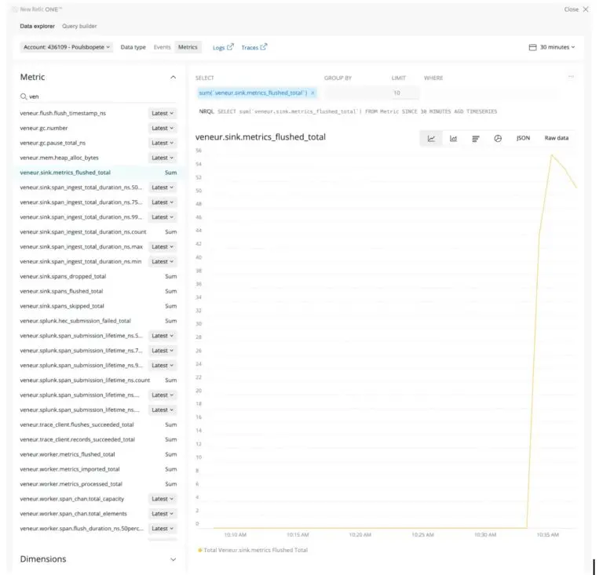

Build a pipeline to send metrics to New Relic using our Veneur [sink](https://github.com/stripe/veneur/tree/master/sinks). If you’re monitoring your servers with DogStatsD, you can easily switch pipelines and send that data to our [Telemetry Data Platform](https://blog.newrelic.com/product-news/introducing-telemetry-data-platform/)—a single database where you can alert on and analyze that data to detect and resolve issues faster.

[Veneur,](https://github.com/stripe/veneur) an open source tool built by [Stripe](https://stripe.com/), is a vendor-agnostic proxy-based metric collection pipeline that consolidates disparate observability data, including [StatsD](https://github.com/statsd/statsd) or DogStatsD metrics, trace spans, and synthetic checks.

With Veneur you get:

* Reduced data ingestion and storage costs by pre-aggregating metrics (such as timers) into percentiles
* Improved efficiency over other metric aggregator implementations because vendors charge based on the number of metrics they consume
* Improved reliability by building a more resilient forwarding system over single points of failure

