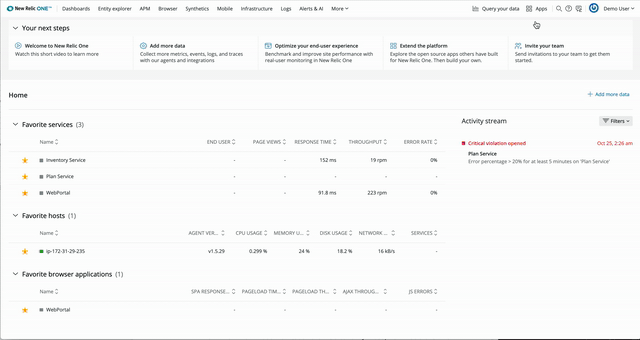

With the new API keys app you can create, view, and manage your user keys, ingest-license keys, and ingest-browser keys for your accounts. Any existing keys will continue to work as they have in the past.

The new API keys page also has links to the Insights keys page and the old version of the API keys page, so you can still view and manage account-wide REST API and Admin API keys.

For more about how to find the UI and more about API keys, see [API keys](https://docs.newrelic.com/docs/apis/intro-apis/new-relic-api-keys/#find).
