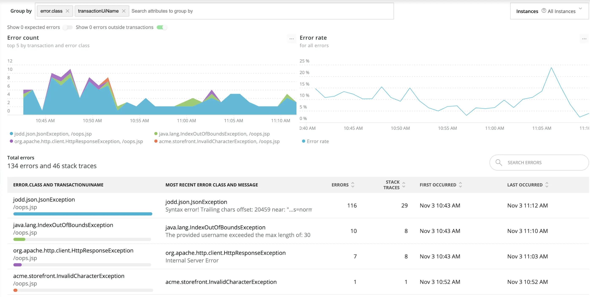

We’ve heard your feedback and improved the new Errors experience in New Relic One. Find the errors you’re looking for with familiar grouping controls based on NRQL attributes. Then see all your error events and stack traces in one place, giving you exactly what you need to reproduce (and fix!) the problem. These improvements to the Errors experience for services are available now to all New Relic users with [Pro or Enterprise Full-Stack Observability](https://newrelic.com/pricing). Just switch **Show new view** to ON when looking at Errors for your service.

