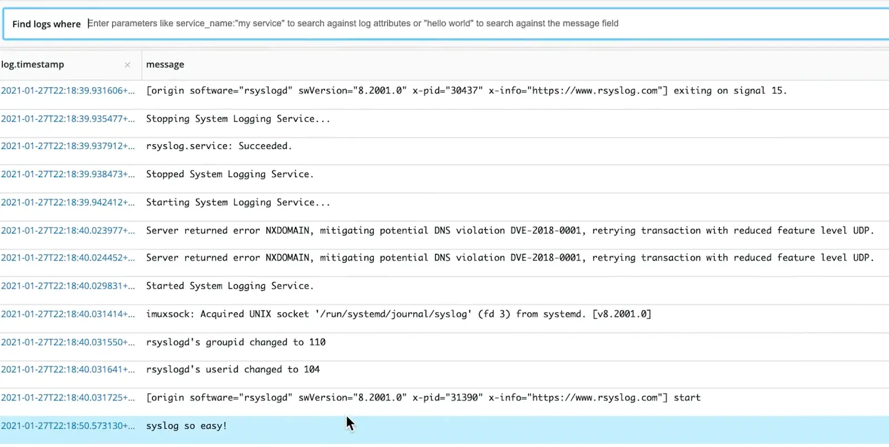

**Native support for forwarding syslog data via rsyslog and syslog-ng**: This new TCP endpoint significantly expands the options available to you for easily ingesting log data without installing, configuring, or maintaining third-party forwarders. Select data from the host, tail specific logs, or easily send detailed log data from firewalls and other network devices.

To get started, check out our [online documentation](https://docs.newrelic.com/docs/logs/log-management/log-api/use-tcp-endpoint-forward-logs-new-relic) for simple steps specific to your environment and needs.
