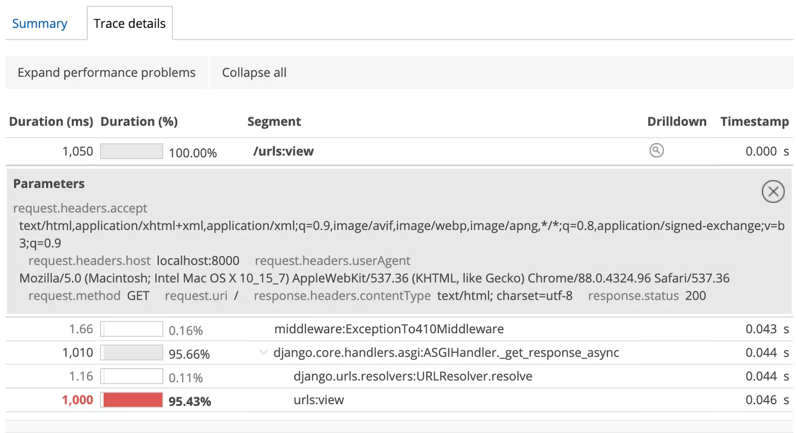

**Httpx instrumentation:** Python agent now automatically instruments external web requests made with the HTTPX client module.

**Django ASGI instrumentation:** Django’s ASGI mode is also supported through automatic instrumentation.

