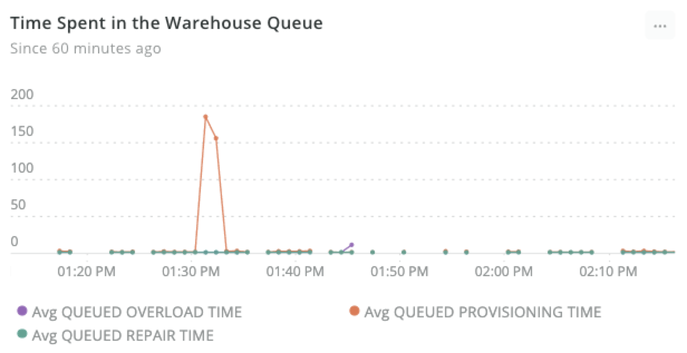

New Relic now integrates with [Snowflake](https://github.com/newrelic/newrelic-snowflake-integration) to give you a broad view across costs, performance, security, and availability. Common use cases include helping you:

* Detect and resolve warehouse performance issues.
* Optimize costs—whether that’s expensive queries, users running many queries, or warehouses that contribute the most to your bill.
* Detect potential security issues and failed logins.
* Monitor and alert on custom Snowflake data.

An example Snowflake integration chart.
