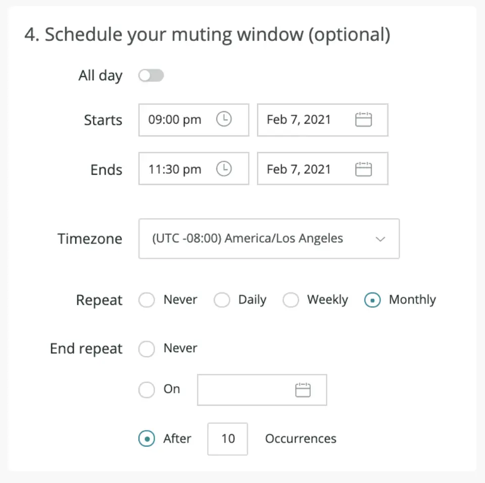

Muting rules now have even more functionality, allowing you to schedule recurring times when you want to mute violation notifications. Scheduling a single occurrence for muting was already possible and now you can specify a start date and time and end date and time and also specify how you would like the rule to repeat out of the three options below:

**Daily:** The rule will activate every day, between the times specified.

**Weekly:** The rule will activate every week, between the times specified, on the specific days of the week you choose.

**Monthly:** The rule will activate once a month, on the day of the month specified. In the screenshot below, if monthly were selected, the rule would activate every month on the 7th.

How to schedule a recurring muting rule in New Relic One

After specifying the recurring schedule, you can define when, or if, the schedule should stop. This can be specified as either a specific date, or a defined number of occurrences as in the example above.
