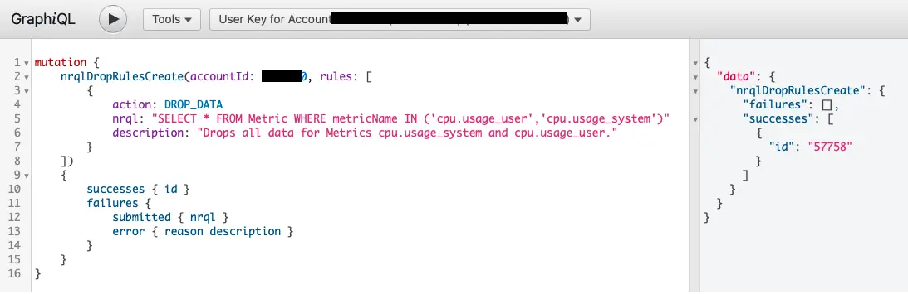

Now you can drop entire metrics at ingest (in addition to events, logs, and traces), allowing you to manage cardinality, data volume, and sensitive data. So, when you identify metric data that you don’t want to send to New Relic, instead of waiting multiple days to redeploy your service, one quick GraphQL command will immediately stop those metrics from being stored in our Telemetry Data Platform.

To get started, follow the steps detailed in our [documentation](https://docs.newrelic.com/docs/accounts/accounts/data-management/drop-data-using-nerdgraph).

